# Java八股文

---
# 掘金文章链接列表
---
1. [一、异常](https://juejin.cn/post/7204653355549278245)
2. [二、集合](https://juejin.cn/post/7204661393499996215)
3. [三、IO](https://juejin.cn/post/7204707115063427128)
4. [四、基础 补充](https://juejin.cn/post/7204659323269070906)
5. [五、JVM（1）](https://juejin.cn/post/7204723936914538553)
6. [六、JVM（2）](https://juejin.cn/post/7204742703505604667)
7. [七、JMM](https://juejin.cn/post/7205546336081756220)
8. [八、并发编程](https://juejin.cn/post/7205567237239095356)
9. [九、线程池](https://juejin.cn/post/7206541359950626876)
10. [十、数据库](https://juejin.cn/post/7206529406613061692)
11. [十一、索引](https://juejin.cn/post/7209960560665509925)
12. [十二、redo log、bin log、undo log、MVCC](https://juejin.cn/post/7209960560666148901)
13. [十三、Redis](https://juejin.cn/post/7407075949509722153)
14. [十四、消息队列](https://juejin.cn/post/7407075949509738537)
15. [十五、分库分表](https://juejin.cn/post/7407275971902111798)
16. [十六、Dubbo](https://juejin.cn/post/7407275971902128182)
17. [十七、Netty](https://juejin.cn/post/7407275971902292022)
18. [十八、注册中心 Nacos、Eureka、SOFARegistry、Zookeeper](https://juejin.cn/post/7407275971902341174)
19. [十九、Spring](https://juejin.cn/post/7407275971902160950)
20. [二十、MyBatis && JPA](https://juejin.cn/post/7407259722430726155)
21. [什么是DDD](https://juejin.cn/post/7205199441288560677)
---

下面是完整内容

# 目录
  * [一、基础](#一基础)
    * [1、Exception 和 Error](#1exception-和-error)
    * [2、ArrayList、Vector](#2arraylistvector)
    * [3、ArrayList、LinkedList](#3arraylistlinkedlist)
    * [4、HashSet、LinkedHashSet 、TreeSet](#4hashsetlinkedhashset-treeset-)
    * [5、LinkedHashMap、HashMap](#5linkedhashmaphashmap)
    * [6、HashMap、HashTable](#6hashmaphashtable)
    * [7、ConcurrentHashMap、HashTable](#7concurrenthashmaphashtable)
    * [8、HashSet 如何检查重复?](#8hashset-如何检查重复)
    * [9、HashMap 的长度为什么是 2 的幂次方](#9hashmap-的长度为什么是-2-的幂次方)
    * [10、Cloneable 和 clone()](#10cloneable-和-clone)
      * [10.1 Cloneable 的用途](#101-cloneable-的用途)
      * [10.2 克隆的分类](#102-克隆的分类)
      * [10.3 克隆的举例](#103-克隆的举例)
      * [10.4 浅克隆的举例](#104-浅克隆的举例)
      * [10.5 深克隆的举例](#105-深克隆的举例)
  * [二、IO](#二io)
    * [1、IO分类、选择](#1io分类选择)
    * [2、为什么 I/O 流操作要分为字节流操作和字符流操作呢？](#2为什么-io-流操作要分为字节流操作和字符流操作呢)
    * [3、常用字符编码所占字节数？](#3常用字符编码所占字节数)
    * [4、BufferedInputStream（字节缓冲输入流）](#4bufferedinputstream字节缓冲输入流)
    * [5、有哪些常见的 IO 模型?](#5有哪些常见的-io-模型)
    * [6、Java 中 3 种常见 IO 模型](#6java-中-3-种常见-io-模型)
  * [三、JVM](#三jvm)
    * [1、JVM内存结构（！！！）](#1jvm内存结构)
    * [2、JVM架构图](#2jvm架构图)
    * [3、类加载机制（双亲委派）](#3类加载机制双亲委派)
      * [3.1【1.8以及之前版本】](#3118以及之前版本)
      * [3.2【1.9以及之后版本】](#3219以及之后版本)
      * [3.3、如果不想用双亲委派模型怎么办？](#33如果不想用双亲委派模型怎么办)
      * [3.4、为什么说 Java SPI 的设计会违反双亲委派原则呢？](#34为什么说-java-spi-的设计会违反双亲委派原则呢)
    * [4、虚拟机栈](#4虚拟机栈)
      * [4.1、局部变量表](#41局部变量表)
      * [4.2、操作数栈](#42操作数栈)
      * [4.3、动态链接](#43动态链接)
      * [4.4、方法返回地址](#44方法返回地址)
    * [5、本地方法栈](#5本地方法栈)
    * [6、堆](#6堆)
      * [6.1、堆内存](#61堆内存)
    * [7、方法区](#7方法区)
      * [7.1、方法区和永久代以及元空间是什么关系？](#71方法区和永久代以及元空间是什么关系)
      * [7.2、为什么要将永久代 (PermGen) 替换为元空间 (MetaSpace) 呢?](#72为什么要将永久代-permgen-替换为元空间-metaspace-呢)
      * [7.3、方法区常用参数有哪些？](#73方法区常用参数有哪些)
    * [8、程序计数器](#8程序计数器)
    * [9、JVM总结（！！！）](#9jvm总结)
    * [10、JVM常量池和运行时常量池](#10jvm常量池和运行时常量池)
      * [10.1、类的二进制字节码包含哪些信息](#101类的二进制字节码包含哪些信息)
      * [10.2、什么是常量池](#102什么是常量池)
      * [10.3、常量池作用](#103常量池作用)
      * [10.4、运行时常量池](#104运行时常量池)
    * [11、字符串常量池](#11字符串常量池)
    * [12、直接内存](#12直接内存)
    * [13、HotSpot 虚拟机在 Java 堆中对象分配、布局和访问的全过程（！！！）](#13hotspot-虚拟机在-java-堆中对象分配布局和访问的全过程)
    * [14、死亡对象判断方法](#14死亡对象判断方法)
    * [15、对象可以被回收，就代表一定会被回收吗？](#15对象可以被回收就代表一定会被回收吗)
    * [16、强引用、软引用、弱引用、虚引用](#16强引用软引用弱引用虚引用)
      * [16.1 ThreadLocal是什么?为什么要使用ThreadLocal？](#161-threadlocal是什么为什么要使用threadlocal)
      * [16.2 一个ThreadLocal的使用案例](#162-一个threadlocal的使用案例)
      * [16.3 ThreadLocal的原理](#163-threadlocal的原理)
        * [16.3.1 ThreadLocal的内存结构图](#1631-threadlocal的内存结构图)
        * [16.3.2 关键源码分析](#1632-关键源码分析)
      * [16.4 为什么不直接用线程id作为ThreadLocalMap的key呢？](#164-为什么不直接用线程id作为threadlocalmap的key呢)
      * [16.5 TreadLocal为什么会导致内存泄漏呢？](#165-treadlocal为什么会导致内存泄漏呢)
        * [16.5.1 弱引用导致的内存泄漏呢？](#1651-弱引用导致的内存泄漏呢)
        * [16.5.2 key是弱引用，GC回收会影响ThreadLocal的正常工作嘛？](#1652-key是弱引用gc回收会影响threadlocal的正常工作嘛)
        * [16.5.3 ThreadLocal内存泄漏的demo](#1653-threadlocal内存泄漏的demo)
      * [16.6 Entry的Key为什么要设计成弱引用呢？](#166-entry的key为什么要设计成弱引用呢)
      * [16.7 ThreadLocal的应用场景和使用注意点](#167-threadlocal的应用场景和使用注意点)
  * [](#)
    * [17、如何判断一个常量是废弃常量？](#17如何判断一个常量是废弃常量)
    * [18、如何判断一个类是无用的类](#18如何判断一个类是无用的类)
    * [19、垃圾收集算法（！！！）](#19垃圾收集算法)
      * [19.1、标记-清除算法](#191标记-清除算法)
      * [19.2、标记-复制算法](#192标记-复制算法)
      * [19.3、标记-整理算法](#193标记-整理算法)
      * [19.4、分代收集算法](#194分代收集算法)
    * [20、垃圾收集器](#20垃圾收集器)
      * [20.1、Serial 收集器](#201serial-收集器)
      * [20.2、ParNew 收集器](#202parnew-收集器)
      * [20.3、Parallel Scavenge 收集器](#203parallel-scavenge-收集器)
      * [20.4、CMS和G1比较](#204cms和g1比较)
    * [21、为什么会OOM？](#21为什么会oom)
  * [四、JMM](#四jmm)
    * [1、CPU 缓存模型](#1cpu-缓存模型)
    * [2、什么是指令重排序？](#2什么是指令重排序)
    * [3、什么是主内存？什么是本地内存？](#3什么是主内存什么是本地内存)
    * [4、一个变量如何从主内存拷贝到工作内存，如何从工作内存同步到主内存之间的实现细节](#4一个变量如何从主内存拷贝到工作内存如何从工作内存同步到主内存之间的实现细节)
    * [5、JVM 内存结构（Java内存区域）和 JMM（Java 内存模型） 有何区别？](#5jvm-内存结构java内存区域和-jmmjava-内存模型-有何区别)
    * [6、happens-before 原则](#6happens-before-原则)
    * [7、JSR-133 对 happens-before 原则的定义](#7jsr-133-对-happens-before-原则的定义)
    * [8、happens-before 常见规则有哪些？谈谈你的理解？](#8happens-before-常见规则有哪些谈谈你的理解)
    * [9、并发编程三个重要特性](#9并发编程三个重要特性)
  * [五、并发编程](#五并发编程)
    * [1、什么是线程和进程?](#1什么是线程和进程)
    * [2、为什么要使用多线程呢?](#2为什么要使用多线程呢)
    * [3、线程的生命周期和状态?](#3线程的生命周期和状态)
    * [4、什么是上下文切换?](#4什么是上下文切换)
    * [5、什么是线程死锁?如何避免死锁?](#5什么是线程死锁如何避免死锁)
    * [6、sleep() 方法和 wait() 方法对比](#6sleep-方法和-wait-方法对比)
    * [7、可以直接调用 Thread 类的 run 方法吗？](#7可以直接调用-thread-类的-run-方法吗)
    * [8、volatile](#8volatile)
    * [9、synchronized](#9synchronized)
      * [9.1 synchronized 和 volatile 有什么区别？](#91-synchronized-和-volatile-有什么区别)
      * [9.2 JVM对synchronized的锁优化](#92-jvm对synchronized的锁优化)
        * [9.2.1 偏向锁](#921-偏向锁)
        * [9.2.2 轻量级锁](#922-轻量级锁)
        * [9.2.3 自旋锁](#923-自旋锁)
        * [9.2.4 锁消除](#924-锁消除)
    * [10、synchronized 和 ReentrantLock ？](#10synchronized-和-reentrantlock-)
  * [六、线程池](#六线程池)
    * [1、使用线程池的好处](#1使用线程池的好处)
    * [2、如何创建线程池？](#2如何创建线程池)
      * [2.1 线程池的种类](#21-线程池的种类)
        * [2.1.1 newCachedThreadPool：](#211-newcachedthreadpool)
        * [2.1.2 newFixedThreadPool：](#212-newfixedthreadpool)
        * [2.1.3 newSingleThreadExecutor:](#213-newsinglethreadexecutor)
        * [2.1.4 newScheduledThreadPool:](#214-newscheduledthreadpool)
    * [3、ThreadPoolExecutor](#3threadpoolexecutor)
    * [4、线程池的饱和策略有哪些？](#4线程池的饱和策略有哪些)
    * [5、如何设定线程池的大小？](#5如何设定线程池的大小)
    * [6、AQS](#6aqs-)
      * [6.1 CountDownLatch 和 CyclicBarrier的区别](#61-countdownlatch-和-cyclicbarrier的区别)
      * [6.2 AQS组件总结](#62-aqs组件总结)
  * [七、数据库](#七数据库)
    * [1、谈谈数据库设计的三大范式及反范式](#1谈谈数据库设计的三大范式及反范式)
    * [2、drop、delete 与 truncate 区别？](#2dropdelete-与-truncate-区别)
    * [3、DML 语句和 DDL 语句区别：](#3dml-语句和-ddl-语句区别)
    * [4、MySQL 优点：](#4mysql-优点)
    * [5、一个 SQL 语句在 MySQL 中的执行流程](#5一个-sql-语句在-mysql-中的执行流程)
    * [6、MySQL 存储引擎架构了解吗？](#6mysql-存储引擎架构了解吗)
    * [7、MyISAM 、InnoDB](#7myisam-innodb-)
    * [8、何谓数据库事务？](#8何谓数据库事务)
    * [9、并发事务带来了哪些问题?](#9并发事务带来了哪些问题)
    * [10、并发事务的控制方式有哪些？](#10并发事务的控制方式有哪些)
    * [11、SQL 标准定义了哪些事务隔离级别?](#11sql-标准定义了哪些事务隔离级别)
    * [12、MySQL 的隔离级别是基于锁实现的吗？](#12mysql-的隔离级别是基于锁实现的吗)
    * [13、行级锁的使用有什么注意事项？](#13行级锁的使用有什么注意事项)
    * [14、InnoDB 有哪几类行锁？](#14innodb-有哪几类行锁)
    * [15、当前读和快照读有什么区别？](#15当前读和快照读有什么区别)
      * [1、能用 MySQL 直接存储文件（比如图片）吗？](#1能用-mysql-直接存储文件比如图片吗)
      * [2、 MySQL 如何存储 IP 地址？](#2-mysql-如何存储-ip-地址)
      * [3、谨慎使用 MySQL 分区表](#3谨慎使用-mysql-分区表)
      * [4、 TIMESTAMP(4 个字节) 或 DATETIME  (8 个字节) 存储时间](#4-timestamp4-个字节-或-datetime-8-个字节-存储时间)
      * [5、同财务相关的金额类数据必须使用 decimal 类型](#5同财务相关的金额类数据必须使用-decimal-类型)
      * [6、超 100 万行的批量写 (UPDATE,DELETE,INSERT) 操作,要分批多次进行操作](#6超-100-万行的批量写-updatedeleteinsert-操作要分批多次进行操作)
  * [八、索引](#八索引)
    * [1、索引的底层数据结构](#1索引的底层数据结构)
    * [2、B 树& B+树两者有何异同呢？](#2b-树-b树两者有何异同呢)
    * [3、主键索引(Primary Key)](#3主键索引primary-key)
    * [4、二级索引(辅助索引)](#4二级索引辅助索引)
    * [5、聚簇索引的优缺点](#5聚簇索引的优缺点)
    * [6、非聚簇索引的优缺点](#6非聚簇索引的优缺点)
    * [7、MYSQL 数据存放文件](#7mysql-数据存放文件)
    * [8、非聚簇索引一定回表查询吗(覆盖索引)?](#8非聚簇索引一定回表查询吗覆盖索引)
    * [9、覆盖索引](#9覆盖索引)
    * [10、联合索引](#10联合索引)
    * [11、最左前缀匹配原则](#11最左前缀匹配原则)
    * [12、索引下推](#12索引下推)
    * [13、正确使用索引的一些建议](#13正确使用索引的一些建议)
  * [九、redo log、bin log、undo log](#九redo-logbin-logundo-log)
    * [1、redo log（重做日志）](#1redo-log重做日志)
      * [（1）刷盘时机](#1刷盘时机)
      * [（2）日志文件组](#2日志文件组)
      * [（3）只要每次把修改后的数据页直接刷盘不就好了，还有 redo log 什么事？](#3只要每次把修改后的数据页直接刷盘不就好了还有-redo-log-什么事)
    * [2、binlog（归档日志）](#2binlog归档日志)
      * [（1）记录格式](#1记录格式)
      * [（2）写入机制](#2写入机制)
    * [3、两阶段提交](#3两阶段提交)
    * [4、undo log（回滚日志）](#4undo-log回滚日志)
    * [5、MVCC?](#5mvcc)
    * [6、什么是执行计划 EXPLAIN？](#6什么是执行计划-explain)
      * [1、type（重要）](#1type重要)
      * [2、key（重要）](#2key重要)
      * [3、Extra（重要）](#3extra重要)
  * [十、redis](#十redis)
    * [1、Redis 为什么这么快？](#1redis-为什么这么快)
    * [2、Redis 除了做缓存，还能做什么？](#2redis-除了做缓存还能做什么)
    * [3、Redis 可以做消息队列么？](#3redis-可以做消息队列么)
    * [4、如何基于 Redis 实现分布式锁？](#4如何基于-redis-实现分布式锁)
    * [5、如何基于 Redis 实现一个最简易的分布式锁？](#5如何基于-redis-实现一个最简易的分布式锁)
    * [6、如何实现可重入锁？](#6如何实现可重入锁)
    * [7、Redis 如何解决集群情况下分布式锁的可靠性？](#7redis-如何解决集群情况下分布式锁的可靠性)
    * [8、缓存雪崩！！！](#8缓存雪崩)
    * [9、缓存穿透！！！](#9缓存穿透)
    * [10、redis 的安全机制（你们公司 redis 的安全这方面怎么考虑的？）](#10redis-的安全机制你们公司-redis-的安全这方面怎么考虑的)
    * [11、redis 的哨兵机制（redis2.6 以后出现的）哨兵机制：](#11redis-的哨兵机制redis26-以后出现的哨兵机制)
    * [12、Redis 提供 6 种数据淘汰策略](#12redis-提供-6-种数据淘汰策略)
    * [13、redis 有事务吗？](#13redis-有事务吗)
    * [14、如何保证缓存与数据库的双写一致性?](#14如何保证缓存与数据库的双写一致性)
    * [15、RDB、AOF（Append-Only File）](#15rdbaofappend-only-file)
      * [1、**RDB是 Redis 默认采用的持久化方式**](#1rdb是-redis-默认采用的持久化方式)
      * [2、AOF 文件的保存位置和 RDB 文件的位置相同](#2aof-文件的保存位置和-rdb-文件的位置相同)
      * [3、AOF 持久化方式](#3aof-持久化方式)
      * [4、AOF 日志是如何实现的？](#4aof-日志是如何实现的)
      * [5、为什么是在执行完命令之后记录日志呢？](#5为什么是在执行完命令之后记录日志呢)
    * [16、如何选择 RDB 和 AOF？](#16如何选择-rdb-和-aof)
    * [17、redis 的并发竞争问题是什么?如何解决这个问题?](#17redis-的并发竞争问题是什么如何解决这个问题)
    * [18、了解 redis 事务的 CAS 方案吗?](#18了解-redis-事务的-cas-方案吗)
    * [19、生产环境中的 redis 是怎么部署的?或者说redis的高可用?](#19生产环境中的-redis-是怎么部署的或者说redis的高可用)
  * [十一、消息队列](#十一消息队列)
    * [1、消息队列都有什么优点和缺点？](#1消息队列都有什么优点和缺点)
    * [2、保证消息没有重复消费?](#2保证消息没有重复消费)
    * [3、怎么处理消息丢失的情况?](#3怎么处理消息丢失的情况)
    * [4、分布式事务](#4分布式事务)
    * [5、保证消息传递的顺序性](#5保证消息传递的顺序性)
    * [6、如何保证消息队列的高可用?](#6如何保证消息队列的高可用)
    * [7、如何保证消息消费的幂等性?](#7如何保证消息消费的幂等性)
    * [8、消息队列中的延时以及过期失效问题可以通过以下方法解决：](#8消息队列中的延时以及过期失效问题可以通过以下方法解决)
    * [9、如果消息队列满了，几种处理方式？](#9如果消息队列满了几种处理方式)
    * [10、解决消息队列积压问题有以下几种方案：](#10解决消息队列积压问题有以下几种方案)
    * [11、如果你要写一个消息队列，那么需要考虑以下几个方面的架构设计：](#11如果你要写一个消息队列那么需要考虑以下几个方面的架构设计)
  * [十二、分库分表](#十二分库分表)
    * [1、如果要实现从未分库分表动态切换到分库分表的话，可以考虑以下几个步骤](#1如果要实现从未分库分表动态切换到分库分表的话可以考虑以下几个步骤)
    * [2、如果你要设计一个可以动态扩容缩容的分库分表方案，可以考虑以下几个方面](#2如果你要设计一个可以动态扩容缩容的分库分表方案可以考虑以下几个方面)
    * [3、通常在分库分表后，主键处理方式可能有所改变。这与数据库的具体类型和需求有关，但是通常的方法有两种：](#3通常在分库分表后主键处理方式可能有所改变这与数据库的具体类型和需求有关但是通常的方法有两种)
    * [4、MySQL 的读写分离](#4mysql-的读写分离)
    * [5、MySQL 主从复制](#5mysql-主从复制)
    * [6、MySQL 主从同步延时问题怎么解决？](#6mysql-主从同步延时问题怎么解决)
    * [7、如何设计一个高并发系统?](#7如何设计一个高并发系统)
  * [十三、dubbo](#十三dubbo)
    * [1、dubbo 的工作原理?](#1dubbo-的工作原理)
    * [2、注册中心挂了可以继续通信 吗?](#2注册中心挂了可以继续通信-吗)
    * [4、Dubbo 支持多种通信协议，包括：](#4dubbo-支持多种通信协议包括)
    * [5、Dubbo支持以下序列化协议：](#5dubbo支持以下序列化协议)
    * [6、PB 知道吗?为什么 PB 的效率是最高 的?](#6pb-知道吗为什么-pb-的效率是最高-的)
    * [7、dubbo 负载均衡策略和集群容错策略都有哪些?动态代理 策略呢?](#7dubbo-负载均衡策略和集群容错策略都有哪些动态代理-策略呢)
    * [8、dubbo spi 思想的具体体现](#8dubbo-spi-思想的具体体现)
    * [9、Java spi 思想的体现](#9java-spi-思想的体现)
    * [10、如何基于 dubbo 进行服务治理、服务降级、失败重试以及超时重试?](#10如何基于-dubbo-进行服务治理服务降级失败重试以及超时重试)
    * [11、分布式服务接口的幂等性如何设计(比如不能重复扣款)?](#11分布式服务接口的幂等性如何设计比如不能重复扣款)
    * [12、分布式服务接口请求的顺序性如何保证?](#12分布式服务接口请求的顺序性如何保证)
    * [13、如何自己设计一个类似 Dubbo 的 RPC 框架?](#13如何自己设计一个类似-dubbo-的-rpc-框架)
    * [14、zk 分布式锁](#14zk-分布式锁)
    * [15、如何做技术选型?Sentinel 还是 Hystrix?](#15如何做技术选型sentinel-还是-hystrix)
  * [十四、Spring/Spring MVC](#十四springspring-mvc)
    * [1、Spring 的 AOP 和 IOC 是什么?使用场景有哪些?](#1spring-的-aop-和-ioc-是什么使用场景有哪些)
  * [2、Spring容器的启动过程](#2spring容器的启动过程)
  * [3、Spring容器中Bean的生命周期主要分为以下几个阶段](#3spring容器中bean的生命周期主要分为以下几个阶段)
    * [2、JDK 动态代理和 CGLIB 代理 ？](#2jdk-动态代理和-cglib-代理-)
    * [3、Spring 事务](#3spring-事务)
      * [3.1 Spring 事务传播机制](#31-spring-事务传播机制)
      * [3.2 Spring声明式事务的原理](#32-spring声明式事务的原理)
      * [3.3 事务传播机制使用与演示](#33-事务传播机制使用与演示)
        * [3.2.1 REQUIRED 使用演示](#321-required-使用演示)
        * [3.2.1 REQUIRED_NEW 使用演示](#321-required_new-使用演示)
        * [3.2.3 NESTED 使用演示](#323-nested-使用演示)
    * [4、Spring MVC 的工作原理](#4spring-mvc-的工作原理)
    * [5、Spring bean的生命周期?](#5spring-bean的生命周期)
      * [5.1 Spring怎么解决循环依赖的呢？](#51-spring怎么解决循环依赖的呢)
      * [5.2 为什么要三级缓存？⼆级不⾏吗？](#52-为什么要三级缓存级不吗)
    * [6、如果你要设计一个系统，需要考虑以下几个方面：](#6如果你要设计一个系统需要考虑以下几个方面)
  * [十五、锁](#十五锁)
    * [1、乐观锁](#1乐观锁)
    * [2、悲观锁](#2悲观锁)
      * [2.1 共享锁](#21-共享锁)
      * [2.2 排它锁](#22-排它锁)
    * [3、CAS](#3cas-)
      * [3.1 CAS的缺点和问题解决](#31-cas的缺点和问题解决)
        * [3.1.1 ABA](#311-aba)
        * [3.1.2 自旋消耗资源](#312-自旋消耗资源)
        * [3.1.3 多变量共享一致性问题](#313-多变量共享一致性问题)
    * [4、行锁](#4行锁)
    * [5、表锁](#5表锁)
    * [6、死锁](#6死锁)
  * [十六、mybatis](#十六mybatis)
    * [1、Mybatis 关键词](#1mybatis-关键词)
      * [SqlSession](#sqlsession)
      * [SqlSessionFactory](#sqlsessionfactory)
      * [SqlSessionFactoryBuilder](#sqlsessionfactorybuilder)
      * [Configuration](#configuration)
      * [MappedStatement](#mappedstatement)
      * [Executor](#executor)
      * [ParameterHandler](#parameterhandler)
      * [StatementHandler](#statementhandler)
      * [ResultSetHandler](#resultsethandler)
      * [Interceptor](#interceptor)
    * [2、Mybatis 架构](#2mybatis-架构)
    * [3、SQL 执行](#3sql-执行)
    * [4、Dao 接口的工作原理是什么？Dao 接口里的方法，参数不同时，方法能重载吗？](#4dao-接口的工作原理是什么dao-接口里的方法参数不同时方法能重载吗)
    * [5、为什么说Mybatis是半自动ORM映射工具？它与全自动的区别在哪里？](#5为什么说mybatis是半自动orm映射工具它与全自动的区别在哪里)
    * [6、请说说MyBatis的工作原理](#6请说说mybatis的工作原理)
    * [7、Mybatis是否支持延迟加载？如果支持，它的实现原理是什么？](#7mybatis是否支持延迟加载如果支持它的实现原理是什么)
    * [8、Mybatis的一级、二级缓存](#8mybatis的一级二级缓存)
    * [9、#{}和${}的区别是什么？](#9和的区别是什么-)
  * [十七、netty](#十七netty)
  * [十八、算法](#十八算法)
    * [1、普通hash 算法](#1普通hash-算法)
      * [1.1 普通 hash算法 与 使用场景描述](#11-普通-hash算法-与-使用场景描述)
      * [1.2 普通 hash 算法的缺陷](#12-普通-hash-算法的缺陷)
    * [2、一致性哈希算法](#2一致性哈希算法)
      * [2.1 什么是一致性 hash 算法](#21-什么是一致性-hash-算法)
      * [2.2 一致性 hash 算法的优点](#22-一致性-hash-算法的优点)
      * [2.3 hash 环的倾斜与虚拟节点](#23-hash-环的倾斜与虚拟节点)
  * [十九、零碎](#十九零碎)
    * [1、final 有什么用？](#1final-有什么用)
    * [2、static存在的主要意义](#2static存在的主要意义)
    * [3、Java集合的快速失败机制 “fail-fast”？](#3java集合的快速失败机制-fail-fast)
    * [4、如何边遍历边移除 Collection 中的元素？](#4如何边遍历边移除-collection-中的元素)
    * [5、单例模式](#5单例模式)
    * [6、限流算法](#6限流算法)
    * [7、Java 序列化中如果有些字段不想进行序列化怎么办](#7java-序列化中如果有些字段不想进行序列化怎么办)
    * [8、TCP三次握手、四次挥手](#8tcp三次握手四次挥手)
  * [二十、编程题](#二十编程题)
    * [程序1：斐波那契数列问题](#程序1斐波那契数列问题)

## 一、基础

### 1、Exception 和 Error

在 Java 中，所有的异常都有一个共同的祖先 java.lang 包中的 Throwable 类。Throwable: 有两个重要的子类: Exception(异常) 和 Error(错 误) ，二者都是 Java 异常处理的重要子类，各自都包含大量子类。 

（1）Error(错误): 是程序无法处理的错误，表示运行应用程序中较严重问题。例如：OutOfMemoryError

（2）Exception(异常): 是程序本身可以处理的异常。

Exception 类有一个重要的子类RuntimeException。RuntimeException异常由Java虚拟机抛出。

		- NullPointerException(要访问的变量没有引用任何对象时，抛出该异常)、 
		- ArithmeticException(算术运算异常，一个整数除以 0 时，抛出该异常)和 
		- ArrayIndexOutOfBoundsException (下标越界异常)。 

---


Throwable 类常用方法:
1. public string getMessage():  返回异常发生时的详细信息 
2. public string toString():  返回异常发生时的简要描述 
3. public string getLocalizedMessage():  返回异常对象的本地化信息。使用Throwable的子类覆盖这个方法，
	可以声称本地化信息。如果子类没有覆盖该方法，则该方法返回的信息与 getMessage()返回的结果相同 
4. public void printStackTrace():  在控制台上打印 Throwable 对象封装的 异常信息 

---


异常处理总结:
1. try 块: 用于捕获异常。其后可接零个或多个 catch 块，如果没有 catch 块，则必须跟一个 finally 块。 
2. catch 块: 用于处理 try 捕获到的异常。 
3. finally 块: 无论是否捕获或处理异常，finally 块里的语句都会被执行。 
	当在 try 块或 catch 块中遇到return语句时，finally语句块将在方法返回之前被执行。 

---

在以下 4 种特殊情况下，finally 块不会被执行:
1. 在finally语句块中发生了异常。
2. 在前面的代码中用了System.exit()退出程序。
3. 程序所在的线程死亡。
4. 关闭CPU。 


### 2、ArrayList、Vector
1. ArrayList 是 List 的主要实现类，底层使用 Object[]存储，适用于频繁的查找工作，线程不安全 ；
2. Vector 是 List 的古老实现类，底层使用Object[] 存储，它是采用了同步锁的形式来保证线程安全，但是这样的代价就是降低了效率。

### 3、ArrayList、LinkedList

1. 是否保证线程安全： ArrayList 和 LinkedList 都是不同步的，也就是不保证线程安全；

2. 底层数据结构： ArrayList 底层使用的是 Object 数组；LinkedList 底层使用的是 双向链表 数据结构（JDK1.6 之前为循环链表，JDK1.7 取消了循环。注意双向链表和双向循环链表的区别，下面有介绍到！）

3. 插入和删除是否受元素位置的影响：ArrayList 采用数组存储，所以插入和删除元素的时间复杂度受元素位置的影响。 
	- 比如：执行add(E e)方法的时候， ArrayList 会默认在将指定的元素追加到此列表的末尾，这种情况时间复杂度就是 O(1)。
	但是如果要在指定位置 i 插入和删除元素的话（add(int index, E element)）时间复杂度就为 O(n-i)。
	因为在进行上述操作的时候集合中第 i 和第 i 个元素之后的(n-i)个元素都要执行向后位/向前移一位的操作。
	LinkedList 采用链表存储，所以，如果是在头尾插入或者删除元素不受元素位置的影响（add(E e)、addFirst(E e)、addLast(E e)、removeFirst() 、 removeLast()），时间复杂度为 O(1)，
	如果是要在指定位置 i 插入和删除元素的话（add(int index, E element)，remove(Object o)）， 时间复杂度为 O(n) ，因为需要先移动到指定位置再插入。

4. 是否支持快速随机访问： LinkedList 不支持高效的随机元素访问，而 ArrayList 支持。快速随机访问就是通过元素的序号快速获取元素对象(对应于get(int index)方法)。

5. 内存空间占用： ArrayList 的空 间浪费主要体现在在 list 列表的结尾会预留一定的容量空间，而 LinkedList 的空间花费则体现在它的每一个元素都需要消耗比 ArrayList 更多的空间（因为要存放直接后继和直接前驱以及数据）。


我们在项目中一般是不会使用到 LinkedList 的，需要用到 LinkedList 的场景几乎都可以使用 ArrayList 来代替，并且，性能通常会更好！
另外，不要下意识地认为 LinkedList 作为链表就最适合元素增删的场景。我在上面也说了，LinkedList 仅仅在头尾插入或者删除元素的时候时间复杂度近似 O(1)，其他情况增删元素的时间复杂度都是 O(n) 。


### 4、HashSet、LinkedHashSet 、TreeSet 

1. HashSet、LinkedHashSet 和 TreeSet 都是 Set 接口的实现类，都能保证元素唯一，并且都不是线程安全的。

2. HashSet、LinkedHashSet 和 TreeSet 的主要区别在于底层数据结构不同。HashSet 的底层数据结构是哈希表（基于 HashMap 实现）。LinkedHashSet 的底层数据结构是链表和哈希表，元素的插入和取出顺序满足 FIFO。TreeSet 底层数据结构是红黑树，元素是有序的，排序的方式有自然排序和定制排序。

3. 底层数据结构不同又导致这三者的应用场景不同。HashSet 用于不需要保证元素插入和取出顺序的场景，LinkedHashSet 用于保证元素的插入和取出顺序满足 FIFO 的场景，TreeSet 用于支持对元素自定义排序规则的场景。


### 5、LinkedHashMap、HashMap

HashMap：
1. 初始化大小是16，如果事先知道数据量的大小，建议修改默认初始化大小。 减少扩容次数，提高性能 

2. 最大的装载因子默认是0.75，当HashMap中元素个数达到容量的0.75时，就会扩容。

3. HashMap底层采用链表法来解决冲突。 
			当链表长度超过8，且数组容量大于64时，链表就会转换为红黑树
			当红黑树的节点数量小于6时，会将红黑树转换为链表。
			因为在数据量较小的情况下，红黑树要维护自身平衡，比链表性能没有优势。

> jdk1.8中在计算新位置的时候并没有跟1.7中一样重新进行hash运算，而是用了原位置+原数组长度这样一种很巧妙的方式，而这个结果与hash运算得到的结果是一致的，只是会更块。
至于为什么新位置要么是原位置，要么是原位置+原数组长度的位置是由于每次扩容相当于数组长度的高位多了一个1，新的hash运算取决于hashCode在这一位上的值是0还是1，如果是0则无需变化位置，如果是1则位置为原位置+原数组长度的位置


LinkedHashMap：
链表+散列表的结构，其底层采用了Linked双向链表来保存节点的访问顺序，所以保证了有序性。

```java
 HashMap<String, Integer> map = new HashMap<>();
 map.put("星期一", 40);
 map.put("星期二", 43);
 map.put("星期三", 35);
 map.put("星期四", 55);
 map.put("星期五", 45);
 map.put("星期六", 35);
 map.put("星期日", 30);
 for (Map.Entry<String, Integer> entry : map.entrySet()){
     System.out.println("key: " + entry.getKey() + ", value: " + entry.getValue());
 }

 /**
  * 结果如下：
  * key: 星期二, value: 40
  * key: 星期六, value: 35
  * key: 星期三, value: 50
  * key: 星期四, value: 55
  * key: 星期五, value: 45
  * key: 星期日, value: 65
  * key: 星期一, value: 30
  */

LinkedHashMap<String, Integer> map = new LinkedHashMap<>();
map.put("星期一", 40);
map.put("星期二", 43);
map.put("星期三", 35);
map.put("星期四", 55);
map.put("星期五", 45);
map.put("星期六", 35);
map.put("星期日", 30);
for (Map.Entry<String, Integer> entry : map.entrySet()){
    System.out.println("key: " + entry.getKey() + ", value: " + entry.getValue());
}

/**
 * 结果如下：
 * key: 星期一, value: 40
 * key: 星期二, value: 43
 * key: 星期三, value: 35
 * key: 星期四, value: 55
 * key: 星期五, value: 45
 * key: 星期六, value: 35
 * key: 星期日, value: 30
 */

```


### 6、HashMap、HashTable

1. 线程是否安全： HashMap 是非线程安全的，Hashtable 是线程安全的,因为 Hashtable 内部的方法基本都经过synchronized 修饰。（如果你要保证线程安全的话就使用 ConcurrentHashMap 吧！）；

2. 效率： 因为线程安全的问题，HashMap 要比 Hashtable 效率高一点。另外，Hashtable 基本被淘汰，不要在代码中使用它；

3. 对 Null key 和 Null value 的支持： HashMap 可以存储 null 的 key 和 value，但 null 作为键只能有一个，null 作为值可以有多个；Hashtable 不允许有 null 键和 null 值，否则会抛出 NullPointerException。

4. 初始容量大小和每次扩充容量大小的不同 ： 
 - 创建时如果不指定容量初始值，Hashtable 默认的初始大小为 11，之后每次扩充，容量变为原来的 2n+1。HashMap 默认的初始化大小为 16。之后每次扩充，容量变为原来的 2 倍。
 - 创建时如果给定了容量初始值，那么 Hashtable 会直接使用你给定的大小，而 HashMap 会将其扩充为 2 的幂次方大小（HashMap 中的tableSizeFor()方法保证，下面给出了源代码）。也就是说 HashMap 总是使用 2 的幂作为哈希表的大小,后面会介绍到为什么是 2 的幂次方。

5. 底层数据结构： JDK1.8 以后的 HashMap 在解决哈希冲突时有了较大的变化，当链表长度大于阈值（默认为8）时，将链表转化为红黑树（将链表转换成红黑树前会判断，如果当前数组的长度小于64，那么会选择先进行数组扩容，而不是转换为红黑树），以减少搜索时间（后文中我会结合源码对这一过程进行分析）。Hashtable 没有这样的机制。

**补充：在多线程环境下，HashMap 可能会遇到如下几个问题：**
+ 并发修改引起的线程不安全：如果多个线程在同时修改 HashMap，可能会造成数据不一致等问题。
+ Hash 冲突引起的性能问题：当 Hash 值相同的数据被映射到同一个位置，如果数据量较大，就会造成 Hash 冲突，导致查询效率降低。


### 7、ConcurrentHashMap、HashTable

1. 在 JDK1.7 的时候，ConcurrentHashMap 对整个桶数组进行了分割分段(Segment，分段锁)，每一把锁只锁容器其中一部分数据（下面有示意图），多线程访问容器里不同数据段的数据，就不会存在锁竞争，提高并发访问率。

2. 到了JDK1.8 的时候，ConcurrentHashMap 已经摒弃了 Segment 的概念，而是直接用 Node数组+链表/红黑树的数据结构来实现，并发控制使用 synchronized 和 CAS 来操作。（JDK1.6 以后 synchronized 锁做了很多优化） 整个看起来就像是优化过且线程安全的 HashMap，虽然在 JDK1.8 中还能看到 Segment 的数据结构，但是已经简化了属性，只是为了兼容旧版本；

3. Hashtable(同一把锁):使用synchronized来保证线程安全，效率非常低下。当一个线程访问同步方法时，其他线程也访问同步方法，可能会进入阻塞或轮询状态，如使用put 添加元素，另一个线程不能使用 put 添加元素，也不能使用 get，竞争会越来越激烈效率越低。


### 8、HashSet 如何检查重复?

当你把对象加入HashSet时，HashSet会先计算对象的hashcode值来判断对象加入的位置，同时也会与其他加入的对象的hashcode 值作比较，
如果没有相符的hashcode，HashSet会假设对象没有重复出现。但是如果发现有相同hashcode值的对象，这时会调用equals()方法来检查 hashcode 
相等的对象是否真的相同。如果两者相同，HashSet 就不会让加入操作成功。


### 9、HashMap 的长度为什么是 2 的幂次方

为了能让 HashMap 存取高效，尽量较少碰撞，也就是要尽量把数据分配均匀。我们上面也讲到了过了，Hash 值的范围值-2147483648 到 2147483647，
前后加起来大概 40 亿的映射空间，只要哈希函数映射得比较均匀松散，一般应用是很难出现碰撞的。但问题是一个 40 亿长度的数组，内存是放不下的。
所以这个散列值是不能直接拿来用的。用之前还要先做对数组的长度取模运算，得到的余数才能用来要存放的位置也就是对应的数组下标。这个数组下标的计算方法是“ (n - 1) & hash”。（n 代表数组长度）。这也就解释了 HashMap 的长度为什么是 2 的幂次方。

**这个算法应该如何设计呢？**
> 我们首先可能会想到采用%取余的操作来实现。但是，重点来了：“取余(%)操作中如果除数是 2 的幂次则等价于与其除数减一的与(&)操作（也就是说 hash%length==hash&(length-1)的前提是 length 是 2 的 n 次方；）。” 并且 采用二进制位操作 &，相对于%能够提高运算效率，这就解释了 HashMap 的长度为什么是 2 的幂次方。

### 10、Cloneable 和 clone()

#### 10.1 Cloneable 的用途

Cloneable和Serializable一样都是标记型接口，它们内部都没有方法和属性，implements Cloneable表示该对象能被克隆，能使用Object.clone()方法。如果没有implements Cloneable的类调用Object.clone()方法就会抛出CloneNotSupportedException。

#### 10.2 克隆的分类

1. 浅克隆（shallow clone），浅拷贝是指拷贝对象时仅仅拷贝对象本身和对象中的基本变量，而不拷贝对象包含的引用指向的对象。

2. 深克隆（deep clone），深拷贝不仅拷贝对象本身，而且拷贝对象包含的引用指向的所有对象。

> 举例区别一下：对象A1中包含对B1的引用，B1中包含对C1的引用。浅拷贝A1得到A2，A2中依然包含对B1的引用，B1中依然包含对C1的引用。深拷贝则是对浅拷贝的递归，深拷贝A1得到A2，A2中包含对B2（B1的copy）的引用，B2中包含对C2（C1的copy）的引用。

#### 10.3 克隆的举例

要让一个对象进行克隆，其实就是两个步骤：

1. 让该类实现java.lang.Cloneable接口；
2. 重写（override）Object类的clone()方法。

```java
public class Wife implements Cloneable {  
    private int id;  
    private String name;  

    public int getId() {  
        return id;  
    }  

    public void setId(int id) {  
        this.id = id;  
    }  

    public String getName() {  
        return name;  
    }  

    public void setName(String name) {  
        this.name = name;  
    }  

    public Wife(int id,String name) {  
        this.id = id;  
        this.name = name;  
    }  

    @Override  
    public int hashCode() {//自动生成的  
        final int prime = 31;  
        int result = 1;  
        result = prime * result + id;  
        result = prime * result + ((name == null) ? 0 : name.hashCode());  
        return result;  
    }  

    @Override  
    public boolean equals(Object obj) {//自动生成的  
        if (this == obj)  
            return true;  
        if (obj == null)  
            return false;  
        if (getClass() != obj.getClass())  
            return false;  
        Wife other = (Wife) obj;  
        if (id != other.id)  
            return false;  
        if (name == null) {  
            if (other.name != null)  
                return false;  
        } else if (!name.equals(other.name))  
            return false;  
        return true;  
    }  

    @Override  
    public Object clone() throws CloneNotSupportedException {  
        return super.clone();  
    }  

    public static void main(String[] args) throws CloneNotSupportedException {  
        Wife wife = new Wife(1,"wang");  
        Wife wife2 = null;  
        wife2 = (Wife) wife.clone();  
        System.out.println("class same="+(wife.getClass()==wife2.getClass()));//true  
        System.out.println("object same="+(wife==wife2));//false  
        System.out.println("object equals="+(wife.equals(wife2)));//true  
    }  
}  
```

#### 10.4 浅克隆的举例

```java
public class Husband implements Cloneable {  
    private int id;  
    private Wife wife;  

    public Wife getWife() {  
        return wife;  
    }  

    public void setWife(Wife wife) {  
        this.wife = wife;  
    }  

    public int getId() {  
        return id;  
    }  

    public void setId(int id) {  
        this.id = id;  
    }  

    public Husband(int id) {  
        this.id = id;  
    }  

    @Override  
    public int hashCode() {//自动生成的  
        final int prime = 31;  
        int result = 1;  
        result = prime * result + id;  
        return result;  
    }  

    @Override  
    protected Object clone() throws CloneNotSupportedException {  
        return super.clone();  
    }  

    @Override  
    public boolean equals(Object obj) {//自动生成的  
        if (this == obj)  
            return true;  
        if (obj == null)  
            return false;  
        if (getClass() != obj.getClass())  
            return false;  
        Husband other = (Husband) obj;  
        if (id != other.id)  
            return false;  
        return true;  
    }  

    public static void main(String[] args) throws CloneNotSupportedException {  
        Wife wife = new Wife(1,"jin");  
        Husband husband = new Husband(1);  
        Husband husband2 = null;  
        husband.setWife(wife);  
        husband2 = (Husband) husband.clone();  
        System.out.println("husband class same="+(husband.getClass()==husband2.getClass()));//true  
        System.out.println("husband object same="+(husband==husband2));//false  
        System.out.println("husband object equals="+(husband.equals(husband)));//true  
        System.out.println("wife class same="+(husband.getWife().getClass()==husband2.getWife().getClass()));//true  
        System.out.println("wife object same="+(husband.getWife()==husband2.getWife()));//true  
        System.out.println("wife object equals="+(husband.getWife().equals(husband.getWife())));//true  
    }  
}  
```

#### 10.5 深克隆的举例

如果要深克隆，需要重写（override）Object类的clone()方法，并且在方法内部调用持有对象的clone()方法；注意如下代码的clone()方法

```java
public class Husband implements Cloneable {  
    private int id;  
    private Wife wife;  

    public Wife getWife() {  
        return wife;  
    }  

    public void setWife(Wife wife) {  
        this.wife = wife;  
    }  

    public int getId() {  
        return id;  
    }  

    public void setId(int id) {  
        this.id = id;  
    }  

    public Husband(int id) {  
        this.id = id;  
    }  

    @Override  
    public int hashCode() {//自动生成的  
        final int prime = 31;  
        int result = 1;  
        result = prime * result + id;  
        return result;  
    }  

    @Override  
    protected Object clone() throws CloneNotSupportedException {  
        Husband husband = (Husband) super.clone();  
        husband.wife = (Wife) husband.getWife().clone();  
        return husband;  
    }  

    @Override  
    public boolean equals(Object obj) {//自动生成的  
        if (this == obj)  
            return true;  
        if (obj == null)  
            return false;  
        if (getClass() != obj.getClass())  
            return false;  
        Husband other = (Husband) obj;  
        if (id != other.id)  
            return false;  
        return true;  
    }  

    public static void main(String[] args) throws CloneNotSupportedException {  
        Wife wife = new Wife(1,"jin");  
        Husband husband = new Husband(1);  
        Husband husband2 = null;  
        husband.setWife(wife);  
        husband2 = (Husband) husband.clone();  
        System.out.println("husband class same="+(husband.getClass()==husband2.getClass()));//true  
        System.out.println("husband object same="+(husband==husband2));//false  
        System.out.println("husband object equals="+(husband.equals(husband)));//true  
        System.out.println("wife class same="+(husband.getWife().getClass()==husband2.getWife().getClass()));//true  
        System.out.println("wife object same="+(husband.getWife()==husband2.getWife()));//false  
        System.out.println("wife object equals="+(husband.getWife().equals(husband.getWife())));//true  
    }  
}  
```


但是也有不足之处，如果Husband内有N个对象属性，突然改变了类的结构，还要重新修改clone()方法。解决办法：可以使用Serializable运用反序列化手段，调用java.io.ObjectInputStream对象的 readObject()方法。


## 二、IO

### 1、IO分类、选择

**分类**
1. 按方向分：输入流，输出流（**注意，是站在程序的角度来看方向，输入流用于读文件，输出流用于写文件**）
2. 按读取的单位分：字节流，字符流
3. 按处理的方式分：节点流，处理流 
   + 比如，FileInputStream和BufferedInputStream(后者带有缓存区功能-byte[])
4. IO流的4大基类：
   - InputStream/Reader: 所有的输入流的基类，前者是字节输入流，后者是字符输入流。
   - OutputStream/Writer: 所有输出流的基类，前者是字节输出流，后者是字符输出流。
   
**选择**
  + **注意：字节流可以读取任何文件**
1. 读取文本文件的时候：选择字符流（假如有解析文件的内容的需求，比如逐行处理，则采用字符流，比如txt文件）
2. 读取二进制文件的时候，选择字节流（视频，音频，doc，ppt）


### 2、为什么 I/O 流操作要分为字节流操作和字符流操作呢？

1. 字符流是由 Java 虚拟机将字节转换得到的，这个过程还算是比较耗时。

2. 如果我们不知道编码类型就很容易出现乱码问题。

因此，I/O 流就干脆提供了一个直接操作字符的接口，方便我们平时对字符进行流操作。如果音频文件、图片等媒体文件用字节流比较好，如果涉及到字符的话使用字符流比较好。

### 3、常用字符编码所占字节数？
字符流默认采用的是 Unicode 编码，我们可以通过构造方法自定义编码。

- utf8 :英文占 1 字节，中文占 3 字节，

- unicode：任何字符都占 2 个字节，

- gbk：英文占 1 字节，中文占 2 字节。


### 4、BufferedInputStream（字节缓冲输入流）

BufferedInputStream 从源头（通常是文件）读取数据（字节信息）到内存的过程中不会一个字节一个字节的读取，而是会先将读取到的字节存放在缓存区，并从内部缓冲区中单独读取字节。这样大幅减少了 IO 次数，提高了读取效率。BufferedInputStream 内部维护了一个缓冲区，这个缓冲区实际就是一个字节数组，缓冲区的大小默认为 8192 字节，当然了，你也可以通过 BufferedInputStream(InputStream in, int size) 这个构造方法来指定缓冲区的大小。


### 5、有哪些常见的 IO 模型?

UNIX 系统下， IO 模型一共有 5 种： 

1. 同步阻塞 I/O

2. 同步非阻塞 I/O

3. I/O 多路复用

4. 信号驱动 I/O 

5. 异步 I/O。


### 6、Java 中 3 种常见 IO 模型

1. BIO 属于同步阻塞 IO 模型 。
> 同步阻塞 IO 模型中，应用程序发起 read 调用后，会一直阻塞，直到内核把数据拷贝到用户空间。

2. NIO同步非阻塞 IO 模型
> Java 中的 NIO 于 Java 1.4 中引入，对应 java.nio 包，提供了 Channel , Selector，Buffer 等抽象。NIO 中的 N 可以理解为 Non-	blocking，不单纯是 New。它是支持面向缓冲的，基于通道的 I/O 操作方法。 对于高负载、高并发的（网络）应用，应使用 NIO 。
	Java 中的 NIO，有一个非常重要的选择器Selector的概念，也可以被称为多路复用器。通过它，只需要一个线程便可以管理多个客户端	连接。当客户端数据到了之后，才会为其服务。

3. AIO异步 IO 模型
> AIO 也就是 NIO 2。Java 7 中引入了 NIO 的改进版 NIO 2,它是异步 IO 模型。异步IO是基于事件和回调机制实现的，也就是应用操作之后会直接返回， 
             不会堵塞在那里，当后台处理完成，操作系统会通知相应的线程进行后续的操作。
             目前来说 AIO 的应用还不是很广泛。Netty 之前也尝试使用过 AIO，不过又放弃了。这是因为，Netty 使用了 AIO 之后，在 Linux系统
             上的性能并没有多少提升。


## 三、JVM

### 1、JVM内存结构（！！！）

JVM 内存结构包括堆内存，方法区，虚拟机栈，本地方法栈和程序计数器。

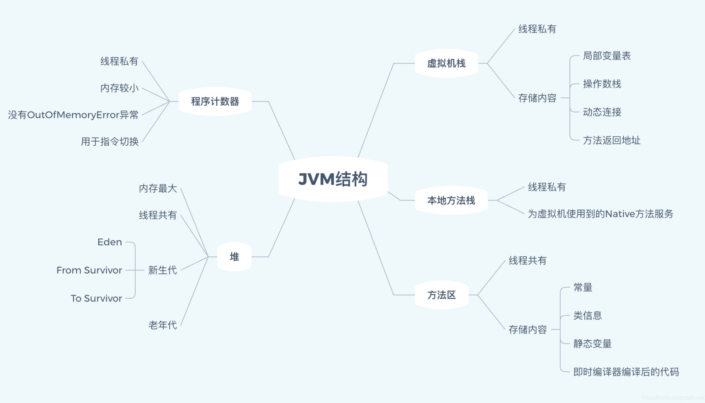


运行时数据区域划分


- JDK1.8前：


| 线程共享 | Heap堆区、**Method Area方法区**  |
| -------- | -------------------------------- |
| 线程私有 | 程序计数器、虚拟机栈、本地方法栈 |


- **JDK1.8后**：


| 线程私有 | Heap堆区、**MetaSpace元空间**    |
  | -------- | -------------------------------- |
| 线程私有 | 程序计数器、虚拟机栈、本地方法栈 |


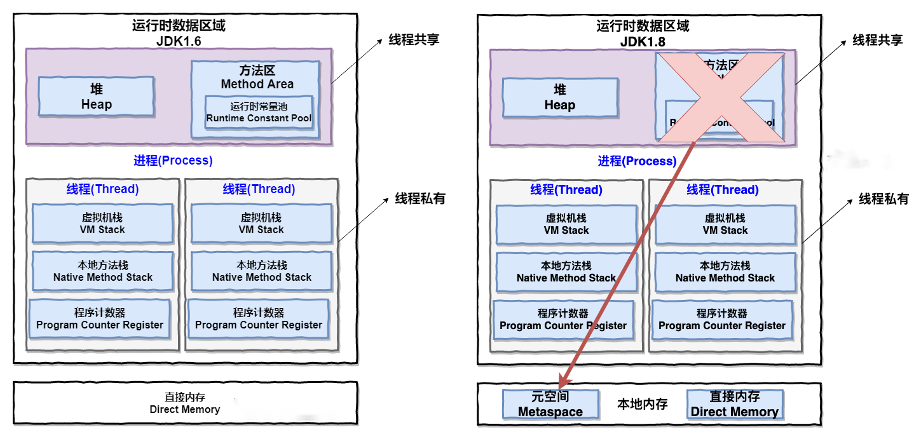


### 2、JVM架构图

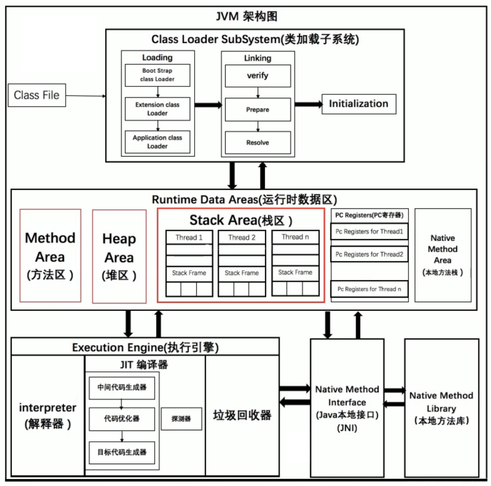

总结：

​		一个Class File文件首先经过ClassLoader的加载、链接（包括：验证、准备、解析）、初始化加载到元空间，一些符号引用被解析为直接引用或等到运行时分派（动态绑定）。
然后程序通过class对象来访问元空间里的各种类型数据，当加载完之后，执行引擎发现main方法，也就是程序入口，那么就会创建相应的栈帧，执行引擎逐行读取方法内的代码转换为机器码，而这些指令大多已经被解析为直接引用了，那么执行引擎通过持有这些直接引用去元空间寻找变量对应的字面量来进行方法操作。
完成操作后，栈帧出栈，内存空间被GC回收。

### 3、类加载机制（双亲委派）

#### 3.1【1.8以及之前版本】

- **启动类加载器（Bootstrap Class Loader）**

  该加载器使用C++实现（不会继承ClassLoader），是虚拟机自身的一部分。该类加载器主要是负责加载存放在JAVA_HOME\lib目录，或者被-Xbootclasspath参数指定路径存放的，并且是java虚拟机能识别的类库加载到虚拟机内存中。（eg:主要是加载java的核心类库，即加载lib目录下的所有class）

- **扩展类加载器（Extension Class Loader）**

  这个类加载器主要是负责加载JAVA_HOME\lib\ext目录中，或者被java.ext.dirs系统变量所指定的路径中所有类库

- **应用类加载器（Application Class Loader)**

  这个类加载器是由sun.misc.Launcher$AppClassLoader来实现，因为该加载器是ClassLoader类中的getSystemClassLoader()方法的返回值，所以一般也称为该加载器为系统类加载器。该加载器主要是加载用户类路径上所有的类库，如果应用程序中没有定义过自己的类加载器，一般情况下这个就是程序的默认加载器。
  

​		在类加载的时候，系统会首先判断当前类是否被加载过。已经被加载的类会直接返回，否则才会尝试加载。加载的时候，首先会把该请求委派给父类加载器的 loadClass() 处理，因此所有的请求最终都应该传送到顶层的启动类加载器 BootstrapClassLoader 中。当父类加载器无法处理时，才由自己来处理。当父类加载器为 null 时，会使用启动类加载器 BootstrapClassLoader 作为父类加载器。

好处：

（1）避免了类的重复加载

（2）保护了程序的安全性，防止核心的API被修改

#### 3.2【1.9以及之后版本】

在java9以及以后的版本中，为了模块化系统的顺利实施，模块下的类加载器主要有几个变动：

（1）扩展类加载器（Extension Class Loader）被平台类加载器（Platform ClassLoader）取代（java9中整个JDK都是基于了模块化的构建，原来的rt.jar和tools.jar都被拆分了数十个JMOD文件）。因为java类库可以满足扩展的需求并且能随时组合构建出程序运行的jre,所以取消了JAVA_HOME\lib\ext和JAVA_HOME\jre目录

（2）平台类加载器和应用程序类加载器都不在派生自java.net.URLClassLoader。现在启动类加载器、平台类加载器、应用程序类加载器全都继承于jdk.internal.loader.BuiltinClassLoader,在BuiltinClassLoader中实现了新的模块化架构下类如何从模块中加载的逻辑，以及模块中资源可访问性的处理。

就是说平台以及应用程序类加载器收到类的加载请求的时候，在委派给父类加载器家在之前，要先判断该类是否归属于摸一个系统模块，如果可以找到这样的归属关系，就要优先委派给负责那个模块的加载器完成加载。如下图：


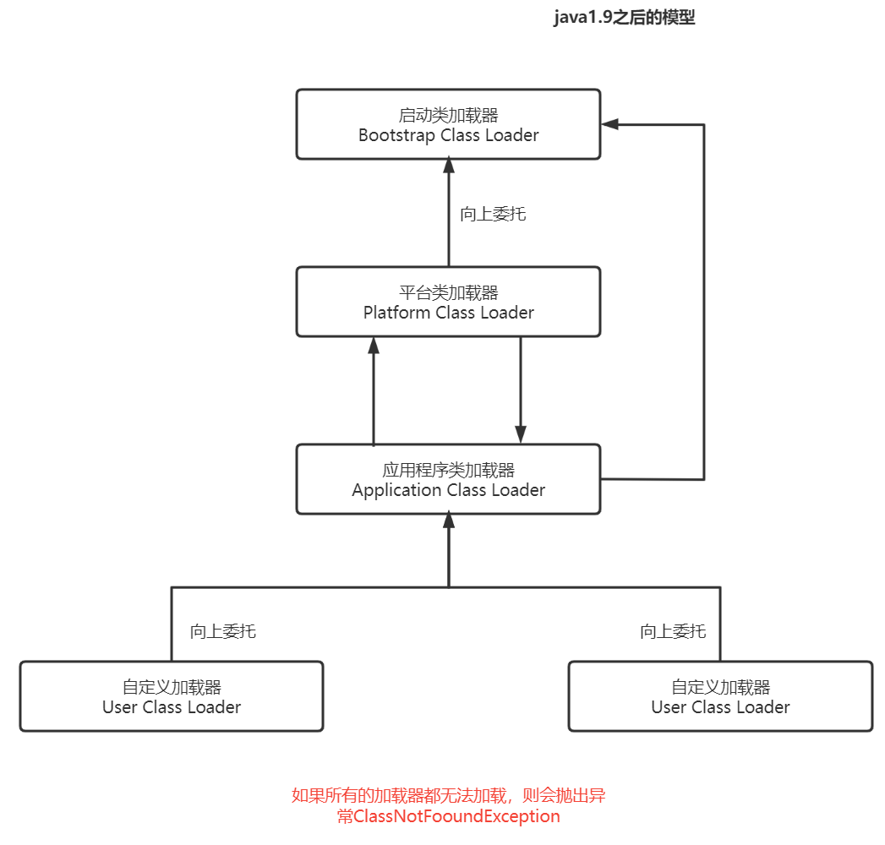

#### 3.3、如果不想用双亲委派模型怎么办？

​		自定义加载器的话，需要继承 ClassLoader 。如果我们不想打破双亲委派模型，就重写 ClassLoader 类中的 findClass() 方法即可，无法被父类加载器加载的类最终会通过这个方法被加载。但是，如果想打破双亲委派模型则需要重写 loadClass() 方法

#### 3.4、为什么说 Java SPI 的设计会违反双亲委派原则呢？

​		首先双亲委派原则本身并非 JVM 强制模型。
​		Java 在核心类库中，定义了许多接口，并给出了针对这些接口的调用逻辑，但未给出接口实现。核心类库由启动类加载器加载。接口的实现类交由开发者实现，然而实现类不会被启动类加载器所加载，基于双亲委派的可见性原则，SPI 调用方无法拿到实现类。

​		SPI Serviceloader 通过线程上下文获取能够加载实现类的classloader，一般情况下是 application classloader，绕过了双亲委派模型的层级限制，逻辑上打破了双亲委派原则。

### 4、虚拟机栈

​        

​		


​		栈绝对算的上是 JVM 运行时数据区域的一个核心，除了一些 Native 方法调用是通过本地方法栈实现的(后面会提到)，其他所有的 Java 方法调用都是通过栈来实现的（也需要和其他运行时数据区域比如程序计数器配合）。

​		栈由一个个栈帧组成，而每个栈帧中都拥有：**局部变量表、操作数栈、动态链接、方法返回地址**。和数据结构上的栈类似，两者都是先进后出的数据结构，只支持出栈和入栈两种操作。

#### 4.1、局部变量表

​		主要存放了编译期可知的各种数据类型（boolean、byte、char、short、int、float、long、double）、对象引用（reference 类型，它不同于对象本身，可能是一个指向对象起始地址的引用指针，也可能是指向一个代表对象的句柄或其他与此对象相关的位置）。

#### 4.2、操作数栈

​		主要作为方法调用的中转站使用，用于存放方法执行过程中产生的中间计算结果。另外，计算过程中产生的临时变量也会放在操作数栈中。

#### 4.3、动态链接

​		主要服务一个方法需要调用其他方法的场景。在 Java 源文件被编译成字节码文件时，所有的变量和方法引用都作为符号引用（Symbilic Reference）保存在 Class 文件的常量池里。当一个方法要调用其他方法，需要将常量池中指向方法的符号引用转化为其在内存地址中的直接引用。动态链接的作用就是为了将符号引用转换为调用方法的直接引用。

#### 4.4、方法返回地址

​		方法正常退出或异常退出的地址，无论方法是否正常完成，都需要返回到方法被调用的位置，程序才能继续进行。

​		栈空间虽然不是无限的，但一般正常调用的情况下是不会出现问题的。不过，如果函数调用陷入无限循环的话，就会导致栈中被压入太多栈帧而占用太多空间，导致栈空间过深。那么当线程请求栈的深度超过当前 Java 虚拟机栈的最大深度的时候，就抛StackOverFlowError 错误。程序运行中栈可能会出现的错误：

（1）StackOverFlowError： 若栈的内存大小不允许动态扩展，那么当线程请求栈的深度超过当前 Java 虚拟机栈的最大深度的时候，就抛出 StackOverFlowError 错误。

（2）OutOfMemoryError： 如果栈的内存大小可以动态扩展， 如果虚拟机在动态扩展栈时无法申请到足够的内存空间，则抛出OutOfMemoryError异常。


### 5、本地方法栈

​		和虚拟机栈所发挥的作用非常相似，一般是用其它语言（C、C++ 或汇编语言等）编写的，并且被编译为基于本机硬件和操作系统的程序，对待这些方法需要特别处理。

区别是： 
- 虚拟机栈为虚拟机执行 Java 方法 （也就是字节码）服务，而本地方法栈则为虚拟机使用到的 Native 方法服务。 


在 HotSpot 虚拟机中和 Java 虚拟机栈合二为一。

本地方法被执行的时候，在本地方法栈也会创建一个栈帧，用于存放该本地方法的局部变量表、操作数栈、动态链接、出口信息。
方法执行完毕后相应的栈帧也会出栈并释放内存空间，也会出现 StackOverFlowError 和 OutOfMemoryError 两种错误。

**虚拟机栈和本地方法栈为什么是私有的?**
1. 虚拟机栈：每个Java方法在执行的同时会创建一个栈帧用于存储局部变量表、操作数栈、常量池引用等信息。从方法调用直至执行完成的过程，就对应着一个栈帧在 Java 虚拟机栈中入栈和出栈的过程。

2. 本地方法栈：和虚拟机栈所发挥的作用非常相似，区别是：
    - 虚拟机栈为虚拟机执行Java方法（也就是字节码）服务，而本地方法栈则为虚拟机使用到的 Native 方法服务。
    - 在HotSpot虚拟机中和Java虚拟机栈合二为一。所以，为了保证线程中的局部变量不被别的线程访问到，虚拟机栈和本地方法栈是线程私有的。


### 6、堆

​		Java 虚拟机所管理的内存中最大的一块，Java堆是所有线程共享的一块内存区域，在虚拟机启动时创建。**几乎所有**的对象实例以及数组都在这里分配内存。
​	  *Java 世界中“几乎”所有的对象都在堆中分配，但是，随着JIT编译器的发展与逃逸分析技术逐渐成熟，栈上分配、标量替换优化技术将会导致一些微妙的变化，所有的对象都分配到堆上也渐渐变得不那么“绝对”了。从JDK1.7开始已经默认开启逃逸分析，如果某些方法中的对象引用没有被返回或者未被外面使用（也就是未逃逸出去），那么对象可以直接在栈上分配内存。*

​		Java 堆是垃圾收集器管理的主要区域，因此也被称作 GC 堆（Garbage Collected Heap）。从垃圾回收的角度，由于现在收集器基本都采用分代垃圾收集算法，所以 Java 堆还可以细分为：新生代和老年代；再细致一点有：Eden、Survivor、Old 等空间。进一步划分的目的是更好地回收内存，或者更快地分配内存。


**为什么 Java 中只有值传递？**
- Java 中没有实现引用传递，而是实现了值传递。这是因为 Java 中所有的参数都是对象的引用，而不是真正的对象。当调用方法时，实际上是传递了对象引用的副本，这就相当于值传递。因此，如果在方法内部修改引用，这些修改不会影响到原始引用，并且对原始对象的任何修改也不会影响到方法内部的引用。这是 Java 的设计选择，目的是保证程序的安全性和稳定性。


#### 6.1、堆内存

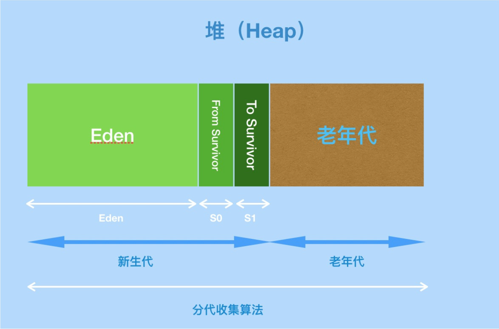

​		在 JDK 7 版本及 JDK 7 版本之前，堆内存被通常分为下面三部分：

1. **年轻代**（Young Generation）
    - 年轻代又分为伊甸园（Eden）和幸存区（Survivor区）；幸存区又分为S0（From Survivor）空间和S1（ To Survivor）空间。
2. **老年代**（Old Generation）
3. **永久代**(Permanent Generation)
   - JDK 8 版本之后 PermGen(永久) 已被 Metaspace(元空间) 取代，元空间使用的是直接内存 。
   大部分情况，对象都会首先在 Eden 区域分配，在一次新生代垃圾回收后，如果对象还存活，则会进入 S0 或者 S1，并且对象的年龄还会加 1(Eden 区->Survivor 区后对象的初始年龄变为 1)，当它的年龄增加到一定程度（默认为 15 岁），就会被晋升到老年代中。对象晋升到老年代的年龄阈值，可以通过参数 -XX:MaxTenuringThreshold 来设置。


### 7、方法区

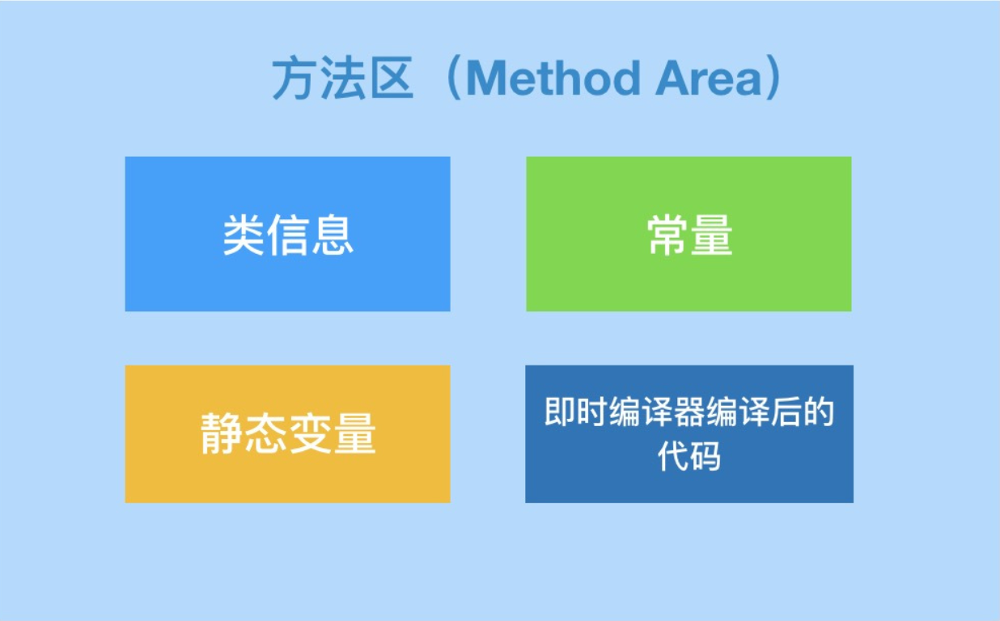

​		方法区属于是 JVM 运行时数据区域的一块逻辑区域，是各个线程共享的内存区域。

​		它存储的是已被虚拟机加载的类信息、常量、静态变量、即时编译器编译后的代码等数据。

​		方法区的内存回收目标主要是针对常量池的回收和对类型的卸载，一般来说这个区域的回收“成绩”比较难以令人满意，尤其是类型的卸载，条件相当苛刻，但是回收确实是有必要的。

#### 7.1、方法区和永久代以及元空间是什么关系？

​		方法区和永久代以及元空间的关系很像 Java 中接口和类的关系，类实现了接口，这里的类就可以看作是永久代和元空间，接口可以看作是方法区，也就是说永久代以及元空间是 HotSpot 虚拟机对虚拟机规范中方法区的两种实现方式。并且，永久代是 JDK 1.8 之前的方法区实现，JDK 1.8 及以后方法区的实现变成了元空间。

#### 7.2、为什么要将永久代 (PermGen) 替换为元空间 (MetaSpace) 呢?

1. 整个永久代有一个JVM本身设置的固定大小上限，无法进行调整，而元空间使用的是直接内存，受本机可用内存的限制，虽然元空间仍旧可能溢出，但是比原来出现的几率会更小。
	当元空间溢出时会得到如下错误： java.lang.OutOfMemoryError: MetaSpace
	可以使用 

   - -XX：MaxMetaspaceSize 标志设置最大元空间大小，默认值为 unlimited，这意味着它只受系统内存的限制。

   - -XX：MetaspaceSize 调整标志定义元空间的初始大小如果未指定此标志，则 Metaspace 将根据运行时的应用程序需求动态地重新调整大小。


2. 元空间里面存放的是类的元数据，这样加载多少类的元数据就不由 MaxPermSize 控制了, 而由系统的实际可用空间来控制，这样能加载的类就更多了。

3. 在 JDK8，合并 HotSpot 和 JRockit 的代码时, JRockit 从来没有一个叫永久代的东西, 合并之后就没有必要额外的设置这么一个永久代的地方了。


#### 7.3、方法区常用参数有哪些？

``` 
    //方法区 (永久代) 初始大小
    -XX:PermSize=N 
    //方法区 (永久代) 最大大小,超过这个值将会抛出 OutOfMemoryError 异常:java.lang.OutOfMemoryError: PermGen
    -XX:MaxPermSize=N 
```

​		相对而言，垃圾收集行为在这个区域是比较少出现的，但并非数据进入方法区后就“永久存在”了。JDK 1.8 的时候，方法区（HotSpot 的永久代）被彻底移除了（JDK1.7 就已经开始了），取而代之是元空间，元空间使用的是直接内存。下面是一些常用参数：

```
    //设置 Metaspace 的初始（和最小大小）
	-XX:MetaspaceSize=N 
	//设置 Metaspace 的最大大小
	-XX:MaxMetaspaceSize=N 
```

与永久代很大的不同就是，如果不指定大小的话，随着更多类的创建，虚拟机会耗尽所有可用的系统内存。


### 8、程序计数器

程序计数器主要有两个作用：
1. 字节码解释器通过改变程序计数器来依次读取指令，从而实现代码的流程控制，如：顺序执行、选择、循环、异常处理。

2. 在多线程的情况下，程序计数器用于记录当前线程执行的位置，从而当线程被切换回来的时候能够知道该线程上次运行到哪儿了。

**⚠️ 注意 ：**

1. 如果执行的是 native 方法，那么程序计数器记录的是 undefined地址，只有执行的是Java代码时程序计数器记录的才是下一条指令的地址。所以，程序计数器私有主要是为了线程切换后能恢复到正确的执行位置。

2. 程序计数器是唯一一个不会出现 OutOfMemoryError 的内存区域，它的生命周期随着线程的创建而创建，随着线程的结束而死亡。

### 9、JVM总结（！！！）

① 类加载器
		如果 JVM 想要执行这个 .class 文件，我们需要将其装进一个 类加载器 中，它就像一个搬运工一样，会把所有的 .class 文件全部搬进JVM里面来。

② 方法区
		方法区 是用于存放类似于元数据信息方面的数据的，比如类信息，常量，静态变量，编译后代码···等
		类加载器将 .class 文件搬过来就是先丢到这一块上

③ 堆
		堆主要放了一些存储的数据，比如对象实例，数组···等，它和方法区都同属于 线程共享区域 。也就是说它们都是 线程不安全 的

④ 栈   
	  栈是我们的代码运行空间。我们编写的每一个方法都会放到 栈 里面运行。我们会听说过 本地方法栈 或者 本地方法接口 这两个名词，不过我们基本不会涉及这两块的内容，它俩底层是使用C来进行工作的，和Java没有太大的关系。

⑤ 程序计数器
	  主要就是完成一个加载工作，类似于一个指针一样的，指向下一行我们需要执行的代码。和栈一样，都是 线程独享 的，就是说每一个线程都会有自己对应的一块区域而不会存在并发和多线程的问题。

虚拟机主要的5大块：方法区，堆都为线程共享区域，有线程安全问题，栈和本地方法栈和计数器都是独享区域，不存在线程安全问题，而 JVM 的调优主要就是围绕堆，栈两大块进行

### 10、JVM常量池和运行时常量池

​		要理解常量池是什么，先看看类的二进制字节码包含哪些信息！！！

#### 10.1、类的二进制字节码包含哪些信息

- (1)常量池
- (2)类的基本信息（比如：类的访问权限、类的名称、实现了哪些接口）
- (3)类的方法定义（包含了虚拟机指令，也就是把我们代码编译为了虚拟机指令 ）

​       将下面的测试代码使用javac 编译为 *.class文件

```java
public class HelloWorld {
    public static void main(String[] args) {
        System.out.println("hello world");
    }
}
```

​		javap反编译*.class字节码

```java
// ===========================================类的描述信息===============================================
Classfile /xx/xx/xx/xx/HelloWorld.class
  Last modified 2021-10-12; size 569 bytes
  MD5 checksum 7f4f0fe4b6e6d04ddaf30401a7b04f07
  Compiled from "HelloWorld.java"
public class org.memory.jvm.t5.HelloWorld
  minor version: 0
  major version: 49
  flags: ACC_PUBLIC, ACC_SUPER
    
// ===========================================常量池===============================================
Constant pool:
   #1 = Methodref          #6.#20         // java/lang/Object."<init>":()V
   #2 = Fieldref           #21.#22        // java/lang/System.out:Ljava/io/PrintStream;
   #3 = String             #23            // hello world
   #4 = Methodref          #24.#25        // java/io/PrintStream.println:(Ljava/lang/String;)V
   #5 = Class              #26            // org/memory/jvm/t5/HelloWorld
   #6 = Class              #27            // java/lang/Object
   #7 = Utf8               <init>
   #8 = Utf8               ()V
   #9 = Utf8               Code
  #10 = Utf8               LineNumberTable
  #11 = Utf8               LocalVariableTable
  #12 = Utf8               this
  #13 = Utf8               Lorg/memory/jvm/t5/HelloWorld;
  #14 = Utf8               main
  #15 = Utf8               ([Ljava/lang/String;)V
  #16 = Utf8               args
  #17 = Utf8               [Ljava/lang/String;
  #18 = Utf8               SourceFile
  #19 = Utf8               HelloWorld.java
  #20 = NameAndType        #7:#8          // "<init>":()V
  #21 = Class              #28            // java/lang/System
  #22 = NameAndType        #29:#30        // out:Ljava/io/PrintStream;
  #23 = Utf8               hello world
  #24 = Class              #31            // java/io/PrintStream
  #25 = NameAndType        #32:#33        // println:(Ljava/lang/String;)V
  #26 = Utf8               org/memory/jvm/t5/HelloWorld
  #27 = Utf8               java/lang/Object
  #28 = Utf8               java/lang/System
  #29 = Utf8               out
  #30 = Utf8               Ljava/io/PrintStream;
  #31 = Utf8               java/io/PrintStream
  #32 = Utf8               println
  #33 = Utf8               (Ljava/lang/String;)V
                            
// =======================================虚拟机中执行编译的方法===========================================
{
  public org.memory.jvm.t5.HelloWorld();
    descriptor: ()V
    flags: ACC_PUBLIC
    Code:
      stack=1, locals=1, args_size=1
         0: aload_0
         1: invokespecial #1                  // Method java/lang/Object."<init>":()V
         4: return
      LineNumberTable:
        line 7: 0
      LocalVariableTable:
        Start  Length  Slot  Name   Signature
            0       5     0  this   Lorg/memory/jvm/t5/HelloWorld;
	
  // main方法JVM指令码
  public static void main(java.lang.String[]);
    descriptor: ([Ljava/lang/String;)V
    // main方法访问修饰符描述
    flags: ACC_PUBLIC, ACC_STATIC
    // main方法中的代码执行部分
    // ===============================解释器读取下面的JVM指令解释并执行===================================             
    Code:
      stack=2, locals=1, args_size=1
         // 从常量池中符号地址为 #2 的地方，先获取静态变量System.out
         0: getstatic     #2                  // Field java/lang/System.out:Ljava/io/PrintStream;
         // 从常量池中符号地址为 #3 的地方加载常量 hello world
         3: ldc           #3                  // String hello world
         // 从常量池中符号地址为 #3 的地方获取要执行的方法描述，并执行方法输出hello world
         5: invokevirtual #4                  // Method java/io/PrintStream.println:(Ljava/lang/String;)V
         // main方法返回
         8: return
    // ==================================解释器读取上面的JVM指令解释并执行================================
      // 行号映射表
      LineNumberTable:
        line 9: 0
        line 10: 8
      // 局部变量表
      LocalVariableTable:
        Start  Length  Slot  Name   Signature
            0       9     0  args   [Ljava/lang/String;
}


```

#### 10.2、什么是常量池

​		从上面的反编译字节码中可以看到，Class的常量池其实就是一张记录着该类的一些常量、方法描述、类描述、变量描述信息的表。**常量池中主要存放两类数据，`一是字面量、二是符号引用`。**

字面量：
- （1）比如String类型的字符串值或者定义为final类型的常量的值。

符号引用：
- （1）类或接口的全限定名（包括他的父类和所实现的接口）
- （2）变量或方法的名称
- （3）变量或方法的描述信息（ 变量的描述信息：变量的返回值；方法的描述：参数个数、参数类型、方法返回类型等等。）
- （4）this

#### 10.3、常量池作用

​		在解释器解释执行每条JVM指令码的时候，根据这些指令码的`符号地址`去常量池中找到对应的描述。然后解释器就知道该执行哪个类的那个方法、方法的参数是什么等。

拿上面反编译的字节码指令来说明：

- （1）当解释器解释执行main方法的时候，读取到JVM指令码 0: getstatic #2
- （2）getstatic指令表示获取一个静态变量，#2表示该静态变量的符号地址，解释器通过#2符号地址去常量池中查找#2对应的静态变量
- （3）解释器继续向下运行，执行下一行 3: ldc #3 指令，该指令的含义是：从常量池中加载符号地址为 #3 的常量
- （4）解释器继续向下运行，执行下一行 5: invokevirtual #4 指令，该指令的含义是：执行方法，那么要执行哪个方法呢？执行常量池中符号地址为 #4 的方法。

```java
  // main方法JVM指令码
  public static void main(java.lang.String[]);
    descriptor: ([Ljava/lang/String;)V
    // main方法访问修饰符描述
    flags: ACC_PUBLIC, ACC_STATIC
    // main方法中的代码执行部分
    // ===============================解释器读取下面的JVM指令解释并执行===================================             
    Code:
      stack=2, locals=1, args_size=1
         // 从常量池中符号地址为 #2 的地方，先获取静态变量System.out
         0: getstatic     #2                  // Field java/lang/System.out:Ljava/io/PrintStream;
         // 从常量池中符号地址为 #3 的地方加载常量 hello world
         3: ldc           #3                  // String hello world
         // 从常量池中符号地址为 #3 的地方获取要执行的方法描述，并执行方法输出hello world
         5: invokevirtual #4                  // Method java/io/PrintStream.println:(Ljava/lang/String;)V
         // main方法返回
         8: return
    // ==================================解释器读取上面的JVM指令解释并执行================================

```

#### 10.4、运行时常量池

​		上面我们分析了常量池其实就是一张对照表，常量池是 `*.class` 文件中的。当类的字节码被加载到内存中后，他的常量池信息就会集中放入到一块内存，这块内存就称为运行时常量池，并且把里面的**符号地址**变为**真实地址**。

​		常量池表会在类加载后存放到**方法区**的运行时常量池中。运行时常量池的功能类似于传统编程语言的符号表，尽管它包含了比典型符号表更广泛的数据。既然运行时常量池是方法区的一部分，自然受到方法区内存的限制，当常量池无法再申请到内存时会抛出 OutOfMemoryError 错误。


**符号地址变为真实地址怎么理解？**
- ①、符号地址: 从上面的反编译后的JVM字节码指令可以看到有这么一条指令0: getstatic #2，解释器解释执行JVM指令的时候，通过指令中的 #x去常量池中获取需要的值。这里的#2其实就是符号地址，标识这某个变量在常量池中的某个位置。

- ②、真实地址在程序运行期，当*.Class文件被加载到内存以后，常量池中的这些描述信息就会被放到内存中，其中的 #x会被转化为内存中的地址（真实地址）。


### 11、字符串常量池

​		字符串常量池 是 JVM 为了提升性能和减少内存消耗针对字符串（String 类）专门开辟的一块区域，主要目的是为了避免字符串的重复创建。
​		JDK1.7 之前，字符串常量池存放在永久代。JDK1.7 字符串常量池和静态变量从永久代移动了 Java 堆中。

JDK 1.7 为什么要将字符串常量池移动到堆中？
		主要是因为永久代（方法区实现）的GC回收效率太低，只有在整堆收集 (Full GC)的时候才会被执行GC。Java程序中通常会有大量的被创建的字符串等待回收，将字符串常量池放到堆中，能够更高效及时地回收字符串内存。

运行时常量池、方法区、字符串常量池这些都是不随虚拟机实现而改变的**逻辑概念**，是公共且抽象的，Metaspace、Heap 是与具体某种虚拟机实现相关的**物理概念**，是私有且具体的。

### 12、直接内存

​		直接内存并不是虚拟机运行时数据区的一部分，也不是虚拟机规范中定义的内存区域，但是这部分内存也被频繁地使用。而且也可能导致 OutOfMemoryError 错误出现。
本机直接内存的分配不会受到 Java 堆的限制，但是，既然是内存就会受到本机总内存大小以及处理器寻址空间的限制。


### 13、HotSpot 虚拟机在 Java 堆中对象分配、布局和访问的全过程（！！！）

✅ Step1: 类加载检查

​		虚拟机遇到一条 new 指令时，首先将去检查这个指令的参数是否能在常量池中定位到这个类的符号引用，并且检查这个符号引用代表的类是否已被加载过、解析和初始化过。如果没有，那必须先执行相应的类加载过程。 

✅ Step2: 分配内存

​		在类加载检查通过后，接下来虚拟机将为新生对象分配内存。**对象所需的内存大小在类加载完成后便可确定**，为对象分配空间的任务等同于把一块确定大小的内存从Java堆中划分出来。分配方式有“指针碰撞”和“空闲列表”两种，选择哪种分配方式由Java堆是否规整决定，而Java堆是否规整又由所采用的垃圾收集器是否带有压缩整理功能决定。

> 内存分配的两种方式 （补充内容，需要掌握）：
- 指针碰撞  
		适用场合 ：堆内存规整（即没有内存碎片）的情况下。
		原理：用过的内存全部整合到一边，没有用过的内存放在另一边，中间有一个分界指针，只需要向着没用过的内存方向将该指针移动对象内存大小位置即可。
		使用该分配方式的 GC 收集器：Serial, ParNew
- 空闲列表 
		适用场合 ： 堆内存不规整的情况下。
		原理：虚拟机会维护一个列表，该列表中会记录哪些内存块是可用的，在分配的时候，找一块儿足够大的内存块儿来划分给对象实例，最后更新列表记录。
		使用该分配方式的GC收集器：CMS

选择以上两种方式中的哪一种，取决于 Java 堆内存是否规整。而 Java 堆内存是否规整，
取决于 GC收集器的算法是"标记-清除"，还是"标记-整理"（也称作"标记-压缩"），值得注意的是，复制算法内存也是规整的。
	
> 内存分配并发问题（补充内容，需要掌握）：
	在创建对象的时候有一个很重要的问题，就是线程安全，因为在实际开发过程中，创建对象是很频繁的事情，作为虚拟机来说，必须要保证线程是安全的，通常来讲，虚拟机采用两种方式来保证线程安全：
- CAS+失败重试： CAS 是乐观锁的一种实现方式。所谓乐观锁就是，每次不加锁而是假设没有冲突而去完成某项操作，如果因为冲突失败就重试，直到成功为止。虚拟机采用CAS配上失败重试的方式保证更新操作的原子性。
- TLAB： 为每一个线程预先在 Eden 区分配一块儿内存，JVM 在给线程中的对象分配内存时，首先在 TLAB 分配，当对象大于 TLAB 中的剩余内存或 TLAB 的内存已用尽时，再采用上述的 CAS 进行内存分配

✅ Step3: 初始化零值

​		内存分配完成后，虚拟机需要将分配到的内存空间都初始化为零值（不包括对象头），这一步操作保证了对象的实例字段在 Java 代码中可以不赋初始值就直接使用，程序能访问到这些字段的数据类型所对应的零值。

✅ Step4: 设置对象头

​		初始化零值完成之后，虚拟机要对对象进行必要的设置，例如这个对象是哪个类的实例、如何才能找到类的元数据信息、对象的哈希码、对象的 GC 分代年龄等信息。 这些信息存放在对象头中。 另外，根据虚拟机当前运行状态的不同，如是否启用偏向锁等，对象头会有不同的设置方式。

✅ Step5: 执行 init 方法

​		在上面工作都完成之后，从虚拟机的视角来看，一个新的对象已经产生了，但从 Java 程序的视角来看，对象创建才刚开始，<init>方法还没有执行，所有的字段都还为零。所以一般来说，执行 new 指令之后会接着执行 <init>方法，把对象按照程序员的意愿进行初始化，这样一个真正可用的对象才算完全产生出来。


### 14、死亡对象判断方法

1. 引用计数法
	给对象中添加一个引用计数器：每当有一个地方引用它，计数器就加 1；当引用失效，计数器就减 1；任何时候计数器为 0 的对象就是不可能再被使用的。这个方法实现简单，效率高，但是目前主流的虚拟机中并没有选择这个算法来管理内存，其最主要的原因是它很难解决对象之间相互循环引用的问题。

2. 可达性分析算法
	这个算法的基本思想就是通过一系列的称为 “GC Roots” 的对象作为起点，从这些节点开始向下搜索，节点所走过的路径称为引用链，当一个对象到 GC Roots 没有任何引用链相连的话，则证明此对象是不可用的，需要被回收。

**哪些对象可以作为 GC Roots 呢？**
- 虚拟机栈(栈帧中的本地变量表)中引用的对象
- 本地方法栈(Native 方法)中引用的对象
- 方法区中类静态属性引用的对象
- 方法区中常量引用的对象
- 所有被同步锁持有的对象


### 15、对象可以被回收，就代表一定会被回收吗？

​		即使在可达性分析法中不可达的对象，也并非是“非死不可”的，这时候它们暂时处于“缓刑阶段”，要真正宣告一个对象死亡，至少要经历两次标记过程；可达性分析法中不可达的对象被第一次标记并且进行一次筛选，筛选的条件是此对象是否有必要执行finalize方法。当对象没有覆盖finalize方法，或finalize方法已经被虚拟机调用过时，虚拟机将这两种情况视为没有必要执行。
被判定为需要执行的对象将会被放在一个队列中进行第二次标记，除非这个对象与引用链上的任何一个对象建立关联，否则就会被真的回收。
Object 类中的 finalize 方法一直被认为是一个糟糕的设计，成为了 Java 语言的负担，影响了 Java 语言的安全和 GC 的性能。JDK9 版本及后续版本中各个类中的 finalize 方法会被逐渐弃用移除。忘掉它的存在吧！


### 16、强引用、软引用、弱引用、虚引用

​		无论是通过引用计数法判断对象引用数量，还是通过可达性分析法判断对象的引用链是否可达，判定对象的存活都与“引用”有关。

- JDK1.2 之前，Java 中引用的定义很传统：如果 reference 类型的数据存储的数值代表的是另一块内存的起始地址，就称这块内存代表一个引用。
- JDK1.2 以后，Java 对引用的概念进行了扩充，将引用分为强引用、软引用、弱引用、虚引用四种（引用强度逐渐减弱）

（1）强引用（StrongReference）

​		以前我们使用的大部分引用实际上都是强引用，这是使用最普遍的引用。如果一个对象具有强引用，那就类似于必不可少的生活用品，垃圾回收器绝不会回收它。当内存空间不足，Java 虚拟机宁愿抛出 OutOfMemoryError 错误，使程序异常终止，也不会靠随意回收具有强引用的对象来解决内存不足问题。

（2）软引用（SoftReference）

​		如果一个对象只具有软引用，那就类似于可有可无的生活用品。如果内存空间足够，垃圾回收器就不会回收它，如果内存空间不足了，就会回收这些对象的内存。只要垃圾回收器没有回收它，该对象就可以被程序使用。软引用可用来实现内存敏感的高速缓存。软引用可以和一个引用队列（ReferenceQueue）联合使用，如果软引用所引用的对象被垃圾回收，JAVA 虚拟机就会把这个软引用加入到与之关联的引用队列中。

（3）弱引用（WeakReference）

​		如果一个对象只具有弱引用，那就类似于可有可无的生活用品。弱引用与软引用的区别在于：只具有弱引用的对象拥有更短暂的生命周期。在垃圾回收器线程扫描它所管辖的内存区域的过程中，一旦发现了只具有弱引用的对象，不管当前内存空间足够与否，都会回收它的内存。不过，由于垃圾回收器是一个优先级很低的线程， 因此不一定会很快发现那些只具有弱引用的对象。弱引用可以和一个引用队列（ReferenceQueue）联合使用，如果弱引用所引用的对象被垃圾回收，Java虚拟机就会把这个弱引用加入到与之关联的引用队列中。

（4）虚引用（PhantomReference）

​		"虚引用"顾名思义，就是形同虚设，与其他几种引用都不同，虚引用并不会决定对象的生命周期。如果一个对象仅持有虚引用，那么它就和没有任何引用一样，在任何时候都可能被垃圾回收。
​		虚引用主要用来跟踪对象被垃圾回收的活动。

**虚引用与软引用和弱引用的一个区别在于**
    虚引用必须和引用队列（ReferenceQueue）联合使用。当垃圾回收器准备回收一个对象时，如果发现它还有虚引用，
    就会在回收对象的内存之前，把这个虚引用加入到与之关联的引用队列中。程序可以通过判断引用队列中是否已经加入了虚引用，
    来了解被引用的对象是否将要被垃圾回收。程序如果发现某个虚引用已经被加入到引用队列，那么就可以在所引用的对象的内存被回收之前采取必要的行动。
		
**特别注意！！！**
    在程序设计中一般很少使用弱引用与虚引用，使用软引用的情况较多，这是因为软引用可以加速JVM对垃圾内存的回收速度，可以维护系统的运行安全，防止内存溢出（OutOfMemory）等问题的产生。

#### 16.1 ThreadLocal是什么?为什么要使用ThreadLocal？

`ThreadLocal`，即线程本地变量。如果你创建了一个`ThreadLocal`变量，那么访问这个变量的每个线程都会有这个变量的一个本地拷贝，多个线程操作这个变量的时候，实际是在操作自己本地内存里面的变量，从而起到**线程隔离**的作用，避免了并发场景下的线程安全问题。

```java
//创建一个ThreadLocal变量
static ThreadLocal<String> localVariable = new ThreadLocal<>();
```

**为什么要使用ThreadLocal**

并发场景下，会存在多个线程同时修改一个共享变量的场景。这就可能会出现**线性安全问题**。

为了解决线性安全问题，可以用加锁的方式，比如使用`synchronized` 或者`Lock`。但是加锁的方式，可能会导致系统变慢。加锁示意图如下：

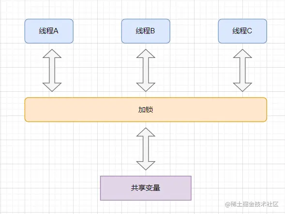

还有另外一种方案，就是使用空间换时间的方式，即使用`ThreadLocal`。使用`ThreadLocal`类访问共享变量时，会在每个线程的本地，都保存一份共享变量的拷贝副本。多线程对共享变量修改时，实际上操作的是这个变量副本，从而保证线性安全。

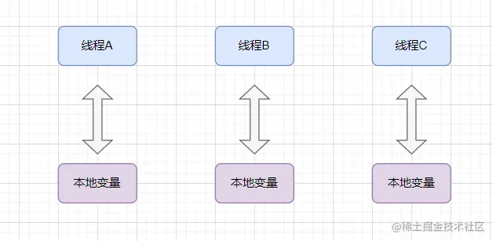

#### 16.2 一个ThreadLocal的使用案例

日常开发中，`ThreadLocal`经常在日期转换工具类中出现，我们先来看个**反例**：

```java

/**
 * 日期工具类
 */
public class DateUtil {

    private static final SimpleDateFormat simpleDateFormat =
            new SimpleDateFormat("yyyy-MM-dd HH:mm:ss");

    public static Date parse(String dateString) {
        Date date = null;
        try {
            date = simpleDateFormat.parse(dateString);
        } catch (ParseException e) {
            e.printStackTrace();
        }
        return date;
    }
  
  // 在多线程环境跑`DateUtil`这个工具类：
  public static void main(String[] args) {
        ExecutorService executorService = Executors.newFixedThreadPool(10);

        for (int i = 0; i < 10; i++) {
            executorService.execute(()->{
                System.out.println(DateUtil.parse("2022-07-24 16:34:30"));
            });
        }
        executorService.shutdown();
    }
  
}
```

运行后，发现报错了：

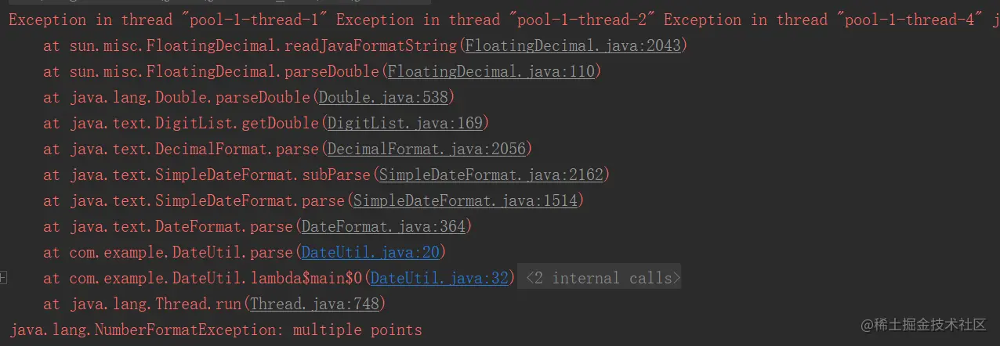

如果在`DateUtil`工具类，加上`ThreadLocal`，运行则不会有这个问题：

```java
/**
 * 日期工具类
 */
public class DateUtil {

    private static ThreadLocal<SimpleDateFormat> dateFormatThreadLocal =
            ThreadLocal.withInitial(() -> new SimpleDateFormat("yyyy-MM-dd HH:mm:ss"));

    public static Date parse(String dateString) {
        Date date = null;
        try {
            date = dateFormatThreadLocal.get().parse(dateString);
        } catch (ParseException e) {
            e.printStackTrace();
        }
        return date;
    }

    public static void main(String[] args) {
        ExecutorService executorService = Executors.newFixedThreadPool(10);

        for (int i = 0; i < 10; i++) {
            executorService.execute(()->{
                System.out.println(DateUtil.parse("2022-07-24 16:34:30"));
            });
        }
        executorService.shutdown();
    }
}

//运行结果
Sun Jul 24 16:34:30 GMT+08:00 2022
Sun Jul 24 16:34:30 GMT+08:00 2022
Sun Jul 24 16:34:30 GMT+08:00 2022
Sun Jul 24 16:34:30 GMT+08:00 2022
Sun Jul 24 16:34:30 GMT+08:00 2022
Sun Jul 24 16:34:30 GMT+08:00 2022
Sun Jul 24 16:34:30 GMT+08:00 2022
Sun Jul 24 16:34:30 GMT+08:00 2022
Sun Jul 24 16:34:30 GMT+08:00 2022
Sun Jul 24 16:34:30 GMT+08:00 2022
```

刚刚**反例中**，为什么会报错呢？这是因为`SimpleDateFormat`不是线性安全的，它以共享变量出现时，并发多线程场景下即会报错。

为什么加了`ThreadLocal`就不会有问题呢？并发场景下，`ThreadLocal`是如何保证的呢？我们接下来看看`ThreadLocal`的核心原理。

#### 16.3 ThreadLocal的原理

##### 16.3.1 ThreadLocal的内存结构图

`ThreadLocal`的内存结构图

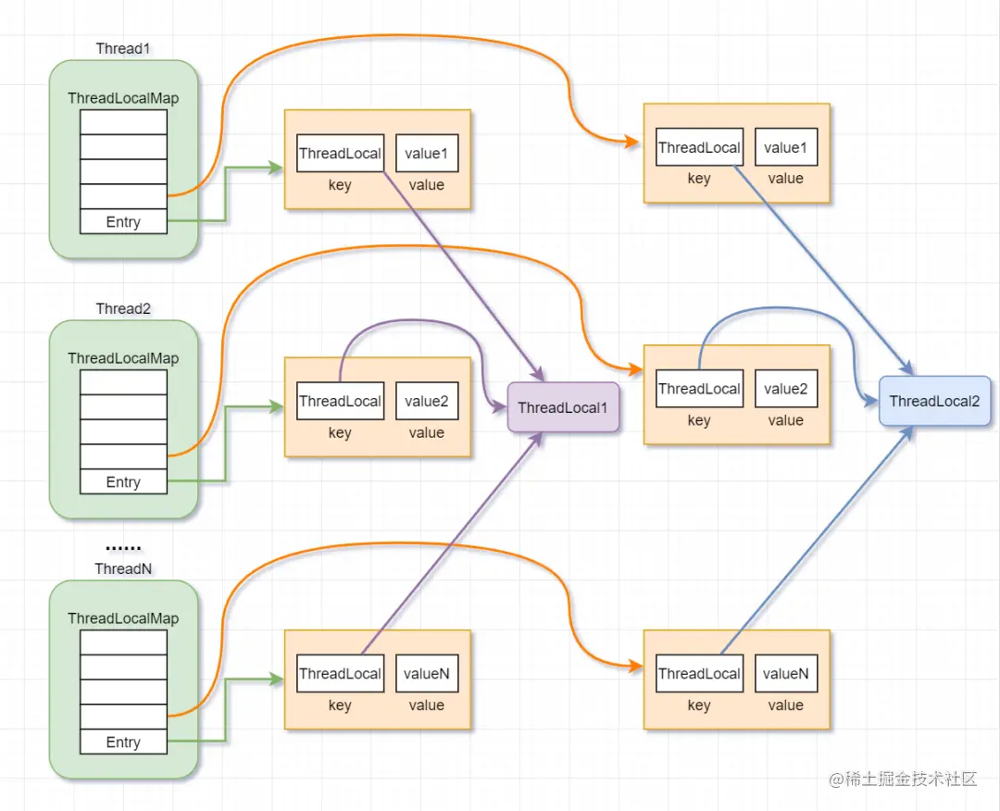

从内存结构图，我们可以看到：

- `Thread`类中，有个`ThreadLocal.ThreadLocalMap`  的成员变量。
- `ThreadLocalMap`内部维护了`Entry`数组，每个`Entry`代表一个完整的对象，`key`是`ThreadLocal`本身，`value`是`ThreadLocal`的泛型对象值。

##### 16.3.2 关键源码分析

```java
// Thread类源码，可以看到成员变量ThreadLocalMap的初始值是为null
public class Thread implements Runnable {
   //ThreadLocal.ThreadLocalMap是Thread的属性
   ThreadLocal.ThreadLocalMap threadLocals = null;
}


// ThreadLocalMap的关键源码如下：
static class ThreadLocalMap {
    
    static class Entry extends WeakReference<ThreadLocal<?>> {
        /** The value associated with this ThreadLocal. */
        Object value;

        Entry(ThreadLocal<?> k, Object v) {
            super(k);
            value = v;
        }
    }
    //Entry数组
    private Entry[] table;
    
    // ThreadLocalMap的构造器，ThreadLocal作为key
    ThreadLocalMap(ThreadLocal<?> firstKey, Object firstValue) {
        table = new Entry[INITIAL_CAPACITY];
        int i = firstKey.threadLocalHashCode & (INITIAL_CAPACITY - 1);
        table[i] = new Entry(firstKey, firstValue);
        size = 1;
        setThreshold(INITIAL_CAPACITY);
    }
}
```

`ThreadLocal`类中的关键`set()`方法：

```java
 public void set(T value) {
        Thread t = Thread.currentThread(); //获取当前线程t
        ThreadLocalMap map = getMap(t);  //根据当前线程获取到ThreadLocalMap
        if (map != null)  //如果获取的ThreadLocalMap对象不为空
            map.set(this, value); //K，V设置到ThreadLocalMap中
        else
            createMap(t, value); //创建一个新的ThreadLocalMap
    }
    
     ThreadLocalMap getMap(Thread t) {
       return t.threadLocals; //返回Thread对象的ThreadLocalMap属性
    }

    void createMap(Thread t, T firstValue) { //调用ThreadLocalMap的构造函数
        t.threadLocals = new ThreadLocalMap(this, firstValue); this表示当前类ThreadLocal
    }
    
```

`ThreadLocal`类中的关键`get()`方法

```java
    public T get() {
        Thread t = Thread.currentThread();//获取当前线程t
        ThreadLocalMap map = getMap(t);//根据当前线程获取到ThreadLocalMap
        if (map != null) { //如果获取的ThreadLocalMap对象不为空
            //由this（即ThreadLoca对象）得到对应的Value，即ThreadLocal的泛型值
            ThreadLocalMap.Entry e = map.getEntry(this);
            if (e != null) {
                @SuppressWarnings("unchecked")
                T result = (T)e.value; 
                return result;
            }
        }
        return setInitialValue(); //初始化threadLocals成员变量的值
    }
    
     private T setInitialValue() {
        T value = initialValue(); //初始化value的值
        Thread t = Thread.currentThread(); 
        ThreadLocalMap map = getMap(t); //以当前线程为key，获取threadLocals成员变量，它是一个ThreadLocalMap
        if (map != null)
            map.set(this, value);  //K，V设置到ThreadLocalMap中
        else
            createMap(t, value); //实例化threadLocals成员变量
        return value;
    }
```

所以怎么回答**ThreadLocal的实现原理**？如下，最好是能结合以上结构图一起说明哈~

- `Thread`线程类有一个类型为`ThreadLocal.ThreadLocalMap`的实例变量`threadLocals`，即每个线程都有一个属于自己的`ThreadLocalMap`。
- `ThreadLocalMap`内部维护着`Entry`数组，每个`Entry`代表一个完整的对象，`key`是`ThreadLocal`本身，`value`是`ThreadLocal`的泛型值。
- 并发多线程场景下，每个线程`Thread`，在往`ThreadLocal`里设置值的时候，都是往自己的`ThreadLocalMap`里存，读也是以某个`ThreadLocal`作为引用，在自己的`map`里找对应的`key`，从而可以实现了**线程隔离**。

了解完这几个核心方法后，有些小伙伴可能会有疑惑，`ThreadLocalMap`为什么要用`ThreadLocal`作为key呢？直接用`线程Id`不一样嘛？

#### 16.4 为什么不直接用线程id作为ThreadLocalMap的key呢？

举个代码例子，如下：

```java
public class TianLuoThreadLocalTest {

    private static final ThreadLocal<String> threadLocal1 = new ThreadLocal<>();
    private static final ThreadLocal<String> threadLocal2 = new ThreadLocal<>();
 
}
```

这种场景：一个使用类，有两个共享变量，也就是说用了两个`ThreadLocal`成员变量的话。如果用线程`id`作为`ThreadLocalMap`的`key`，怎么区分哪个`ThreadLocal`成员变量呢？因此还是需要使用`ThreadLocal`作为`Key`来使用。每个`ThreadLocal`对象，都可以由`threadLocalHashCode`属性**唯一区分**的，每一个ThreadLocal对象都可以由这个对象的名字唯一区分（**下面的例子**）。看下`ThreadLocal`代码：

```java
public class ThreadLocal<T> {
  private final int threadLocalHashCode = nextHashCode();
  
  private static int nextHashCode() {
    return nextHashCode.getAndAdd(HASH_INCREMENT);
  }
}
```

然后我们再来看下一个代码例子：

```java
public class TianLuoThreadLocalTest {

    public static void main(String[] args) {
        Thread t = new Thread(new Runnable(){
            public void run(){
                ThreadLocal<UserDTO> threadLocal1 = new ThreadLocal<>();
                threadLocal1.set(new UserDTO("test1"));
                System.out.println(threadLocal1.get());
                ThreadLocal<UserDTO> threadLocal2 = new ThreadLocal<>();
                threadLocal2.set(new UserDTO("test2"));
                System.out.println(threadLocal2.get());
            }});
        t.start();
    }

}
//运行结果
TianLuoDTO{name='test1'}
TianLuoDTO{name='test2'}
```

再对比下这个图，可能就更清晰一点啦：

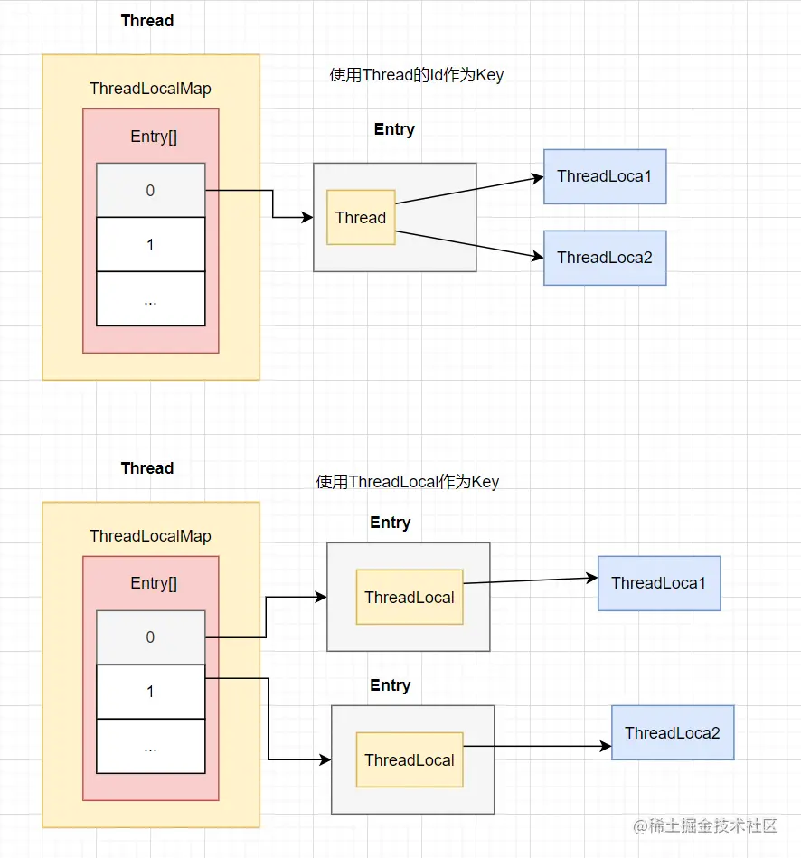

#### 16.5 TreadLocal为什么会导致内存泄漏呢？

**16.5.1 弱引用导致的内存泄漏呢？**

TreadLocal的引用示意图:

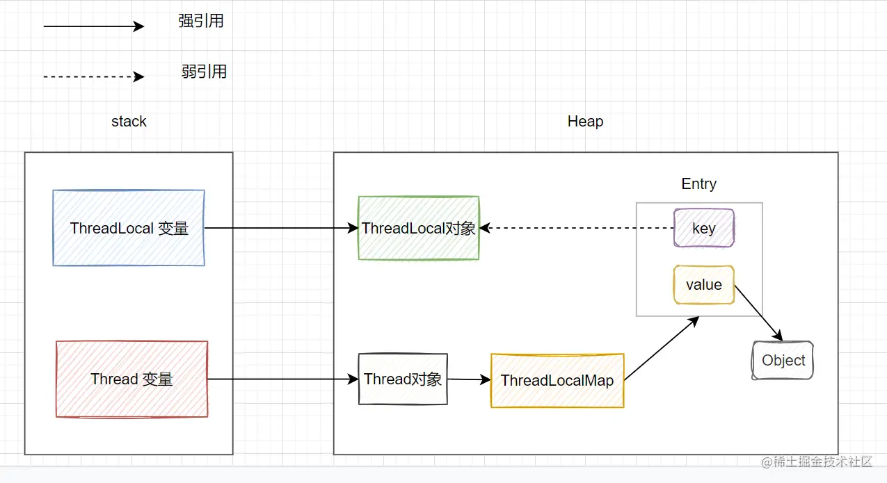

关于ThreadLocal内存泄漏，网上比较流行的说法是这样的：

`ThreadLocalMap`使用`ThreadLocal`的**弱引用**作为`key`，当`ThreadLocal`变量被手动设置为`null`，即一个`ThreadLocal`没有外部强引用来引用它，当系统GC时，`ThreadLocal`一定会被回收。这样的话，`ThreadLocalMap`中就会出现`key`为`null`的`Entry`，就没有办法访问这些`key`为`null`的`Entry`的`value`，如果当前线程再迟迟不结束的话(比如线程池的核心线程)，这些`key`为`null`的`Entry`的`value`就会一直存在一条强引用链：Thread变量 -> Thread对象 -> ThreaLocalMap -> Entry -> value -> Object 永远无法回收，造成内存泄漏。

当ThreadLocal变量被手动设置为`null`后的引用链图：

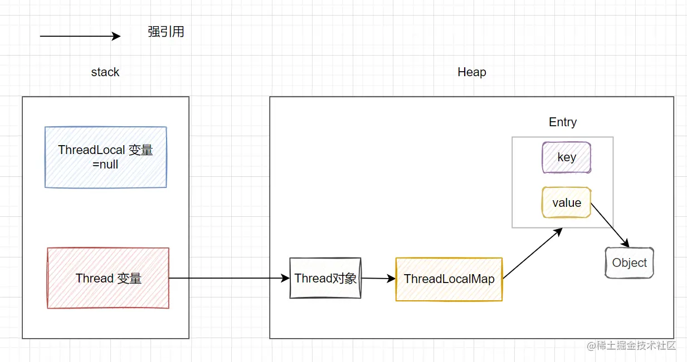

实际上，`ThreadLocalMap`的设计中已经考虑到这种情况。所以也加上了一些防护措施：即在`ThreadLocal`的`get`,`set`,`remove`方法，都会清除线程`ThreadLocalMap`里所有`key`为`null`的`value`。

源代码中，是有体现的，如`ThreadLocalMap`的`set`方法：

```java
  private void set(ThreadLocal<?> key, Object value) {

      Entry[] tab = table;
      int len = tab.length;
      int i = key.threadLocalHashCode & (len-1);

      for (Entry e = tab[i];
            e != null;
            e = tab[i = nextIndex(i, len)]) {
          ThreadLocal<?> k = e.get();

          if (k == key) {
              e.value = value;
              return;
          }

           //如果k等于null,则说明该索引位之前放的key(threadLocal对象)被回收了,这通常是因为外部将threadLocal变量置为null,
           //又因为entry对threadLocal持有的是弱引用,一轮GC过后,对象被回收。
            //这种情况下,既然用户代码都已经将threadLocal置为null,那么也就没打算再通过该对象作为key去取到之前放入threadLocalMap的value, 因此ThreadLocalMap中会直接替换调这种不新鲜的entry。
          if (k == null) {
              replaceStaleEntry(key, value, i);
              return;
          }
        }

        tab[i] = new Entry(key, value);
        int sz = ++size;
        //触发一次Log2(N)复杂度的扫描,目的是清除过期Entry  
        if (!cleanSomeSlots(i, sz) && sz >= threshold)
          rehash();
    }
```

ThreadLocal的`get`方法：

```java
  public T get() {
    Thread t = Thread.currentThread();
    ThreadLocalMap map = getMap(t);
    if (map != null) {
        //去ThreadLocalMap获取Entry，方法里面有key==null的清除逻辑
        ThreadLocalMap.Entry e = map.getEntry(this);
        if (e != null) {
            @SuppressWarnings("unchecked")
            T result = (T)e.value;
            return result;
        }
    }
    return setInitialValue();
}

private Entry getEntry(ThreadLocal<?> key) {
        int i = key.threadLocalHashCode & (table.length - 1);
        Entry e = table[i];
        if (e != null && e.get() == key)
             return e;
        else
          //里面有key==null的清除逻辑
          return getEntryAfterMiss(key, i, e);
    }
        
private Entry getEntryAfterMiss(ThreadLocal<?> key, int i, Entry e) {
        Entry[] tab = table;
        int len = tab.length;

        while (e != null) {
            ThreadLocal<?> k = e.get();
            if (k == key)
                return e;
            // Entry的key为null,则表明没有外部引用,且被GC回收,是一个过期Entry
            if (k == null)
                expungeStaleEntry(i); //删除过期的Entry
            else
                i = nextIndex(i, len);
            e = tab[i];
        }
        return null;
    }
```

**16.5.2 key是弱引用，GC回收会影响ThreadLocal的正常工作嘛？**

到这里，有些小伙伴可能有疑问，`ThreadLocal`的`key`既然是**弱引用**.会不会GC贸然把`key`回收掉，进而影响`ThreadLocal`的正常使用？

> - **弱引用**:具有弱引用的对象拥有更短暂的生命周期。如果一个对象只有弱引用存在了，则下次GC**将会回收掉该对象**（不管当前内存空间足够与否）

其实不会的，因为有`ThreadLocal变量`引用着它，是不会被GC回收的，除非手动把`ThreadLocal变量设置为null`，我们可以跑个demo来验证一下：

```java
  public class WeakReferenceTest {
    public static void main(String[] args) {
        Object object = new Object();
        WeakReference<Object> testWeakReference = new WeakReference<>(object);
        System.out.println("GC回收之前，弱引用："+testWeakReference.get());
        //触发系统垃圾回收
        System.gc();
        System.out.println("GC回收之后，弱引用："+testWeakReference.get());
        //手动设置为object对象为null
        object=null;
        System.gc();
        System.out.println("对象object设置为null，GC回收之后，弱引用："+testWeakReference.get());
    }
}
运行结果：
GC回收之前，弱引用：java.lang.Object@7b23ec81
GC回收之后，弱引用：java.lang.Object@7b23ec81
对象object设置为null，GC回收之后，弱引用：null
```

**16.5.3 ThreadLocal内存泄漏的demo**

```java
public class ThreadLocalTestDemo {

    private static ThreadLocal<TianLuoClass> myThreadLocal = new ThreadLocal<>();


    public static void main(String[] args) throws InterruptedException {

        ThreadPoolExecutor threadPoolExecutor = new ThreadPoolExecutor(5, 5, 1, TimeUnit.MINUTES, new LinkedBlockingQueue<>());

        for (int i = 0; i < 10; ++i) {
            threadPoolExecutor.execute(new Runnable() {
                @Override
                public void run() {
                    System.out.println("创建对象：");
                    UserDTO userDTO = new UserDTO();
                    myThreadLocal.set(userDTO);
                    userDTO = null; //将对象设置为 null，表示此对象不在使用了
                   // myThreadLocal.remove();
                }
            });
            Thread.sleep(1000);
        }
    }

    static class TianLuoClass {
        // 100M
        private byte[] bytes = new byte[100 * 1024 * 1024];
    }
}


创建对象：
创建对象：
创建对象：
创建对象：
Exception in thread "pool-1-thread-4" java.lang.OutOfMemoryError: Java heap space
	at com.example.dto.ThreadLocalTestDemo$TianLuoClass.<init>(ThreadLocalTestDemo.java:33)
	at com.example.dto.ThreadLocalTestDemo$1.run(ThreadLocalTestDemo.java:21)
	at java.util.concurrent.ThreadPoolExecutor.runWorker(ThreadPoolExecutor.java:1149)
	at java.util.concurrent.ThreadPoolExecutor$Worker.run(ThreadPoolExecutor.java:624)
	at java.lang.Thread.run(Thread.java:748)
```

运行结果出现了OOM，`myThreadLocal.remove();`加上后，则不会`OOM`。

```
创建对象：
创建对象：
创建对象：
创建对象：
创建对象：
创建对象：
创建对象：
创建对象：
......
```

我们这里**没有手动设置**`myThreadLocal`变量为`null`，但是还是**会内存泄漏**。因为我们使用了线程池，线程池有很长的生命周期，因此线程池会一直持有`userDTO`对象的`value`值，即使设置`userDTO = null;`引用还是存在的。这就好像，你把一个个对象`object`放到一个`list`列表里，然后再单独把`object`设置为`null`的道理是一样的，列表的对象还是存在的。

```java
    public static void main(String[] args) {
        List<Object> list = new ArrayList<>();
        Object object = new Object();
        list.add(object);
        object = null;
        System.out.println(list.size());
    }
    //运行结果
    1
```

所以内存泄漏就这样发生啦，最后内存是有限的，就抛出了`OOM`了。如果我们加上`threadLocal.remove();`，则不会内存泄漏。为什么呢？因为`threadLocal.remove();`会清除`Entry`，源码如下：

```java
    private void remove(ThreadLocal<?> key) {
      Entry[] tab = table;
      int len = tab.length;
      int i = key.threadLocalHashCode & (len-1);
      for (Entry e = tab[i];
          e != null;
          e = tab[i = nextIndex(i, len)]) {
          if (e.get() == key) {
              //清除entry
              e.clear();
            expungeStaleEntry(i);
            return;
        }
    }
}
```

有些小伙伴说，既然内存泄漏不一定是因为弱引用，那为什么需要设计为弱引用呢？我们来探讨下：

#### 16.6 Entry的Key为什么要设计成弱引用呢？

通过源码，我们是可以看到`Entry`的`Key`是设计为弱引用的(`ThreadLocalMap`使用`ThreadLocal`的弱引用作为`Key`的)。为什么要设计为弱引用呢？

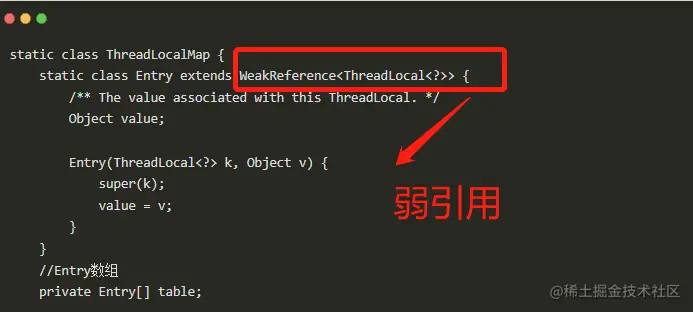

我们先来看看官方文档，为什么要设计为弱引用：

> To help deal with very large and long-lived usages, the hash table entries use WeakReferences for keys.
为了应对非常大和长时间的用途，哈希表使用弱引用的 key。


我再把ThreadLocal的引用示意图搬过来：


下面我们分情况讨论：

- 如果`Key`使用强引用：当`ThreadLocal`的对象被回收了，但是`ThreadLocalMap`还持有`ThreadLocal`的强引用的话，如果没有手动删除，ThreadLocal就不会被回收，会出现Entry的内存泄漏问题。
- 如果`Key`使用弱引用：当`ThreadLocal`的对象被回收了，因为`ThreadLocalMap`持有ThreadLocal的弱引用，即使没有手动删除，ThreadLocal也会被回收。`value`则在下一次`ThreadLocalMap`调用`set,get，remove`的时候会被清除。

因此可以发现，使用弱引用作为`Entry`的`Key`，可以多一层保障：弱引用`ThreadLocal`不会轻易内存泄漏，对应的`value`在下一次`ThreadLocalMap`调用`set,get,remove`的时候会被清除。

实际上，我们的内存泄漏的根本原因是，不再被使用的`Entry`，没有从线程的`ThreadLocalMap`中删除。一般删除不再使用的`Entry`有这两种方式：

- 一种就是，使用完`ThreadLocal`，手动调用`remove()`，把`Entry从ThreadLocalMap`中删除
- 另外一种方式就是：`ThreadLocalMap`的自动清除机制去清除过期`Entry`.（`ThreadLocalMap`的`get(),set()`时都会触发对过期`Entry`的清除）

#### 16.7 ThreadLocal的应用场景和使用注意点

`ThreadLocal`的**很重要一个注意点**，就是使用完，要手动调用`remove()`。

而`ThreadLocal`的应用场景主要有以下这几种：

- 使用日期工具类，当用到`SimpleDateFormat`，使用ThreadLocal保证线性安全
- 全局存储用户信息（用户信息存入`ThreadLocal`，那么当前线程在任何地方需要时，都可以使用）
- 保证同一个线程，获取的数据库连接`Connection`是同一个，使用`ThreadLocal`来解决线程安全的问题
- 使用`MDC`保存日志信息。

## 


### 17、如何判断一个常量是废弃常量？

（1）JDK1.7 之前运行时常量池逻辑包含字符串常量池存放在方法区, 此时 hotspot 虚拟机对方法区的实现为永久代

（2）JDK1.7 字符串常量池被从方法区拿到了堆中, 这里没有提到运行时常量池,也就是说字符串常量池被单独拿到堆,运行时常量池剩下的东西还在方法区, 也就是 hotspot 中的永久代 。

（3）JDK1.8 hotspot 移除了永久代用元空间(Metaspace)取而代之, 这时候字符串常量池还在堆, 运行时常量池还在方法区, 只不过方法区的实现从永久代变成了元空间(Metaspace)

​		假如在字符串常量池中存在字符串 "abc"，如果当前没有任何 String 对象引用该字符串常量的话，就说明常量 "abc" 就是废弃常量，如果这时发生内存回收的话而且有必要的话，"abc" 就会被系统清理出常量池了。


### 18、如何判断一个类是无用的类

类需要同时满足下面 3 个条件才能算是 “无用的类” ：
（1）该类所有的实例都已经被回收，也就是 Java 堆中不存在该类的任何实例。

（2）加载该类的 ClassLoader 已经被回收。

（3）该类对应的 java.lang.Class 对象没有在任何地方被引用，无法在任何地方通过反射访问该类的方法。

虚拟机可以对满足上述 3 个条件的无用类进行回收，这里说的仅仅是“可以”，而并不是和对象一样不使用了就会必然被回收。


### 19、垃圾收集算法（！！！）

#### 19.1、标记-清除算法

​		该算法分为“标记”和“清除”阶段：首先标记出所有不需要回收的对象，在标记完成后统一回收掉所有没有被标记的对象。它是最基础的收集算法，后续的算法都是对其不足进行改进得到。这种垃圾收集算法会带来两个明显的问题：效率问题、空间问题（标记清除后会产生大量不连续的碎片）

#### 19.2、标记-复制算法

​		为了解决效率问题，“标记-复制”收集算法出现了。它可以将内存分为大小相同的两块，每次使用其中的一块。当这一块的内存使用完后，就将还存活的对象复制到另一块去，然后再把使用的空间一次清理掉。这样就使每次的内存回收都是对内存区间的一半进行回收。

#### 19.3、标记-整理算法

​		根据老年代的特点提出的一种标记算法，标记过程仍然与“标记-清除”算法一样，但后续步骤不是直接对可回收对象回收，而是让所有存活的对象向一端移动，然后直接清理掉端边界以外的内存。

#### 19.4、分代收集算法

​		根据对象存活周期的不同将内存分为几块。一般将 java 堆分为新生代和老年代，这样我们就可以根据各个年代的特点选择合适的垃圾收集算法。
​		比如在新生代中，每次收集都会有大量对象死去，所以可以选择”标记-复制“算法，只需要付出少量对象的复制成本就可以完成每次垃圾收集。而老年代的对象存活几率是比较高的，而且没有额外的空间对它进行分配担保，所以我们必须选择“标记-清除”或“标记-整理”算法进行垃圾收集。


### 20、垃圾收集器

如果说收集算法是内存回收的方法论，那么垃圾收集器就是内存回收的具体实现。

#### 20.1、Serial 收集器

​		Serial（串行）收集器是最基本、历史最悠久的垃圾收集器了。大家看名字就知道这个收集器是一个单线程收集器了。它的 “单线程” 的意义不仅仅意味着它只会使用一条垃圾收集线程去完成垃圾收集工作，更重要的是它在进行垃圾收集工作的时候必须暂停其他所有的工作线程（ "Stop The World" ），直到它收集结束。新生代采用标记-复制算法，老年代采用标记-整理算法。
虚拟机的设计者们当然知道 Stop The World 带来的不良用户体验，所以在后续的垃圾收集器设计中停顿时间在不断缩短（仍然还有停顿，寻找最优秀的垃圾收集器的过程仍然在继续）。但是 Serial 收集器有没有优于其他垃圾收集器的地方呢？当然有，它简单而高效（与其他收集器的单线程相比）。Serial 收集器由于没有线程交互的开销，自然可以获得很高的单线程收集效率。Serial 收集器对于运行在 Client 模式下的虚拟机来说是个不错的选择。

#### 20.2、ParNew 收集器

​		ParNew 收集器其实就是 Serial 收集器的多线程版本，除了使用多线程进行垃圾收集外，其余行为（控制参数、收集算法、回收策略等等）和 Serial 收集器完全一样。新生代采用标记-复制算法，老年代采用标记-整理算法。
它是许多运行在 Server 模式下的虚拟机的首要选择，除了 Serial 收集器外，只有它能与 CMS 收集器（真正意义上的并发收集器，后面会介绍到）配合工作。

**并行和并发概念补充：**
- 并行（Parallel） ：指多条垃圾收集线程并行工作，但此时用户线程仍然处于等待状态。
- 并发（Concurrent）：指用户线程与垃圾收集线程同时执行（但不一定是并行，可能会交替执行），用户程序在继续运行，而垃圾收集器运行在另一个 CPU 上。

#### 20.3、Parallel Scavenge 收集器

​		Parallel Scavenge 收集器也是使用标记-复制算法的多线程收集器，它看上去几乎和 ParNew 都一样。 那么它有什么特别之处呢？

到jdk8为止，默认的垃圾收集器是Parallel Scavenge 和 Parallel Old从jdk9开始，G1收集器成为默认的垃圾收集器 目前来看，G1回收器停顿时间最短而且没有明显缺点，非常适合Web应用。在jdk8中测试Web应用，堆内存6G，新生代4.5G的情况下，Parallel Scavenge 回收新生代停顿长达1.5秒。G1回收器回收同样大小的新生代只停顿0.2秒。

#### 20.4、CMS和G1比较

1、G1和CMS都分为4个阶段,前三个阶段基本相同都为初始标记,并发标记,再次标记,区别在于最后清除阶段CMS是并发的,G1不是并发的,因此CMS最终会产生浮动垃圾,只能等待下次gc才能清除

2、G1可以管理整个堆,而CMS只能作用于老年代,并且CMS在老年代使用的是标记清除算法,会产生内存碎片,而G1使用标记整理算法,不会产生内存碎片

3、G1相比于CMS最大的区别是G1将内存划分为大小相等的Region,可以选择垃圾对象多的Region而不是整个堆从而减少STW,同时使用Region可以更精确控制收集,我们可以手动明确一个垃圾回收的最大时间

### 21、为什么会OOM？

原因不外乎有两点：

① 分配的少了：比如虚拟机本身可使用的内存(一般通过启动时的VM参数指定)太少。

② 应用用的太多，并且用完没释放，浪费了。此时就会造成内存泄露或者内存溢出。

解决办法

① java.lang.OutOfMemoryError: Java heap space ——>java堆内存溢出，此种情况最常见，一般由于内存泄露或者堆的大小设置不当引起。对于内存泄露，需要通过内存监控软件查找程序中的泄露代码，而堆大小可以通过虚拟机参数-Xms,-Xmx等修改。

② java.lang.OutOfMemoryError: PermGen space ——>java永久代溢出，即方法区溢出了，一般出现于大量Class或者jsp页面，或者采用cglib等反射机制的情况，因为上述情况会产生大量的Class信息存储于方法区。此种情况可以通过更改方法区的大小来解决，使用类似-XX:PermSize=64m -XX:MaxPermSize=256m的形式修改。另外，过多的常量尤其是字符串也会导致方法区溢出。

③ java.lang.StackOverflowError ——> 不会抛OOM error，但也是比较常见的Java内存溢出。JAVA虚拟机栈溢出，一般是由于程序中存在死循环或者深度递归调用造成的，栈大小设置太小也会出现此种溢出。可以通过虚拟机参数-Xss来设置栈的大小。


## 四、JMM

​		对于 Java 来说，你可以把 JMM 看作是 Java 定义的并发编程相关的一组规范，除了抽象了线程和主内存之间的关系之外，其还规定了从 **Java 源代码到 CPU 可执行指令的这个转化过程要遵守哪些和并发相关的原则和规范**，其主要目的是**为了简化多线程编程，增强程序可移植性的**。为什么要遵守这些并发相关的原则和规范呢？ 这是因为并发编程下，像 CPU 多级缓存和指令重排这类设计可能会导致程序运行出现一些问题。就比如说我们上面提到的指令重排序就可能会让多线程程序的执行出现问题，为此，JMM 抽象了 happens-before 原则来解决这个指令重排序问题。JMM 说白了就是定义了一些规范来解决这些问题，开发者可以利用这些规范更方便地开发多线程程序。对于 Java 开发者说，你不需要了解底层原理，直接使用并发相关的一些关键字和类（比如 volatile、synchronized、各种 Lock）即可开发出并发安全的程序。

### 1、CPU 缓存模型

​		CPU Cache 缓存的是内存数据用于解决 CPU 处理速度和内存不匹配的问题，内存缓存的是硬盘数据用于解决硬盘访问速度过慢的问题。CPU 为了解决内存缓存不一致性问题可以通过制定**缓存一致协议（比如 MESI 协议）**

1.1 MESI工作原理（单核 CPU）

| **状态**                 | **描述**                                                     |
| :----------------------- | ------------------------------------------------------------ |
| M 修改 (Modified)        | 该Cache line有效，数据被修改了，和内存中的数据不一致，数据只存在于本Cache中。 |
| E 独享、互斥 (Exclusive) | 该Cache line有效，缓存行内容和内存中的一样，而且其它处理器都没有这行数据； |
| S 共享 (Shared)          | 该Cache line有效，缓存行内容和内存中的一样, 有可能其它处理器也存在此缓存行的拷贝 |
| I 无效 (Invalid)         | 该Cache line无效。                                           |


### 2、什么是指令重排序？

（1）编译器优化重排 ：编译器（包括 JVM、JIT 编译器等）在不改变单线程程序语义的前提下，重新安排语句的执行顺序。

（2）指令并行重排：现代处理器采用了指令级并行技术(Instruction-Level Parallelism，ILP)来将多条指令重叠执行。如果不存在数据依赖性，处理器可以改变语句对应机器指令的执行顺序。


另外，内存系统也会有“重排序”，但又不是真正意义上的重排序。在 JMM 里表现为主存和本地内存的内容可能不一致，进而导致程序在多线程下执行可能出现问题。

Java 源代码会经历 编译器优化重排 —> 指令并行重排 —> 内存系统重排 的过程，最终才变成操作系统可执行的指令序列。

**指令重排序可以保证串行语义一致，但是没有义务保证多线程间的语义也一致 ，所以在多线程下，指令重排序可能会导致一些问题。**
编译器和处理器的指令重排序的处理方式不一样。对于编译器，通过禁止特定类型的编译器重排序的方式来禁止重排序。对于处理器，通过插入内存屏障（Memory Barrier，或有时叫做内存栅栏，Memory Fence）的方式来禁止特定类型的处理器重排序。指令并行重排和内存系统重排都属于是处理器级别的指令重排序。

内存屏障（Memory Barrier，或有时叫做内存栅栏，Memory Fence）是一种 CPU 指令，用来禁止处理器指令发生重排序（像屏障一样），从而保障指令执行的有序性。另外，为了达到屏障的效果，它也会使处理器写入、读取值之前，将主内存的值写入高速缓存，清空无效队列，从而保障变量的可见性。


### 3、什么是主内存？什么是本地内存？

主内存 ：所有线程创建的实例对象都存放在主内存中，不管该实例对象是成员变量还是方法中的本地变量(也称局部变量)
本地内存：每个线程都有一个私有的本地内存来存储共享变量的副本，并且，每个线程只能访问自己的本地内存，无法访问其他线程的本地内存。本地内存是 JMM 抽象出来的一个概念，存储了主内存中的共享变量副本。

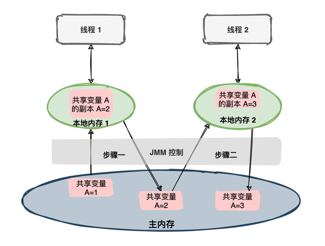


### 4、一个变量如何从主内存拷贝到工作内存，如何从工作内存同步到主内存之间的实现细节

主内存和工作内存之间的交互有具体的交互协议，JMM定义了八种操作来完成，这八种操作是原子的、不可再分的，它们分别是：lock，unlock，read，load，use，assign，store，write，其中lock,unlock,read,write作用于主内存；load,use,assign,store作用于工作内存。

(1) lock:将主内存中的变量锁定，为一个线程所独占

(2) unclock:将lock加的锁定解除，此时其它的线程可以有机会访问此变量

(3) read:将主内存中的变量值读到工作内存当中

(4) load:将read读取的值保存到工作内存中的变量副本中。

(5) use:将值传递给线程的代码执行引擎

(6) assign:将执行引擎处理返回的值重新赋值给变量副本

(7) store:将变量副本的值存储到主内存中。

(8) write:将store存储的值写入到主内存的共享变量当中。

- 从主存复制变量到当前工作内存（read and load）
- 执行代码，改变共享变量值 （use and assign）
- 用工作内存数据刷新主存相关内容 （store and write）

**指令规则**

- read 和 load、store和write必须成对出现
- assign操作，工作内存变量改变后必须刷回主内存
- 同一时间只能运行一个线程对变量进行lock，当前线程lock可重入，unlock次数必须等于lock的次数，该变量才能解锁。
- 对一个变量lock后，会清空该线程工作内存变量的值，重新执行load或者assign操作初始化工作内存中变量的值。
- unlock前，必须将变量同步到主内存（store/write操作）

>除了这 8 种同步操作之外，还规定了下面这些同步规则来保证这些同步操作的正确执行（了解即可，无需死记硬背）：
 - 不允许一个线程无原因地（没有发生过任何 assign 操作）把数据从线程的工作内存同步回主内存中。
 - 一个新的变量只能在主内存中 “诞生”，不允许在工作内存中直接使用一个未被初始化（load 或 assign）的变量，换句话说就是对一个变量实施 use 和 store 操作之前，必须先执行过了 assign 和 load 操作。
 - 一个变量在同一个时刻只允许一条线程对其进行 lock 操作，但 lock 操作可以被同一条线程重复执行多次，多次执行 lock 后，只有执行相同次数的 unlock 操作，变量才会被解锁。
 - 如果对一个变量执行 lock 操作，将会清空工作内存中此变量的值，在执行引擎使用这个变量前，需要重新执行 load 或 assign 操作初始化变量的值。
 - 如果一个变量事先没有被 lock 操作锁定，则不允许对它执行 unlock 操作，也不允许去 unlock 一个被其他线程锁定住的变量。
 - ......


### 5、JVM 内存结构（Java内存区域）和 JMM（Java 内存模型） 有何区别？

JVM 内存结构和内存模型是完全不一样的两个东西 ：

（1）JVM 内存结构和 Java 虚拟机的运行时区域相关，定义了 JVM 在运行时如何分区存储程序数据，就比如说堆主要用于存放对象实例。

（2）Java 内存模型和 Java 的并发编程相关，抽象了线程和主内存之间的关系就比如说线程之间的共享变量必须存储在主内存中，规定了从 Java 源代码到 CPU 可执行指令的这个转化过程要遵守哪些和并发相关的原则和规范，其主要目的是为了简化多线程编程，增强程序可移植性的。


### 6、happens-before 原则

（1）为了对编译器和处理器的约束尽可能少，只要不改变程序的执行结果（单线程程序和正确执行的多线程程序），编译器和处理器怎么进行重排序优化都行。

（2）对于会改变程序执行结果的重排序，JMM 要求编译器和处理器必须禁止这种重排序。


### 7、JSR-133 对 happens-before 原则的定义

从 JDK5 开始，java 使用新的 JSR -133 内存模型。

（1）如果一个操作happens-before另一个操作，那么第一个操作的执行结果将对第二个操作可见，并且第一个操作的执行顺序排在第二个操作之前。

（2）两个操作之间存在happens-before关系，并不意味着Java平台的具体实现必须要按照happens-before关系指定的顺序来执行。如果重排序之后的执行结果，与按 happens-before 关系来执行的结果一致，那么 JMM 也允许这样的重排序。


### 8、happens-before 常见规则有哪些？谈谈你的理解？

happens-before 的规则就 8 条，说多不多，重点了解下面列举的5条即可。全记是不可能的，很快就忘记了，意义不大，随时查阅即可。

（1）程序顺序规则 ：一个线程内，按照代码顺序，书写在前面的操作 happens-before 于书写在后面的操作；

（2）解锁规则 ：解锁 happens-before 于加锁；

（3）volatile 变量规则 ：对一个 volatile 变量的写操作 happens-before 于后面对这个 volatile 变量的读操作。说白了就是对 volatile 变量的写操作的结果对于发生于其后的任何操作都是可见的。

（4）传递规则 ：如果 A happens-before B，且 B happens-before C，那么 A happens-before C；

（5）线程启动规则 ：Thread 对象的 start()方法 happens-before 于此线程的每一个动作。如果两个操作不满足上述任意一个 happens-before 规则，那么这两个操作就没有顺序的保障，JVM 可以对这两个操作进行重排序。

happens-before 与 JMM 的关系如下图所示：

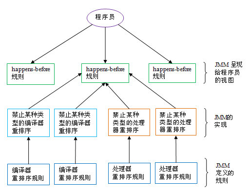


### 9、并发编程三个重要特性

（1）原子性：
	一次操作或者多次操作，要么所有的操作全部都得到执行并且不会受到任何因素的干扰而中断，要么都不执行。
	在 Java 中，可以借助synchronized 、各种 Lock 以及各种原子类实现原子性。
	synchronized 和各种 Lock 可以保证任一时刻只有一个线程访问该代码块，因此可以保障原子性。各种原子类是利用 CAS (compare and swap) 操作（可能也会用到 volatile或者final关键字）来保证原子操作。

（2）可见性：
	当一个线程对共享变量进行了修改，那么另外的线程都是立即可以看到修改后的最新值。
	在 Java 中，可以借助synchronized、volatile以及各种Lock实现可见性。如果我们将变量声明为volatile，这就指示JVM，这个变量是共享且不稳定的，每次使用它都到主存中进行读取。

（3）有序性：
	由于指令重排序问题，代码的执行顺序未必就是编写代码时候的顺序。我们上面讲重排序的时候也提到过：指令重排序可以保证串行语义一致，但是没有义务保证多线程间的语义也一致 ，所以在多线程下，指令重排序可能会导致一些问题。在 Java 中，volatile 关键字可以禁止指令进行重排序优化。


## 五、并发编程

### 1、什么是线程和进程?

​	（1）进程是程序的一次执行过程，是系统运行程序的基本单位，因此进程是动态的。系统运行一个程序即是一个进程从创建，运行到消亡的过程。在 Java 中，当我们启动 main 函数时其实就是启动了一个 JVM 的进程，而 main 函数所在的线程就是这个进程中的一个线程，也称主线程。

​	（2）线程与进程相似，但线程是一个比进程更小的执行单位。一个进程在其执行的过程中可以产生多个线程。与进程不同的是**同类的多个线程共享进程的堆和方法区资源，但每个线程有自己的程序计数器、虚拟机栈和本地方法栈**，所以系统在产生一个线程，或是在各个线程之间作切换工作时，负担要比进程小得多，也正因为如此，线程也被称为轻量级进程。

一个进程中可以有多个线程，多个线程共享进程的堆和方法区 (JDK1.8 之后的元空间)资源，但是每个线程有自己的程序计数器、虚拟机栈 和 本地方法栈。


### 2、为什么要使用多线程呢?

多核 CPU 时代意味着多个线程可以同时运行，这减少了线程上下文切换的开销。
利用好多线程机制可以大大提高系统整体的并发能力以及性能。
在单核时代多线程主要是为了提高单进程利用 CPU 和 IO 系统的效率。
多核时代多线程主要是为了提高进程利用多核 CPU 的能力。


### 3、线程的生命周期和状态?

​	**NEW: 初始状态**，线程被创建出来但没有被调用 start() 。

​	**RUNNABLE: 运行状态**，线程被调用了 start()等待运行的状态。

​	**BLOCKED ：阻塞状态**，需要等待锁释放。

​	**WAITING：等待状态**，表示该线程需要等待其他线程做出一些特定动作（通知或中断）。

​	**TIME_WAITING：超时等待状态**，可以在指定的时间后自行返回而不是像 WAITING 那样一直等待。

​	**TERMINATED：终止状态**，表示该线程已经运行完毕。

（1）线程创建之后它将处于 NEW（新建） 状态，调用 start() 方法后开始运行，线程这时候处于 READY（可运行） 状态。可运行状态的线程获得了 CPU 时间片（timeslice）后就处于 RUNNING（运行） 状态。

>在操作系统层面，线程有 READY 和 RUNNING 状态；而在 JVM 层面，只能看到 RUNNABLE 状态，所以 Java系统一般将这两个状态统称为 RUNNABLE（运行中） 状态 。

>为什么 JVM 没有区分这两种状态呢？
		现在的时分（time-sharing）多任务（multi-task）操作系统架构通常都是用所谓的“时间分片（time quantum or time slice）”方式进行抢占式（preemptive）轮转调度（round-robin 式）。这个时间分片通常是很小的，一个线程一次最多只能在 CPU 上运行比如 10-20ms 的时间（此时处于 running 状态），也即大概只有 0.01 秒这一量级，时间片用后就要被切换下来放入调度队列的末尾等待再次调度。（也即回到 ready 状态）。线程切换的如此之快，区分这两种状态就没什么意义了。


（2）当线程执行wait()方法之后，线程进入WAITING（等待）状态。进入等待状态的线程需要依靠其他线程的通知才能够返回到运行状态。

（3）TIMED_WAITING(超时等待) 状态相当于在等待状态的基础上增加了超时限制，比如通过 sleep（long millis）方法或 wait（long millis）方法可以将线程置于 TIMED_WAITING 状态。当超时时间结束后，线程将会返回到 RUNNABLE 状态。

（4）当线程进入synchronized 方法/块或者调用wait后（被notify）重新进入synchronized 方法/块，但是锁被其它线程占有，这个时候线程就会进入BLOCKED（阻塞）状态。

（5）线程在执行完了run()方法之后将会进入到 TERMINATED（终止） 状态。


### 4、什么是上下文切换?

​		线程在执行过程中会有自己的运行条件和状态（也称上下文），比如上文所说到过的程序计数器，栈信息等。当出现如下情况的时候，线程会从占用 CPU 状态中退出。
（1）主动让出 CPU，比如调用了 sleep(), wait() 等。

（2）时间片用完，因为操作系统要防止一个线程或者进程长时间占用 CPU 导致其他线程或者进程饿死。

（3）调用了阻塞类型的系统中断，比如请求 IO，线程被阻塞。

（4）被终止或结束运行

​		这其中前三种都会发生线程切换，**线程切换意味着需要保存当前线程的上下文，留待线程下次占用 CPU 的时候恢复现场****。并加载下一个将要占用 CPU 的线程上下文。**这就是所谓的上下文切换。上下文切换是现代操作系统的基本功能，因其每次需要保存信息恢复信息，这将会占用CPU，内存等系统资源进行处理，也就意味着效率会有一定损耗，如果频繁切换就会造成整体效率低下。


### 5、什么是线程死锁?如何避免死锁?

多个线程同时被阻塞，它们中的一个或者全部都在等待某个资源被释放。由于线程被无限期地阻塞，因此程序不可能正常终止。

产生死锁的四个必要条件：

（1）互斥条件：该资源任意一个时刻只由一个线程占用。

（2）请求与保持条件：一个线程因请求资源而阻塞时，对已获得的资源保持不放。

（3）不剥夺条件:线程已获得的资源在未使用完之前不能被其他线程强行剥夺，只有自己使用完毕后才释放资源。

（4）循环等待条件:若干线程之间形成一种头尾相接的循环等待资源关系。

破坏死锁的产生的必要条件：

（1）破坏请求与保持条件 ：一次性申请所有的资源。

（2）破坏不剥夺条件 ：占用部分资源的线程进一步申请其他资源时，如果申请不到，可以主动释放它占有的资源。

（3）破坏循环等待条件 ：靠按序申请资源来预防。按某一顺序申请资源，释放资源则反序释放。破坏循环等待条件。


### 6、sleep() 方法和 wait() 方法对比

（1）sleep() 方法没有释放锁，而 wait() 方法释放了锁 。

（2）wait() 通常被用于线程间交互/通信，sleep()通常被用于暂停执行。

（3）wait() 方法被调用后，线程不会自动苏醒，需要别的线程调用同一个对象上的 notify()或者 notifyAll() 方法。sleep()方法执行完成后，线程会自动苏醒，或者也可以使用 wait(long timeout) 超时后线程会自动苏醒。

（4）sleep() 是 Thread 类的静态本地方法，wait() 则是 Object 类的本地方法。

  >为什么 wait() 方法不定义在 Thread 中？sleep() 方法定义在 Thread 中？**
  - （1）wait()是让获得对象锁的线程实现等待，会自动释放当前线程占有的对象锁。每个对象（Object）都拥有对象锁，既然要释放当前线程占有的对象锁并让其进入 WAITING 状态，自然是要操作对应的对象（Object）而非当前的线程（Thread）。
  - （2）sleep() 是让当前线程暂停执行，不涉及到对象类，也不需要获得对象锁。


### 7、可以直接调用 Thread 类的 run 方法吗？

​		new 一个 Thread，线程进入了新建状态。调用 start()方法，会启动一个线程并使线程进入了就绪状态，当分配到时间片后就可以开始运行了。 start() 会执行线程的相应准备工作，然后自动执行 run() 方法的内容，这是真正的多线程工作。 但是，直接执行 run() 方法，会把 run() 方法当成一个 main 线程下的普通方法去执行，并不会在某个线程中执行它，所以这并不是多线程工作。


### 8、volatile

​		volatile 关键字其实并非是 Java 语言特有的，在 C 语言里也有，它最原始的意义就是禁用 CPU 缓存。如果我们将一个变量使用 volatile 修饰，这就指示 编译器，这个变量是共享且不稳定的，每次使用它都到主存中进行读取。volatile关键字能保证数据的可见性，但不能保证数据的原子性。synchronized 关键字两者都能保证。
​		在 Java 中，volatile 关键字除了可以保证变量的可见性，还有一个重要的作用就是防止 JVM 的指令重排序。 如果我们将变量声明为 volatile ，在对这个变量进行读写操作的时候，会通过插入特定的 **内存屏障** 的方式来禁止指令重排序。

参考eg 六.4、一个变量如何从主内存拷贝到工作内存，如何从工作内存同步到主内存之间的实现细节


### 9、synchronized

synchronized 关键字加到 static 静态方法和 synchronized(class) 代码块上都是是给 Class 类上锁；
synchronized 关键字加到实例方法上是给对象实例上锁；
尽量不要使用 synchronized(String a) 因为 JVM 中，字符串常量池具有缓存功能。

构造方法不能使用 synchronized 关键字修饰。
构造方法本身就属于线程安全的，不存在同步的构造方法一说。

**synchronized 底层原理了解吗？synchronized 关键字底层原理属于 JVM 层面的东西。**
- （1）synchronized 同步语句块的实现使用的是 monitorenter 和 monitorexit 指令，其中 monitorenter 指令指向同步代码块的开始位置，monitorexit 指令则指明同步代码块的结束位置。
	当执行monitorenter指令时，线程试图获取锁也就是获取对象监视器monitor的持有权。在执行monitorenter时，会尝试获取对象的锁，如果锁的计数器为 0 则表示锁可以被获取，获取后将锁计数器设为 1 也就是加 1。
	对象锁的的拥有者线程才可以执行monitorexit指令来释放锁。在执行monitorexit指令后，将锁计数器设为0，表明锁被释放，其他线程可以尝试获取锁。
- （2）synchronized 修饰的方法并没有 monitorenter 指令和 monitorexit 指令，取得代之的确实是 ACC_SYNCHRONIZED 标识，该标识指明了该方法是一个同步方法。JVM通过该ACC_SYNCHRONIZED访问标志来辨别一个方法是否声明为同步方法，从而执行相应的同步调用。

如果是实例方法，JVM 会尝试获取实例对象的锁。如果是静态方法，JVM 会尝试获取当前 class 的锁。


#### 9.1 synchronized 和 volatile 有什么区别？

synchronized 关键字和 volatile 关键字是两个互补的存在，而不是对立的存在！

（1）volatile 关键字是线程同步的轻量级实现，所以 volatile性能肯定比synchronized关键字要好 。但是 volatile 关键字只能用于变量而 synchronized 关键字可以修饰方法以及代码块 。

（2）volatile 关键字能保证数据的可见性，但不能保证数据的原子性。synchronized 关键字两者都能保证。

（3）volatile关键字主要用于解决变量在多个线程之间的可见性，而 synchronized 关键字解决的是多个线程之间访问资源的同步性。

#### 9.2 JVM对synchronized的锁优化

Java SE 1.6为了减少获得锁和释放锁带来的性能消耗，引入了“偏向锁”和“轻量级锁”。锁的状态总共有四种，级别从低到高依次是：无锁状态、偏向锁、轻量级锁和重量级锁。随着锁的竞争，锁可以升级**但不能降级**。 

##### 9.2.1 偏向锁

偏向锁的核心思想是，如果一个线程获得了锁，那么锁就进入偏向模式，此时**Mark Word** 的结构也变为偏向锁结构，当这个线程再次请求锁时，无需再做任何同步操作，即获取锁的过程，这样就省去了大量有关锁申请的操作，从而也就提升程序的性能。

对于锁竞争比较激烈的场合，偏向锁就失效了，因为这样场合极有可能每次申请锁的线程都是不相同的

##### 9.2.2 轻量级锁

偏向锁失败，虚拟机并不会立即升级为重量级锁，它还会尝试使用一种称为轻量级锁的优化手段(1.6之后加入的)，此时Mark Word 的结构也变为轻量级锁的结构。轻量级锁能够提升程序性能的依据是“对绝大部分的锁，在整个同步周期内都不存在竞争”，注意这是经验数据。需要了解的是，轻量级锁所适应的场景是线程交替执行同步块的场合，如果存在同一时间访问同一锁的场合，就会导致轻量级锁膨胀为重量级锁。

##### 9.2.3 自旋锁

轻量级锁失败后，虚拟机为了避免线程真实地在操作系统层面挂起，还会进行一项称为自旋锁的优化手段。这是基于在大多数情况下，线程持有锁的时间都不会太长，如果直接挂起操作系统层面的线程可能会得不偿失，毕竟操作系统实现线程之间的切换时需要从用户态转换到核心态，这个状态之间的转换需要相对比较长的时间，时间成本相对较高，因此自旋锁会假设在不久将来，当前的线程可以获得锁，因此虚拟机会让当前想要获取锁的线程做几个空循环(这也是称为自旋的原因)，一般不会太久，可能是50个循环或100循环，在经过若干次循环后，如果得到锁，就顺利进入临界区。如果还不能获得锁，那就会将线程在操作系统层面挂起，这就是自旋锁的优化方式，这种方式确实也是可以提升效率的。最后没办法也就只能升级为重量级锁了。

##### 9.2.4 锁消除

消除锁是虚拟机另外一种锁的优化，这种优化更彻底，Java虚拟机在JIT编译时(可以简单理解为当某段代码即将第一次被执行时进行编译，又称即时编译)，通过对运行上下文的扫描，去除不可能存在共享资源竞争的锁，通过这种方式消除没有必要的锁，可以节省毫无意义的请求锁时间，如下StringBuffer的append是一个同步方法，但是在add方法中的StringBuffer属于一个局部变量，并且不会被其他线程所使用，因此StringBuffer不可能存在共享资源竞争的情景，JVM会自动将其锁消除。

```java
public class StringBufferRemoveSync {

    public void add(String str1, String str2) {
        //StringBuffer是线程安全,由于sb只会在append方法中使用,不可能被其他线程引用
        //因此sb属于不可能共享的资源,JVM会自动消除内部的锁
        StringBuffer sb = new StringBuffer();
        sb.append(str1).append(str2);
    }

    public static void main(String[] args) {
        StringBufferRemoveSync rmsync = new StringBufferRemoveSync();
        for (int i = 0; i < 10000000; i++) {
            rmsync.add("abc", "123");
        }
    }

}
```


### 10、synchronized 和 ReentrantLock ？

（1）两者都是可重入锁
		“可重入锁” 指的是自己可以再次获取自己的内部锁。比如一个线程获得了某个对象的锁，此时这个对象锁还没有释放，当其再次想要获取这个对象的锁的时候还是可以获取的，如果是不可重入锁的话，就会造成死锁。同一个线程每次获取锁，锁的计数器都自增1，所以要等到锁的计数器下降为 0 时才能释放锁。JDK 提供的所有现成的 Lock 实现类，包括 synchronized 关键字锁都是可重入的。

（2）synchronized 是依赖于 JVM 实现的，前面我们也讲到了虚拟机团队在JDK1.6为synchronized关键字进行了很多优化，但是这些优化都是在虚拟机层面实现的，并没有直接暴露给我们。
	ReentrantLock 是 JDK 层面实现的（也就是 API 层面，需要 lock() 和 unlock() 方法配合 try/finally 语句块来完成）

（3）相比synchronized，ReentrantLock增加了一些高级功能。主要来说主要有三点：

​		1)等待可中断 : ReentrantLock提供了一种能够中断等待锁的线程的机制，通过 lock.lockInterruptibly() 来实现这个机制。也就是说正在等待的线程可以选择放弃等待，改为处理其他事情。

​		2)可实现公平锁 : ReentrantLock可以指定是公平锁还是非公平锁。而synchronized只能是非公平锁。所谓的公平锁就是先等待的线程先获得锁。ReentrantLock默认情况是非公平的，可以通过 ReentrantLock类的ReentrantLock(boolean fair)构造方法来制定是否是公平的。

​		3)可实现选择性通知（锁可以绑定多个条件）: synchronized关键字与wait()和notify()/notifyAll()方法相结合可以实现等待/通知机制。ReentrantLock类当然也可以实现，但是需要借助于Condition接口与newCondition()方法。

**关于公平锁和非公平锁的补充：**
- 公平锁 : 锁被释放之后，先申请的线程/进程先得到锁。
- 非公平锁 ：锁被释放之后，后申请的线程/进程可能会先获取到锁，是随机或者按照其他优先级排序的。

>关于 Condition接口的补充：
Condition是 JDK1.5 之后才有的，它具有很好的灵活性，比如可以实现多路通知功能也就是在一个Lock对象中可以创建多个Condition实例（即对象监视器），线程对象可以注册在指定的Condition中，从而可以有选择性的进行线程通知，在调度线程上更加灵活。 在使用notify()/notifyAll()方法进行通知时，被通知的线程是由 JVM 选择的，用ReentrantLock类结合Condition实例可以实现“选择性通知” ，这个功能非常重要，而且是 Condition 接口默认提供的。而synchronized关键字就相当于整个 Lock 对象中只有一个Condition实例，所有的线程都注册在它一个身上。如果执行notifyAll()方法的话就会通知所有处于等待状态的线程，这样会造成很大的效率问题。而Condition实例的signalAll()方法，只会唤醒注册在该Condition实例中的所有等待线程。


## 六、线程池

### 1、使用线程池的好处

（1）降低资源消耗。通过重复利用已创建的线程降低线程创建和销毁造成的消耗。

（2）提高响应速度。当任务到达时，任务可以不需要等到线程创建就能立即执行。

（3）提高线程的可管理性。线程是稀缺资源，如果无限制的创建，不仅会消耗系统资源，还会降低系统的稳定性，使用线程池可以进行统一的分配，调优和监控。


### 2、如何创建线程池？

**方式一：通过构造方法实现**


**方式二：通过 Executor 框架的工具类 Executors 来实现**

可以创建三种类型的 ThreadPoolExecutor：

- **FixedThreadPool** ： 该方法返回一个固定线程数量的线程池。该线程池中的线程数量始终不变。当有一个新的任务提交时，线程池中若有空闲线程，则立即执行。若没有，则新的任务会被暂存在一个任务队列中，待有线程空闲时，便处理在任务队列中的任务。
- **SingleThreadExecutor：** 方法返回一个只有一个线程的线程池。若多余一个任务被提交到该线程池，任务会被保存在一个任务队列中，待线程空闲，按先入先出的顺序执行队列中的任务。
- **CachedThreadPool：** 该方法返回一个可根据实际情况调整线程数量的线程池。线程池的线程数量不确定，但若有空闲线程可以复用，则会优先使用可复用的线程。若所有线程均在工作，又有新的任务提交，则会创建新的线程处理任务。所有线程在当前任务执行完毕后，将返回线程池进行复用。

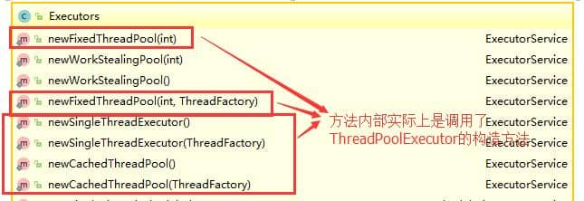

线程池必须手动通过 ThreadPoolExecutor 的构造函数来声明。
**为什么不允许使用 Executors 去创建？** 避免使用Executors 类的 newFixedThreadPool 和 newCachedThreadPool ，因为可能会有 OOM 的风险。

- （1）FixedThreadPool 和 SingleThreadExecutor ： 允许请求的队列长度为 Integer.MAX_VALUE ，可能堆积大量的请求，从而导致 OOM。

- （2）CachedThreadPool 和 ScheduledThreadPool ： 允许创建的线程数量为 Integer.MAX_VALUE ，可能会创建大量线程，从而导致 OOM。


除了避免 OOM 的原因之外，不推荐使用 Executors提供的两种快捷的线程池的原因还有：
（1）实际使用中需要根据自己机器的性能、业务场景来手动配置线程池的参数比如核心线程数、使用的任务队列、饱和策略等等。
（2）我们应该显示地给我们的线程池命名，这样有助于我们定位问题。

> 一般建议是不同的业务使用不同的线程池    。
    假如我们线程池的核心线程数为 n，父任务（扣费任务）数量为 n，父任务下面有两个子任务（扣费任务下的子任务），
    其中一个已经执行完成，另外一个被放在了任务队列中。由于父任务把线程池核心线程资源用完，
    所以子任务因为无法获取到线程资源无法正常执行，一直被阻塞在队列中。
    父任务等待子任务执行完成，而子任务等待父任务释放线程池资源，这也就造成了 "死锁"。


Executor 框架结构(主要由三大部分组成)
1) 任务(Runnable /Callable)执行任务需要实现的 Runnable 接口 或 Callable接口。Runnable 接口或 Callable 接口 实现类都可以被 ThreadPoolExecutor 或 ScheduledThreadPoolExecutor 执行。

2) 任务的执行(Executor)，包括任务执行机制的核心接口 Executor ，以及继承自 Executor 接口的 ExecutorService 接口。ThreadPoolExecutor 和 ScheduledThreadPoolExecutor 这两个关键类实现了 ExecutorService 接口。

3) 异步计算的结果(Future)Future 接口以及 Future 接口的实现类 FutureTask 类都可以代表异步计算的结果。当我们把 Runnable接口 或 Callable 接口 的实现类提交给 ThreadPoolExecutor 或 ScheduledThreadPoolExecutor 执行。（调用 submit() 方法时会返回一个 FutureTask 对象）


Executor 框架
- （1）主线程首先要创建实现 Runnable 或者 Callable 接口的任务对象。

- （2）把创建完成的实现 Runnable/Callable接口的 对象直接交给 ExecutorService 执行: ExecutorService.execute（Runnable command））或者也可以把 Runnable 对象或Callable 对象提交给 ExecutorService 执行（ExecutorService.submit（Runnable task）或 ExecutorService.submit（Callable <T> task））。

- （3）如果执行 ExecutorService.submit（…），ExecutorService 将返回一个实现Future接口的对象（我们刚刚也提到过了执行 execute()方法和 submit()方法的区别，submit()会返回一个 FutureTask 对象）。由于 FutureTask 实现了 Runnable，我们也可以创建 FutureTask，然后直接交给 ExecutorService 执行。

- （4）最后，主线程可以执行FutureTask.get()方法来等待任务执行完成。主线程也可以执行FutureTask.cancel（booleanmayInterruptIfRunning）来取消此任务的执行。


#### 2.1 线程池的种类

##### 2.1.1 newCachedThreadPool：

- 底层：返回ThreadPoolExecutor实例，corePoolSize为0；maximumPoolSize为Integer.MAX_VALUE；keepAliveTime为60L；unit为TimeUnit.SECONDS；workQueue为SynchronousQueue(同步队列)
- 通俗：当有新任务到来，则插入到SynchronousQueue中，由于SynchronousQueue是同步队列，因此会在池中寻找可用线程来执行，若有可以线程则执行，若没有可用线程则创建一个线程来执行该任务；若池中线程空闲时间超过指定大小，则该线程会被销毁。
- 适用：执行很多短期异步的小程序或者负载较轻的服务器

##### 2.1.2 newFixedThreadPool：

- 底层：返回ThreadPoolExecutor实例，接收参数为所设定线程数量nThread，corePoolSize为nThread，maximumPoolSize为nThread；keepAliveTime为0L(不限时)；unit为：TimeUnit.MILLISECONDS；WorkQueue为：new LinkedBlockingQueue<Runnable>() 无解阻塞队列
- 通俗：创建可容纳固定数量线程的池子，每隔线程的存活时间是无限的，当池子满了就不在添加线程了；如果池中的所有线程均在繁忙状态，对于新任务会进入阻塞队列中(无界的阻塞队列)
- 适用：执行长期的任务，性能好很多

##### 2.1.3 newSingleThreadExecutor:

- 底层：FinalizableDelegatedExecutorService包装的ThreadPoolExecutor实例，corePoolSize为1；maximumPoolSize为1；keepAliveTime为0L；unit为：TimeUnit.MILLISECONDS；workQueue为：new LinkedBlockingQueue<Runnable>() 无解阻塞队列
- 通俗：创建只有一个线程的线程池，且线程的存活时间是无限的；当该线程正繁忙时，对于新任务会进入阻塞队列中(无界的阻塞队列)
- 适用：一个任务一个任务执行的场景

##### 2.1.4 newScheduledThreadPool:

- 底层：创建ScheduledThreadPoolExecutor实例，corePoolSize为传递来的参数，maximumPoolSize为Integer.MAX_VALUE；keepAliveTime为0；unit为：TimeUnit.NANOSECONDS；workQueue为：new DelayedWorkQueue() 一个按超时时间升序排序的队列
- 通俗：创建一个固定大小的线程池，线程池内线程存活时间无限制，线程池可以支持定时及周期性任务执行，如果所有线程均处于繁忙状态，对于新任务会进入DelayedWorkQueue队列中，这是一种按照超时时间排序的队列结构
- 适用：周期性执行任务的场景


### 3、ThreadPoolExecutor

​	（1）corePoolSize :  核心线程数定义了最小可以同时运行的线程数量。

​	（2）maximumPoolSize :  当队列中存放的任务达到队列容量的时候，当前可以同时运行的线程数量变为最大线程数。

​	（3）workQueue:  当新任务来的时候会先判断当前运行的线程数量是否达到核心线程数，如果达到的话，新任务就会被存放在队列中。

​	（4）keepAliveTime:  当线程池中的线程数量大于 corePoolSize 的时候，如果这时没有新的任务提交，核心线程外的线程不会立即销毁，而是会等待，直到等待的时间超过了 keepAliveTime才会被回收销毁；

​	（5）unit :  keepAliveTime 参数的时间单位。

​	（6）threadFactory :  executor 创建新线程的时候会用到。

​	（7）handler :  饱和策略。


### 4、线程池的饱和策略有哪些？

（1）ThreadPoolExecutor.AbortPolicy： 抛出 RejectedExecutionException来拒绝新任务的处理。

（2）ThreadPoolExecutor.CallerRunsPolicy： 调用执行自己的线程运行任务，也就是直接在调用execute方法的线程中运行(run)被拒绝的任务，如果执行程序已关闭，则会丢弃该任务。因此这种策略会降低对于新任务提交速度，影响程序的整体性能。如果您的应用程序可以承受此延迟并且你要求任何一个任务请求都要被执行的话，你可以选择这个策略。

（3）ThreadPoolExecutor.DiscardPolicy： 不处理新任务，直接丢弃掉。

（4）ThreadPoolExecutor.DiscardOldestPolicy： 此策略将丢弃最早的未处理的任务请求。


### 5、如何设定线程池的大小？

（1）CPU 密集型任务(N+1)： 这种任务消耗的主要是 CPU 资源，可以将线程数设置为 N（CPU 核心数）+1，比 CPU 核心数多出来的一个线程是为了防止线程偶发的缺页中断，或者其它原因导致的任务暂停而带来的影响。一旦任务暂停，CPU 就会处于空闲状态，而在这种情况下多出来的一个线程就可以充分利用 CPU 的空闲时间。

（2）I/O 密集型任务(2N)： 这种任务应用起来，系统会用大部分的时间来处理 I/O 交互，而线程在处理 I/O 的时间段内不会占用 CPU 来处理，这时就可以将 CPU 交出给其它线程使用。因此在 I/O 密集型任务的应用中，我们可以多配置一些线程，具体的计算方法是 2N。


**如何判断是 CPU 密集任务还是 IO 密集任务？**
- CPU 密集型简单理解就是利用 CPU 计算能力的任务比如你在内存中对大量数据进行排序。但凡涉及到网络读取，文件读取这类都是 IO 密集型，这类任务的特点是 CPU 计算耗费时间相比于等待 IO 操作完成的时间来说很少，大部分时间都花在了等待 IO 操作完成上。


### 6、AQS 

AQS 的全称为 AbstractQueuedSynchronizer ，翻译过来的意思就是抽象队列同步器。这个类在 java.util.concurrent.locks 包下面。
AQS 为构建锁和同步器提供了一些通用功能的是实现，因此，使用 AQS 能简单且高效地构造出应用广泛的大量的同步器，比如我们提到的 ReentrantLock，Semaphore，其他的诸如 ReentrantReadWriteLock，SynchronousQueue等等皆是基于 AQS 的。

**AQS 的原理是什么？**

AQS 核心思想是，如果被请求的共享资源空闲，则将当前请求资源的线程设置为有效的工作线程，并且将共享资源设置为锁定状态。如果被请求的共享资源被占用，那么就需要一套线程阻塞等待以及被唤醒时锁分配的机制，这个机制 AQS 是用 CLH 队列锁 实现的，即将暂时获取不到锁的线程加入到队列中。

CLH 队列结构如下图所示：

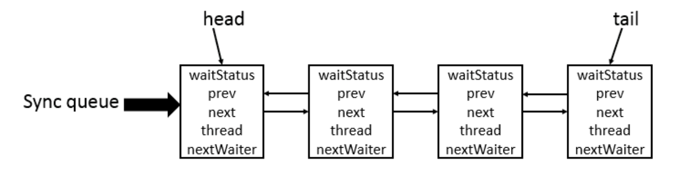

>CLH(Craig,Landin,and Hagersten) 队列是一个虚拟的双向队列（虚拟的双向队列即不存在队列实例，仅存在结点之间的关联关系）。AQS 是将每条请求共享资源的线程封装成一个CLH锁队列的一个结点（Node）来实现锁的分配。在CLH同步队列中，一个节点表示一个线程，它保存着线程的引用（thread）、 当前节点在队列中的状态（waitStatus）、前驱节点（prev）、后继节点（next）。

AQS(`AbstractQueuedSynchronizer`)的核心原理图：


AQS 使用 int 成员变量 state 表示同步状态，通过内置的线程等待队列来完成获取资源线程的排队工作。
state 变量由 volatile 修饰，用于展示当前临界资源的获锁情况。

另外，状态信息 state 可以通过 protected 类型的getState()、setState()和compareAndSetState() 进行操作。并且，这几个方法都是 final 修饰的，在子类中无法被重写。

以 ReentrantLock 为例，state 初始值为 0，表示未锁定状态。A 线程 lock() 时，会调用 tryAcquire() 独占该锁并将 state+1 。此后，其他线程再 tryAcquire() 时就会失败，直到 A 线程 unlock() 到 state=0（即释放锁）为止，其它线程才有机会获取该锁。当然，释放锁之前，A 线程自己是可以重复获取此锁的（state 会累加），这就是可重入的概念。
但要注意，获取多少次就要释放多少次，这样才能保证 state 是能回到零态的。

#### 6.1 CountDownLatch 和 CyclicBarrier的区别

CountDownLatch 的计数器是大于或等于线程数的，而CyclicBarrier是一定等于线程数
CountDownLatch 放行由其他线程控制而CyclicBarrier是由本身来控制的


CountDownLatch

说明： 一个线程等待其他线程执行完之后再执行，相当于加强版的join，在初始化CountDownLatch是需要设定计数器的数值（计数器数据不一定跟线程数相同，但是一定计数器的值一定是要大于等于线程数，一个线程中可以进行多次扣减。当计数器扣减至0时才可继续向下执行）

举例说明：
比如LOL在游戏开始时需要玩家全部准备完毕之后才开始，开始游戏可以理解为“主线程”，玩家准备理解为“其他线程”，在“其他线程”没有准备完毕之前，“主线程时等待状态”，当“其他线程”准备完毕之后“主线程”就会执行下一步开始游戏的动作

CyclicBarrier
说明： 让一组线程到达某个屏障，然后被阻塞，一直到最后一个线程到达屏障，然后屏障开放，所有被阻塞的线程继续执行，计数器与线程数相等。
CyclicBarrier(int parties, Runnable barrierAction) 当时使用这个构造函数时，barrierAction定义的任务会执行

举例说明： 假设有一家公司要全体员工进行团建活动，活动内容为翻越三个障碍物，每一个人翻越障碍物所用的时间是不一样的。但是公司要求所有人在翻越当前障碍物之后再开始翻越下一个障碍物，也就是所有人翻越第一个障碍物之后，才开始翻越第二个，以此类推比如跨栏比赛，我们修改一下规则，当所有选手都跨过第一个栏杆是，才去跨第二个，以此类推，每一个员工都是一个“其他线程”。当所有人都翻越的所有的障碍物之后，程序才结束。而主线程可能早就结束了，这里我们不用管主线程。


#### 6.2 AQS组件总结

1、Semaphore(信号量)-允许多个线程同时访问： synchronized 和 ReentrantLock 都是一次只允许一个线程访问某个资源，Semaphore(信号量)可以指定多个线程同时访问某个资源。

2、CountDownLatch （倒计时器）： CountDownLatch是一个同步工具类，用来协调多个线程之间的同步。这个工具通常用来控制线程等待，它可以让某一个线程等待直到倒计时结束，再开始执行。

3、CyclicBarrier(循环栅栏)： CyclicBarrier 和 CountDownLatch 非常类似，它也可以实现线程间的技术等待，但是它的功能比 CountDownLatch 更加复杂和强大。主要应用场景和 CountDownLatch 类似。CyclicBarrier 的字面意思是可循环使用（Cyclic）的屏障（Barrier）。它要做的事情是，让一组线程到达一个屏障（也可以叫同步点）时被阻塞，直到最后一个线程到达屏障时，屏障才会开门，所有被屏障拦截的线程才会继续干活。CyclicBarrier默认的构造方法是 CyclicBarrier(int parties)，其参数表示屏障拦截的线程数量，每个线程调用await()方法告诉 CyclicBarrier 我已经到达了屏障，然后当前线程被阻塞。


## 七、数据库

### 1、谈谈数据库设计的三大范式及反范式

（1）数据库的三大范式

​	第一范式：列不可分

​	第二范式：要有主键

​	第三范式：不可存在传递依赖

比如商品表里面关联商品类别表，那么只需要一个关联字段product_type_id即可，其他字段信息可以通过表关联查询即可得到
如果商品表还存在一个商品类别名称字段，如product_type_name，那就属于存在传递依赖的情况，第三范式主要是从空间的角度来考虑，避免产生冗余信息，浪费磁盘空间

（2）反范式设计：(第三范式)
为什么会有反范式设计？

原因一：提高查询效率（读多写少）
比如上述的描述中，显示商品信息时，经常需要伴随商品类别信息的展示，
所以这个时候，为了提高查询效率，可以通过冗余一个商品名称字段，这个可以将原先的表关联查询转换为单表查询

原因二：保存历史快照信息
比如订单表，里面需要包含收货人的各项信息，如姓名，电话，地址等等，这些都属于历史快照，需要冗余保存起来，
不能通过保存用户地址ID去关联查询，因为用户的收货人信息可能会在后期发生变更


### 2、drop、delete 与 truncate 区别？

drop(丢弃数据): drop table 表名 ，直接将表都删除掉，在删除表的时候使用。

truncate (清空数据) : truncate table 表名 ，只删除表中的数据，再插入数据的时候自增长 id 又从 1 开始，在清空表中数据的时候使用。

delete（删除数据） : delete from 表名 where 列名=值，删除某一行的数据，如果不加 where 子句和truncate table 表名作用类似。

​		truncate 和不带 where``子句的 delete、以及 drop 都会删除表内的数据，但是 truncate 和 delete 只删除数据不删除表的结构(定义)，执行 drop 语句，此表的结构也会删除，也就是执行 drop 之后对应的表不复存在。


### 3、DML 语句和 DDL 语句区别：

（1）DML 是数据库操作语言（Data Manipulation Language）的缩写，是指对数据库中表记录的操作，主要包括表记录的插入、更新、删除和查询，是开发人员日常使用最频繁的操作。

（2）DDL （Data Definition Language）是数据定义语言的缩写，简单来说，就是对数据库内部的对象进行创建、删除、修改的操作语言。它和 DML 语言的最大区别是 DML 只是对表内部数据的操作，而不涉及到表的定义、结构的修改，更不会涉及到其他对象。DDL语句更多的被数据库管理员（DBA）所使用，一般的开发人员很少使用。

另外，由于select不会对表进行破坏，所以有的地方也会把select单独区分开叫做数据库查询语言 DQL（Data Query Language）。


### 4、MySQL 优点：

（1）成熟稳定，功能完善。

（2）开源免费。

（3）文档丰富，既有详细的官方文档，又有非常多优质文章可供参考学习。

（4）开箱即用，操作简单，维护成本低。

（5）兼容性好，支持常见的操作系统，支持多种开发语言。

（6）社区活跃，生态完善。

（7）事务支持优秀， InnoDB 存储引擎默认使用 REPEATABLE-READ 并不会有任何性能损失，并且，InnoDB 实现的 REPEATABLE-READ 隔离级别其实是可以解决幻读问题发生的。

（8）支持分库分表、读写分离、高可用。


### 5、一个 SQL 语句在 MySQL 中的执行流程

MySQL 主要由下面几部分构成
（1）连接器： 身份认证和权限相关(登录 MySQL 的时候)。

（2）查询缓存： 执行查询语句的时候，会先查询缓存（MySQL 8.0 版本后移除，因为这个功能不太实用）。

（3）分析器： 没有命中缓存的话，SQL 语句就会经过分析器，分析器说白了就是要先看你的 SQL 语句要干嘛，再检查你的 SQL 语句语法是否正确。

（4）优化器： 按照 MySQL 认为最优的方案去执行。

（5）执行器： 执行语句，然后从存储引擎返回数据。 执行语句之前会先判断是否有权限，如果没有权限的话，就会报错。

（6）插件式存储引擎 ： 主要负责数据的存储和读取，采用的是插件式架构，支持 InnoDB、MyISAM、Memory 等多种存储引擎。MySQL 5.5.5 之前，MyISAM 是 MySQL 的默认存储引擎。5.5.5 版本之后，InnoDB 是 MySQL 的默认存储引擎。


MySQL 主要分为 Server 层和存储引擎层：

（1）Server 层：主要包括连接器、查询缓存、分析器、优化器、执行器等，所有跨存储引擎的功能都在这一层实现，比如存储过程、触发器、视图，函数等，还有一个通用的日志模块 binlog 日志模块。

（2）存储引擎： 主要负责数据的存储和读取，采用可以替换的插件式架构，支持 InnoDB、MyISAM、Memory 等多个存储引擎，其中 InnoDB 引擎有自有的日志模块 redolog 模块。现在最常用的存储引擎是 InnoDB，它从 MySQL 5.5 版本开始就被当做默认存储引擎了。


### 6、MySQL 存储引擎架构了解吗？

​		MySQL 存储引擎采用的是插件式架构，支持多种存储引擎，我们甚至可以为不同的数据库表设置不同的存储引擎以适应不同场景的需要。**存储引擎是基于表的，而不是数据库。**并且，你还可以根据 MySQL定义的存储引擎实现标准接口来编写一个属于自己的存储引擎。这些非官方提供的存储引擎可以称为第三方存储引擎，区别于官方存储引擎。像目前最常用的 InnoDB 其实刚开始就是一个第三方存储引擎，后面由于过于优秀，其被 Oracle 直接收购了。


### 7、MyISAM 、InnoDB 

（1）是否支持行级锁
		MyISAM 只有表级锁(table-level locking)，而 InnoDB 支持行级锁(row-level locking)和表级锁,默认为行级锁。也就说，MyISAM 一锁就是锁住了整张表，这在并发写的情况下是多么滴憨憨啊！这也是为什么 InnoDB 在并发写的时候，性能更牛皮了！

（2）是否支持事务
		MyISAM 不提供事务支持。InnoDB 提供事务支持，实现了 SQL 标准定义了四个隔离级别，具有提交(commit)和回滚(rollback)事务的能力。并且，InnoDB 默认使用的 REPEATABLE-READ（可重读）隔离级别是可以解决幻读问题发生的（基于 MVCC 和 Next-Key Lock）。

（3）是否支持外键
		MyISAM 不支持，而InnoDB支持。外键对于维护数据一致性非常有帮助，但是对性能有一定的损耗。因此，通常情况下，我们是不建议在实际生产项目中使用外键的，在业务代码中进行约束即可！

（4）是否支持数据库异常崩溃后的安全恢复
		MyISAM 不支持，而 InnoDB 支持。使用 InnoDB 的数据库在异常崩溃后，数据库重新启动的时候会保证数据库恢复到崩溃前的状态。这个恢复的过程依赖于 redo log 。

（5）是否支持 MVCC
		MyISAM 不支持，而 InnoDB 支持。讲真，这个对比有点废话，毕竟 MyISAM 连行级锁都不支持。MVCC 可以看作是行级锁的一个升级，可以有效减少加锁操作，提高性能。

（6）索引实现不一样。
		虽然 MyISAM 引擎和 InnoDB 引擎都是使用 B+Tree 作为索引结构，但是两者的实现方式不太一样。InnoDB 引擎中，其数据文件本身就是索引文件。相比 MyISAM，索引文件和数据文件是分离的，其表数据文件本身就是按 B+Tree 组织的一个索引结构，树的叶节点 data 域保存了完整的数据记录。

（7）性能有差别。
		InnoDB 的性能比 MyISAM 更强大，不管是在读写混合模式下还是只读模式下，随着 CPU 核数的增加，InnoDB 的读写能力呈线性增长。MyISAM 因为读写不能并发，它的处理能力跟核数没关系。


### 8、何谓数据库事务？

大多数情况下，我们在谈论事务的时候，如果没有特指分布式事务，往往指的就是数据库事务。
关系型数据库（例如：MySQL、SQL Server、Oracle 等）事务都有 ACID 特性：

原子性（Atomicity） ： 事务是最小的执行单位，不允许分割。事务的原子性确保动作要么全部完成，要么完全不起作用；

一致性（Consistency）： 执行事务前后，数据保持一致，例如转账业务中，无论事务是否成功，转账者和收款人的总额应该是不变的；

隔离性（Isolation）： 并发访问数据库时，一个用户的事务不被其他事务所干扰，各并发事务之间数据库是独立的；

持久性（Durability）： 一个事务被提交之后。它对数据库中数据的改变是持久的，即使数据库发生故障也不应该对其有任何影响。

🌈 这里要额外补充一点：只有保证了事务的持久性、原子性、隔离性之后，一致性才能得到保障。也就是说 **A、I、D 是手段，C 是目的！**


### 9、并发事务带来了哪些问题?

（1）脏读（Dirty read）一个事务读取数据并且对数据进行了修改，这个修改对其他事务来说是可见的，即使当前事务没有提交。这时另外一个事务读取了这个还未提交的数据，但第一个事务突然回滚，导致数据并没有被提交到数据库，那第二个事务读取到的就是脏数据，这也就是脏读的由来。

（2）丢失修改（Lost to modify）在一个事务读取一个数据时，另外一个事务也访问了该数据，那么在第一个事务中修改了这个数据后，第二个事务也修改了这个数据。这样第一个事务内的修改结果就被丢失，因此称为丢失修改。

（3）不可重复读（Unrepeatable read）指在一个事务内多次读同一数据。在这个事务还没有结束时，另一个事务也访问该数据。那么，在第一个事务中的两次读数据之间，由于第二个事务的修改导致第一个事务两次读取的数据可能不太一样。这就发生了在一个事务内两次读到的数据是不一样的情况，因此称为不可重复读。

（4）幻读（Phantom read）幻读与不可重复读类似。它发生在一个事务读取了几行数据，接着另一个并发事务插入了一些数据时。在随后的查询中，第一个事务就会发现多了一些原本不存在的记录，就好像发生了幻觉一样，所以称为幻读。


### 10、并发事务的控制方式有哪些？

MySQL 中并发事务的控制方式无非就两种：锁 和 MVCC。
锁可以看作是悲观控制的模式，
多版本并发控制（MVCC，Multiversion concurrency control）可以看作是乐观控制的模式。

1. 锁 控制方式下会通过锁来显示控制共享资源而不是通过调度手段，MySQL 中主要是通过 读写锁 来实现并发控制。

- 共享锁（S 锁） ：又称读锁，事务在读取记录的时候获取共享锁，允许多个事务同时获取（锁兼容）。
- 排他锁（X 锁） ：又称写锁/独占锁，事务在修改记录的时候获取排他锁，不允许多个事务同时获取。如果一个记录已经被加了排他锁，那其他事务不能再对这条事务加任何类型的锁（锁不兼容）。

不论是表级锁还是行级锁，都存在共享锁（Share Lock，S 锁）和排他锁（Exclusive Lock，X 锁）这两类。

2. MVCC 是多版本并发控制方法，即对一份数据会存储多个版本，通过事务的可见性来保证事务能看到自己应该看到的版本。通常会有一个全局的版本分配器来为每一行数据设置版本号，版本号是唯一的。在 MySQL 中实现所依赖的手段主要是: 隐藏字段、read view、undo log。undo log : undo log 用于记录某行数据的多个版本的数据。read view 和 隐藏字段 : 用来判断当前版本数据的可见性。


### 11、SQL 标准定义了哪些事务隔离级别?

（1）READ-UNCOMMITTED(读取未提交) ： 
	最低的隔离级别，允许读取尚未提交的数据变更，可能会导致脏读、幻读或不可重复读。

（2）READ-COMMITTED(读取已提交) ： 
	允许读取并发事务已经提交的数据，可以阻止脏读，但是幻读或不可重复读仍有可能发生。

（3）REPEATABLE-READ(可重复读 MySQL 的默认隔离级别) ：
	对同一字段的多次读取结果都是一致的，除非数据是被本身事务自己所修改，可以阻止脏读和不可重复读，但幻读仍有可能发生。

（4）SERIALIZABLE(可串行化)：
	最高的隔离级别，完全服从ACID的隔离级别。所有的事务依次逐个执行，这样事务之间就完全不可能产生干扰，也就是说，该级别可以防止脏读、不可重复读以及幻读。


**InnoDB 实现的 REPEATABLE-READ 隔离级别其实是可以解决幻读问题发生的**，主要有下面两种情况：

快照读 ：由 MVCC 机制来保证不出现幻读。

当前读 ： 使用 Next-Key Lock 进行加锁来保证不出现幻读，Next-Key Lock 是行锁（Record Lock）和间隙锁（Gap Lock）的结合，行锁只能锁住已经存在的行，为了避免插入新行，需要依赖间隙锁。


### 12、MySQL 的隔离级别是基于锁实现的吗？

MySQL 的隔离级别基于锁和 MVCC 机制共同实现的。SERIALIZABLE 隔离级别是通过锁来实现的，READ-COMMITTED 和 REPEATABLE-READ 隔离级别是基于 MVCC 实现的。不过，SERIALIZABLE 之外的其他隔离级别可能也需要用到锁机制，就比如 REPEATABLE-READ 在当前读情况下需要使用加锁读来保证不会出现幻读。


### 13、行级锁的使用有什么注意事项？

InnoDB 的行锁是针对索引字段加的锁，表级锁是针对非索引字段加的锁。当我们执行 UPDATE、DELETE 语句时，如果 WHERE条件中字段没有命中唯一索引或者索引失效的话，就会导致扫描全表对表中的所有行记录进行加锁。这个在我们日常工作开发中经常会遇到，一定要多多注意！！！
不过，很多时候即使用了索引也有可能会走全表扫描，这是因为 MySQL 优化器的原因。


### 14、InnoDB 有哪几类行锁？

InnoDB 行锁是通过对索引数据页上的记录加锁实现的，MySQL InnoDB 支持三种行锁定方式：

（1）记录锁（Record Lock） ：也被称为记录锁，属于单个行记录上的锁。

（2）间隙锁（Gap Lock） ：锁定一个范围，不包括记录本身。

（3）临键锁（Next-Key Lock） ：Record Lock+GapLock，锁定一个范围，包含记录本身，主要目的是为了解决幻读问题（MySQL事务部分提到过）。记录锁只能锁住已经存在的记录，为了避免插入新记录，需要依赖间隙锁。

在 InnoDB 默认的隔离级别 REPEATABLE-READ 下，行锁默认使用的是 Next-Key Lock。但是，如果操作的索引是唯一索引或主键，InnoDB 会对 Next-Key Lock 进行优化，将其降级为 Record Lock，即仅锁住索引本身，而不是范围。

**共享锁和排他锁呢？**
不论是表级锁还是行级锁，都存在共享锁（Share Lock，S 锁）和排他锁（Exclusive Lock，X 锁）这两类：
- （1)共享锁（S 锁） ：又称读锁，事务在读取记录的时候获取共享锁，允许多个事务同时获取（锁兼容）。
- （2）排他锁（X 锁）：又称写锁/独占锁，事务在修改记录的时候获取排他锁，不允许多个事务同时获取。如果一个记录已经被加了排他锁，那其他事务不能再对这条事务加任何类型的锁（锁不兼容）。
排他锁与任何的锁都不兼容，共享锁仅和共享锁兼容。

在`索引失效`的情况下，MySQL会把`所有聚集索引记录和间隙`都锁上，我们称之为`锁表`，或叫`行锁升表锁`.

那么对于 `行锁升表锁`，有的同学误以为**行锁 升级变成了 表锁**，但实际上`锁的类型并没有发生变化`，**还是行锁!** 只是表的所有聚集索引记录都被加上了行锁, 看起来像表锁


### 15、当前读和快照读有什么区别？

(1)快照读（一致性非锁定读）就是单纯的 SELECT 语句，但不包括下面这两类 SELECT 语句：

```sql
SELECT ... FOR UPDATE
SELECT ... LOCK IN SHARE MODE
```

快照即记录的历史版本，每行记录可能存在多个历史版本（多版本技术）。
快照读的情况下，如果读取的记录正在执行 UPDATE/DELETE 操作，读取操作不会因此去等待记录上 X 锁的释放，而是会去读取行的一个快照。

```
只有在事务隔离级别 RC(读取已提交) 和 RR（可重读）下，InnoDB 才会使用一致性非锁定读：
在 RC 级别下，对于快照数据，一致性非锁定读总是读取被锁定行的最新一份快照数据。
在 RR 级别下，对于快照数据，一致性非锁定读总是读取本事务开始时的行数据版本。
```

快照读比较适合对于数据一致性要求不是特别高且追求极致性能的业务场景。

(2)当前读 （一致性锁定读）就是给行记录加 X 锁或 S 锁。当前读的一些常见 SQL 语句类型如下：

```sql
-- 对读的记录加一个X锁
SELECT...FOR UPDATE

-- 对读的记录加一个S锁
SELECT...LOCK IN SHARE MODE

-- 对修改的记录加一个X锁
INSERT...
UPDATE...
DELETE...
```


#### 1、能用 MySQL 直接存储文件（比如图片）吗？

​		可以是可以，直接存储文件对应的二进制数据即可。不过，还是建议不要在数据库中存储文件，会严重影响数据库性能，消耗过多存储空间。


#### 2、 MySQL 如何存储 IP 地址？

​		可以将 IP 地址转换成整形数据存储，性能更好，占用空间也更小。MySQL 提供了两个方法来处理 ip 地址INET_ATON() ： 把 ip 转为无符号整型 (4-8 位)INET_NTOA() :把整型的 ip 转为地址插入数据前，先用 INET_ATON() 把 ip 地址转为整型，显示数据时，使用 INET_NTOA() 把整型的 ip 地址转为地址显示即可。#


#### 3、谨慎使用 MySQL 分区表

分区表在物理上表现为多个文件，在逻辑上表现为一个表；
谨慎选择分区键，跨分区查询效率可能更低；
建议采用物理分表的方式管理大数据。


#### 4、 TIMESTAMP(4 个字节) 或 DATETIME  (8 个字节) 存储时间

TIMESTAMP 存储的时间范围 1970-01-01 00:00:01 ~ 2038-01-19-03:14:07TIMESTAMP 
占用 4 字节和 INT 相同，但比 INT 可读性高
超出 TIMESTAMP 取值范围的使用 DATETIME 类型存储
经常会有人用字符串存储日期型的数据（不正确的做法）
缺点 1：无法用日期函数进行计算和比较
缺点 2：用字符串存储日期要占用更多的空间


#### 5、同财务相关的金额类数据必须使用 decimal 类型

非精准浮点 ：float,double
精准浮点 ：decimal
decimal 类型为精准浮点数，在计算时不会丢失精度。占用空间由定义的宽度决定，每 4 个字节可以存储 9 位数字，并且小数点要占用一个字节。并且，decimal 可用于存储比 bigint 更大的整型数据
不过， 由于 decimal 需要额外的空间和计算开销，应该尽量只在需要对数据进行精确计算时才使用 decimal 。


#### 6、超 100 万行的批量写 (UPDATE,DELETE,INSERT) 操作,要分批多次进行操作

大批量操作可能会造成严重的主从延迟
主从环境中,大批量操作可能会造成严重的主从延迟，大批量的写操作一般都需要执行一定长的时间，而只有当主库上执行完成后，才会在其他从库上执行，所以会造成主库与从库长时间的延迟情况
binlog 日志为 row 格式时会产生大量的日志
大批量写操作会产生大量日志，特别是对于 row 格式二进制数据而言，由于在 row 格式中会记录每一行数据的修改，我们一次修改的数据越多，产生的日志量也就会越多，日志的传输和恢复所需要的时间也就越长，这也是造成主从延迟的一个原因

避免产生大事务操作
大批量修改数据，一定是在一个事务中进行的，这就会造成表中大批量数据进行锁定，从而导致大量的阻塞，阻塞会对 MySQL 的性能产生非常大的影响。特别是长时间的阻塞会占满所有数据库的可用连接，这会使生产环境中的其他应用无法连接到数据库，因此一定要注意大批量写操作要进行分批

## 八、索引

### 1、索引的底层数据结构

- （1）Hash 表
	哈希表是键值对的集合，通过键(key)即可快速取出对应的值(value)，因此哈希表可以快速检索数据（接近 O（1））。
	为何能够通过 key 快速取出 value 呢？ 
	**原因在于 哈希算法（也叫散列算法）。通过哈希算法，我们可以快速找到 key 对应的 index，找到了 index 也就找到了对应的 value。**但是！哈希算法有个 Hash 冲突 问题，也就是说多个不同的 key 最后得到的 index 相同。通常情况下，我们常用的解决办法是 链地址法。**链地址法就是将哈希冲突数据存放在链表中。**就比如 JDK1.8 之前 HashMap 就是通过链地址法来解决哈希冲突的。不过，JDK1.8 以后HashMap为了减少链表过长的时候搜索时间过长引入了红黑树。
	为了减少 Hash 冲突的发生，一个好的哈希函数应该“均匀地”将数据分布在整个可能的哈希值集合中。


**既然哈希表这么快，为什么MySQL没有使用其作为索引的数据结构呢?**
> 主要是因为 Hash 索引不支持顺序和范围查询。假如我们要对表中的数据进行排序或者进行范围查询，那 Hash 索引可就不行了。并且，每次 IO 只能取一个。
SELECT * FROM tb1 WHERE id < 500;
在这种范围查询中，优势非常大，直接遍历比 500 小的叶子节点就够了。而 Hash 索引是根据 hash 算法来定位的，难不成还要把 1 - 499 的数据，每个都进行一次 hash 计算来定位吗?这就是 Hash 最大的缺点了。


- （2）B 树& B+树
	B 树也称 B-树,全称为 多路平衡查找树 ，B+ 树是 B 树的一种变体。B 树和 B+树中的 B 是 Balanced （平衡）的意思。
	在 MySQL 中，MyISAM 引擎和 InnoDB 引擎都是使用 B+Tree 作为索引结构，但是，两者的实现方式不太一样。


>MyISAM 引擎中，B+Tree 叶节点的 data 域存放的是数据记录的地址。在索引检索的时候，首先按照 B+Tree 搜索算法搜索索引，如果指定的 Key 存在，则取出其 data 域的值，然后以 data 域的值为地址读取相应的数据记录。这被称为“非聚簇索引（非聚集索引）”。InnoDB 引擎中，其数据文件本身就是索引文件。相比 MyISAM，索引文件和数据文件是分离的，其表数据文件本身就是按 B+Tree 组织的一个索引结构，树的叶节点 data 域保存了完整的数据记录。这个索引的 key 是数据表的主键，因此 InnoDB 表数据文件本身就是主索引。这被称为“聚簇索引（聚集索引）”，而其余的索引都作为 辅助索引 ，辅助索引的 data 域存储相应记录主键的值而不是地址，这也是和 MyISAM 不同的地方。在根据主索引搜索时，直接找到 key 所在的节点即可取出数据；在根据辅助索引查找时，则需要先取出主键的值，再走一遍主索引。 因此，在设计表的时候，不建议使用过长的字段作为主键，也不建议使用非单调的字段作为主键，这样会造成主索引频繁分裂


### 2、B 树& B+树两者有何异同呢？

（1）B 树的所有节点既存放键(key) 也存放 数据(data)，而 B+树只有叶子节点存放 key 和 data，其他内节点只存放 key。

（2）B 树的叶子节点都是独立的;B+树的叶子节点有一条引用链指向与它相邻的叶子节点。

（3）B 树的检索的过程相当于对范围内的每个节点的关键字做二分查找，可能还没有到达叶子节点，检索就结束了。而B+树的检索效率就很稳定了，任何查找都是从根节点到叶子节点的过程，叶子节点的顺序检索很明显。


### 3、主键索引(Primary Key)

数据表的主键列使用的就是主键索引。
一张数据表有只能有一个主键，并且主键不能为 null，不能重复。


### 4、二级索引(辅助索引)

二级索引又称为辅助索引，是因为二级索引的叶子节点存储的数据是主键。也就是说，通过二级索引，可以定位主键的位置。
唯一索引，普通索引，前缀索引等索引属于二级索引。

​	（1）唯一索引(Unique Key) ：唯一索引也是一种约束。唯一索引的属性列不能出现重复的数据，但是允许数据为NULL，一张表允许创建多个唯一索引。建立唯一索引的目的大部分时候都是为了该属性列的数据的唯一性，而不是为了查询效率。

​	（2）普通索引(Index) ：普通索引的唯一作用就是为了快速查询数据，一张表允许创建多个普通索引，并允许数据重复和 NULL。

​	（3）前缀索引(Prefix) ：前缀索引只适用于字符串类型的数据。前缀索引是对文本的前几个字符创建索引，相比普通索引建立的数据更小， 因为只取前几个字符。

​	（4）全文索引(Full Text) ：全文索引主要是为了检索大文本数据中的关键字的信息，是目前搜索引擎数据库使用的一种技术。Mysql5.6 之前只有 MYISAM 引擎支持全文索引，5.6 之后 InnoDB 也支持了全文索引。


### 5、聚簇索引的优缺点

聚簇索引即索引结构和数据一起存放的索引，并不是一种单独的索引类型。InnoDB 中的主键索引就属于聚簇索引。在 MySQL 中，InnoDB 引擎的表的 .ibd文件就包含了该表的索引和数据，对于 InnoDB 引擎表来说，该表的索引(B+树)的每个非叶子节点存储索引，叶子节点存储索引和索引对应的数据。

优点 ：

（1）查询速度非常快：聚簇索引的查询速度非常的快，因为整个B+树本身就是一颗多叉平衡树，叶子节点也都是有序的，定位到索引的节点，就相当于定位到了数据。相比于非聚簇索引， 聚簇索引少了一次读取数据的 IO 操作。

（2）对排序查找和范围查找优化 ：聚簇索引对于主键的排序查找和范围查找速度非常快。

缺点 ：

（1）依赖于有序的数据 ：因为 B+树是多路平衡树，如果索引的数据不是有序的，那么就需要在插入时排序，如果数据是整型还好，否则类似于字符串或UUID这种又长又难比较的数据，插入或查找的速度肯定比较慢。

（2）更新代价大 ： 如果对索引列的数据被修改时，那么对应的索引也将会被修改，而且聚簇索引的叶子节点还存放着数据，修改代价肯定是较大的，所以对于主键索引来说，主键一般都是不可被修改的。


### 6、非聚簇索引的优缺点

非聚簇索引即索引结构和数据分开存放的索引，并不是一种单独的索引类型。二级索引(辅助索引)就属于非聚簇索引。MySQL的MyISAM引擎，不管主键还是非主键，使用的都是非聚簇索引，非聚簇索引的叶子节点并不一定存放数据的指针，因为二级索引的叶子节点就存放的是主键，根据主键再回表查数据。

优点 ：更新代价比聚簇索引要小 。非聚簇索引的更新代价就没有聚簇索引那么大了，非聚簇索引的叶子节点是不存放数据的

缺点 ：

（1）依赖于有序的数据 ：跟聚簇索引一样，非聚簇索引也依赖于有序的数据

（2）可能会二次查询(回表) ：这应该是非聚簇索引最大的缺点了。 当查到索引对应的指针或主键后，可能还需要根据指针或主键再到数据文件或表中查询。


### 7、MYSQL 数据存放文件

InnoDB

.ibd文件： 包含索引和数据 

MYISM
.MYD文件： 包含表的数据
.MYI文件： 包含表的索引


### 8、非聚簇索引一定回表查询吗(覆盖索引)?

非聚簇索引不一定回表查询。
试想一种情况，用户准备使用 SQL 查询用户名，而用户名字段正好建立了索引。 SELECT name FROM table WHERE name='guang19';
那么这个索引的 key 本身就是 name，查到对应的 name 直接返回就行了，无需回表查询。
即使是 MYISAM 也是这样，虽然 MYISAM 的主键索引确实需要回表，因为它的主键索引的叶子节点存放的是指针。但是！如果 SQL 查的就是主键呢?SELECT id FROM table WHERE id=1;
主键索引本身的 key 就是主键，查到返回就行了。这种情况就称之为【**覆盖索引**】了


### 9、覆盖索引

如果一个索引包含（或者说覆盖）所有需要查询的字段的值，我们就称之为“覆盖索引”。我们知道在InnoDB存储引擎中，如果不是主键索引，叶子节点存储的是主键+列值。最终还是要“回表”，也就是要通过主键再查找一次。这样就会比较慢，覆盖索引就是把要查询出的列和索引是对应的，不做回表操作！
覆盖索引即需要查询的字段正好是索引的字段，那么直接根据该索引，就可以查到数据了，而无需回表查询。如主键索引，如果一条 SQL 需要查询主键，那么正好根据主键索引就可以查到主键。再如普通索引，如果一条 SQL 需要查询 name，name 字段正好有索引， 那么直接根据这个索引就可以查到数据，也无需回表。


### 10、联合索引

使用表中的多个字段创建索引，就是 联合索引，也叫 组合索引 或 复合索引。


### 11、最左前缀匹配原则

最左前缀匹配原则指的是，在使用联合索引时，MySQL 会根据联合索引中的字段顺序，从左到右依次到查询条件中去匹配，如果查询条件中存在与联合索引中最左侧字段相匹配的字段，则就会使用该字段过滤一批数据，直至联合索引中全部字段匹配完成，或者在执行过程中遇到范围查询，如 >、<、between 和 以%开头的like查询 等条件，才会停止匹配。所以，我们在使用联合索引时，可以将区分度高的字段放在最左边，这也可以过滤更多数据。


### 12、索引下推

索引下推（IndexConditionPushdown）是MySQL5.6版本中提供的一项索引优化功能，可以在非聚簇索引遍历过程中，对索引中包含的字段先做判断，过滤掉不符合条件的记录，减少回表次数。


### 13、正确使用索引的一些建议

（1）选择合适的字段创建索引
	不为 NULL 的字段 ：索引字段的数据应该尽量不为 NULL，因为对于数据为 NULL 的字段，数据库较难优化。如果字段频繁被查询，但又避免不了为 NULL，建议使用 0,1,true,false 这样语义较为清晰的短值或短字符作为替代。
	被频繁查询的字段 ：我们创建索引的字段应该是查询操作非常频繁的字段。
	被作为条件查询的字段 ：被作为 WHERE 条件查询的字段，应该被考虑建立索引。
	频繁需要排序的字段 ：索引已经排序，这样查询可以利用索引的排序，加快排序查询时间。
	被经常频繁用于连接的字段 ：经常用于连接的字段可能是一些外键列，对于外键列并不一定要建立外键，只是说该列涉及到表与表的关系。对于频繁被连接查询的字段，可以考虑建立索引，提高多表连接查询的效率。

（2）被频繁更新的字段应该慎重建立索引
	虽然索引能带来查询上的效率，但是维护索引的成本也是不小的。 如果一个字段不被经常查询，反而被经常修改，那么就更不应该在这种字段上建立索引了。

（3）尽可能的考虑建立联合索引而不是单列索引
	因为索引是需要占用磁盘空间的，可以简单理解为每个索引都对应着一颗 B+树。如果一个表的字段过多，索引过多，那么当这个表的数据达到一个体量后，索引占用的空间也是很多的，且修改索引时，耗费的时间也是较多的。如果是联合索引，多个字段在一个索引上，那么将会节约很大磁盘空间，且修改数据的操作效率也会提升。

（4）注意避免冗余索引
	冗余索引指的是索引的功能相同，能够命中索引(a, b)就肯定能命中索引(a) ，那么索引(a)就是冗余索引。如（name,city）和（name）这两个索引就是冗余索引，能够命中前者的查询肯定是能够命中后者的 在大多数情况下，都应该尽量扩展已有的索引而不是创建新索引。

（5）考虑在字符串类型的字段上使用前缀索引代替普通索引
	前缀索引仅限于字符串类型，较普通索引会占用更小的空间，所以可以考虑使用前缀索引带替普通索引。

（6）避免索引失效
	索引失效也是慢查询的主要原因之一，常见的导致索引失效的情况有下面这些：
	使用 SELECT * 进行查询;
	创建了组合索引，但查询条件未准守最左匹配原则;
	在索引列上进行计算、函数、类型转换等操作;
	以 % 开头的 LIKE 查询比如 like '%abc';
	查询条件中使用 or，且 or 的前后条件中有一个列没有索引，涉及的索引都不会被使用到;
	

​	发生隐式转换;

​		1）当操作符左右两边的数据类型不一致时，会发生隐式转换。

​		2）当 where 查询操作符左边为数值类型时发生了隐式转换，那么对效率影响不大，但还是不推荐这么做。

​		3）当 where 查询操作符左边为字符类型时发生了隐式转换，那么会导致索引失效，造成全表扫描效率极低。

​		4）字符串转换为数值类型时，非数字开头的字符串会转化为0，以数字开头的字符串会截取从第一个字符到第一个非数字内容为止的值为转化结果。


（7）删除长期未使用的索引
	删除长期未使用的索引，不用的索引的存在会造成不必要的性能损耗 MySQL 5.7 可以通过查询 sys 库的 schema_unused_indexes 视图来查询哪些索引从未被使用

## 九、redo log、bin log、undo log

### 1、redo log（重做日志）

​		redo log（重做日志）是InnoDB存储引擎独有的，它让MySQL拥有了崩溃恢复能力。比如 MySQL 实例挂了或宕机了，重启时，InnoDB存储引擎会使用redo log恢复数据，保证数据的持久性与完整性。
​		MySQL 中数据是以页为单位，你查询一条记录，会从硬盘把一页的数据加载出来，加载出来的数据叫数据页，会放入到 Buffer Pool 中。后续的查询都是先从 Buffer Pool 中找，没有命中再去硬盘加载，减少硬盘 IO 开销，提升性能。更新表数据的时候，也是如此，发现 Buffer Pool 里存在要更新的数据，就直接在 Buffer Pool 里更新。然后会把“在某个数据页上做了什么修改”记录到重做日志缓存（redo log buffer）里，接着刷盘到 redo log 文件里。

#### （1）刷盘时机

InnoDB 存储引擎为 redo log 的刷盘策略提供了 innodb_flush_log_at_trx_commit 参数，它支持三种策略：

​	0 ：设置为 0 的时候，表示每次事务提交时不进行刷盘操作  （如果MySQL挂了或宕机可能会有1秒数据的丢失。）

​	1 ：设置为 1 的时候，表示每次事务提交时都将进行刷盘操作（默认值）

​	2 ：设置为 2 的时候，表示每次事务提交时都只把 redo log buffer 内容写入 page cache


innodb_flush_log_at_trx_commit 参数默认为 1 ，也就是说当事务提交时会调用 fsync 对 redo log 进行刷盘另外，InnoDB 存储引擎有一个后台线程，每隔1 秒，就会把 redo log buffer 中的内容写到文件系统缓存（page cache），然后调用 fsync 刷盘。

也就是说，一个没有提交事务的 redo log 记录，也可能会被后台线程刷盘。

除了后台线程每秒1次的轮询操作，还有一种情况，当 redo log buffer 占用的空间即将达到 innodb_log_buffer_size 一半的时候，后台线程会主动刷盘。


- 1）为0时，如果MySQL挂了或宕机可能会有1秒数据的丢失。
- 2）为1时， 只要事务提交成功，redolog记录就一定在硬盘里，不会有任何数据丢失。如果事务执行期间MySQL挂了或宕机，这部分日志丢了，但是事务并没有提交，所以日志丢了也不会有损失。
- 3）为2时，只要事务提交成功，redologbuffer中的内容只写入文件系统缓存（pagecache）。如果仅仅只是MySQL挂了不会有任何数据丢失，但是宕机可能会有1秒数据的丢失。

#### （2）日志文件组

​		硬盘上存储的 redo log 日志文件不只一个，而是以一个日志文件组的形式出现的，每个的redo日志文件大小都是一样的。比如可以配置为一组4个文件，每个文件的大小是 1GB，整个 redo log 日志文件组可以记录4G的内容。它采用的是环形数组形式，从头开始写，写到末尾又回到头循环写

在个日志文件组中还有两个重要的属性，分别是 write pos、checkpointwrite 
pos 是当前记录的位置，一边写一边后移
checkpoint 是当前要擦除的位置，也是往后推移

​		每次刷盘 redo log 记录到日志文件组中，write pos 位置就会后移更新。每次 MySQL 加载日志文件组恢复数据时，会清空加载过的 redo log 记录，并把 checkpoint 后移更新。write pos 和 checkpoint 之间的还空着的部分可以用来写入新的 redo log 记录。
​		如果 write pos 追上 checkpoint ，表示日志文件组满了，这时候不能再写入新的 redo log 记录，MySQL 得停下来，清空一些记录，把 checkpoint 推进一下。

#### （3）只要每次把修改后的数据页直接刷盘不就好了，还有 redo log 什么事？

​		实际上，数据页大小是16KB，刷盘比较耗时，可能就修改了数据页里的几Byte数据，有必要把完整的数据页刷盘吗？而且数据页刷盘是随机写，因为一个数据页对应的位置可能在硬盘文件的随机位置，所以性能是很差。如果是写redolog，一行记录可能就占几十Byte，只包含表空间号、数据页号、磁盘文件偏移量、更新值，再加上是顺序写，所以刷盘速度很快。所以用 redo log 形式记录修改内容，性能会远远超过刷数据页的方式，这也让数据库的并发能力更强。

其实内存的数据页在一定时机也会刷盘，我们把这称为页合


### 2、binlog（归档日志）

​		binlog 是逻辑日志，记录内容是语句的原始逻辑，类似于“给 ID=2 这一行的 c 字段加 1”，属于MySQL Server 层。不管用什么存储引擎，只要发生了表数据更新，都会产生 binlog 日志。
可以说MySQL数据库的数据备份、主备、主主、主从都离不开binlog，需要依靠binlog来同步数据，保证数据一致性。
binlog会记录所有涉及更新数据的逻辑操作，并且是顺序写。

#### （1）记录格式

​	binlog 日志有三种格式，可以通过binlog_format参数指定。
​		statement
​		row
​		mixed
​	指定statement，记录的内容是SQL语句原文，比如执行一条update T set update_time=now() where id=1
​	同步数据时，会执行记录的SQL语句，但是有个问题，update_time=now()这里会获取当前系统时间，直接执行会导致与原库的数据不一致。

>为了解决这种问题，我们需要指定为row，记录的内容不再是简单的SQL语句了，还包含操作的具体数据，记录内容如下。
row格式记录的内容看不到详细信息，要通过mysqlbinlog工具解析出来。update_time=now()变成了具体的时间update_time=1627112756247，条件后面的@1、@2、@3 都是该行数据第 1 个~3 个字段的原始值（假设这张表只有 3 个字段）。

但是这种格式，需要更大的容量来记录，比较占用空间，恢复与同步时会更消耗IO资源，影响执行速度。所以就有了一种折中的方案，指定为mixed，记录的内容是前两者的混合。
MySQL会判断这条SQL语句是否可能引起数据不一致，如果是，就用row格式，否则就用statement格式。

#### （2）写入机制

​		binlog的写入时机也非常简单，事务执行过程中，先把日志写到binlog cache，事务提交的时候，再把binlogcache写到binlog文件中。因为一个事务的binlog不能被拆开，无论这个事务多大，也要确保一次性写入，所以系统会给每个线程分配一个块内存作为binlog cache。我们可以通过binlog_cache_size参数控制单个线程 binlog cache 大小，如果存储内容超过了这个参数，就要暂存到磁盘（Swap）。
​		上图的 write，是指把日志写入到文件系统的 page cache，并没有把数据持久化到磁盘，所以速度比较快上图的 fsync，才是将数据持久化到磁盘的操作

write和fsync的时机，可以由参数sync_binlog控制，默认是0。为0的时候，表示每次提交事务都只write，由系统自行判断什么时候执行fsync。
虽然性能得到提升，但是机器宕机，page cache里面的 binlog 会丢失。
为了安全起见，可以设置为1，表示每次提交事务都会执行fsync，就如同 redo log 日志刷盘流程 一样。最后还有一种折中方式，可以设置为N(N>1)，表示每次提交事务都write，但累积N个事务后才fsync。
在出现IO瓶颈的场景里，将sync_binlog设置成一个比较大的值，可以提升性能。
同样的，如果机器宕机，会丢失最近N个事务的binlog日志。


### 3、两阶段提交

redo log（重做日志）让InnoDB存储引擎拥有了崩溃恢复能力。

binlog（归档日志）保证了MySQL集群架构的数据一致性。

在执行更新语句过程，会记录redo log与binlog两块日志，以基本的事务为单位，redo log在事务执行过程中可以不断写入，而binlog只有在提交事务时才写入，所以redo log与binlog的写入时机不一样。

- （1）redo log与binlog两份日志之间的逻辑不一致，会出现什么问题？

​	以update语句为例，假设id=2的记录，字段c值是0，把字段c值更新成1，SQL语句为update T set c=1 where id=2。

​	假设执行过程中写完redo log日志后，binlog日志写期间发生了异常，会出现什么情况呢？

​		由于binlog没写完就异常，这时候binlog里面没有对应的修改记录。因此，之后用binlog日志恢复数据时，就会少这一次更新，恢复出来的这一行c值是0，而原库因为redo log日志恢复，这一行c值是1，最终数据不一致。

为了解决两份日志之间的逻辑一致问题，InnoDB存储引擎使用两阶段提交方案。
原理很简单，将redo log的写入拆成了两个步骤prepare和commit，这就是两阶段提交。

使用两阶段提交后，写入binlog时发生异常也不会有影响，因为MySQL根据redolog日志恢复数据时，发现redolog还处于prepare阶段，并且没有对应binlog日志，就会回滚该事务。

- 再看一个场景，redo log设置commit阶段发生异常，那会不会回滚事务呢？
并不会回滚事务，虽然redo log是处于prepare阶段，但是能通过事务id找到对应的binlog日志，所以MySQL认为是完整的，就会提交事务恢复数据。


### 4、undo log（回滚日志）

​		我们知道如果想要保证事务的原子性，就需要在异常发生时，对已经执行的操作进行回滚，在 MySQL 中，恢复机制是通过 回滚日志（undo log） 实现的，所有事务进行的修改都会先记录到这个回滚日志中，然后再执行相关的操作。如果执行过程中遇到异常的话，我们直接利用 回滚日志 中的信息将数据回滚到修改之前的样子即可！并且，回滚日志会先于数据持久化到磁盘上。这样就保证了即使遇到数据库突然宕机等情况，当用户再次启动数据库的时候，数据库还能够通过查询回滚日志来回滚将之前未完成的事务。
另外，MVCC 的实现依赖于：隐藏字段、Read View、undo log。在内部实现中，InnoDB 通过数据行的 DB_TRX_ID 和 Read View 来判断数据的可见性，如不可见，则通过数据行的 DB_ROLL_PTR 找到 undo log 


### 5、MVCC?

​	MVCC，英文全称Multiversion Concurrency Control，多版本并发控制。简单理解，就是相当于给我们的MySQL数据库拍个“快照”，定格某个时刻数据库的状态。
​	为了保证事务启动到结束整个生命周期看到的数据是一致的, 一般有两种方案：

​	（1）MySQL对数据“读-写”的时候，加锁，其他事务写这条数据时加上锁，其他事务读取的时候阻塞。

​	（2）MySQL可以对事务启动的时候，对数据库拍个“快照”，那么事务运行过程中读取都从这个快照读取，不也是保证数据一致么。

​	第一种方案存在明显的问题，加锁会引发阻塞，从而降低数据库性能。而MySQL设计者们采用第二种，也就是大名鼎鼎的MVCC，它不仅能够解决不可重复读，还一定程度解决幻读的问题，因为你整个数据库快照都有了，你就知道那个时刻的数据了。

>MVCC在MySQL InnoDB中的实现主要是为了提高数据库并发性能，用更好的方式去处理读-写冲突 ，做到即使有读写冲突时，也能做到不加锁 ， 非阻塞并发读，而这个读指的就是快照读 , 而非当前读。

**什么是快照读和当前读？eg [15、当前读和快照读有什么区别？](#15当前读和快照读有什么区别)**

**MVCC机制是咋工作的呢？**
- (1)数据的多个版本
undo log保存了数据的各个历史版本，用于数据的回滚，保证事务的一致性。

>对于使用 InnoDB 存储引擎的数据库表，它的聚簇索引记录中都包含下面两个隐藏列：
trx_id，当一个事务对某条聚簇索引记录进行改动时，就会把该事务的事务 id 记录在 trx_id 隐藏列里；
roll_pointer，每次对某条聚簇索引记录进行改动时，都会把旧版本的记录写入到undolog日志中，然后这个隐藏列是个指针，指向每一个旧版本记录，于是就可以通过它找到修改前的记录。
所有的版本都会被 roll_pointer 属性连接成一个链表，我们把这个链表称之为版本链，根据版本链就可以找到这条数据历史的版本。

- (2)一致性视图ReadView
  - trx_ids: 指的是在创建 ReadView 时，当前数据库中「活跃事务」的事务 id 列表，注意是一个列表， “活跃事务”指的就是，启动了但还没提交的事务。
  - min_trx_id: 指的是在创建 ReadView 时，当前数据库中「活跃事务」中事务 id 最小的事务，也就是 m_ids 的最小值。
  - max_trx_id：这个并不是 m_ids 的最大值，而是创建 ReadView 时当前数据库中应该给下一个事务的 id 值，也就是全局事务中最大的事务 id 值 + 1；
  - creator_trx_id ：指的是创建该 ReadView 的事务的事务 id, 只有在对表中的记录做改动时（执行INSERT、DELETE、UPDATE这些语句时）才会为 事务分配事务id，否则在一个只读事务中的事务id值都默认为0。


**对于当前事务的启动瞬间来说，读取的一个数据版本的trx_id，有以下几种可能：**
- （1）如果被访问版本的trx_id属性值与ReadView中的 creator_trx_id 值相同，意味着当前事务在访问它自己修改过的记录，所以该版本可以被当前事务访问。
- （2）如果小于min_trx_id，表示这个版本是已提交的事务或者是当前事务自己生成的，这个数据是可见的；
- （3）如果大于max_trx_id，表示这个版本是由将来启动的事务生成的，是肯定不可见的；
- （4）如果大于min_trx_id小于max_trx_id，那就包括两种情况
  - （4.1）若 数据的trx_id在trx_ids数组中，表示这个版本是由还没提交的事务生成的，不可见,去读取这条数据的历史版本，这条数据的历史版本中都包含了事务id信息，去查找第一个不在活跃事务数组的版本记录。
  - （4.2）若 数据的trx_id不在trx_ids数组中，表示这个版本是已经提交了的事务生成的，可见。

>这种通过版本链 + 一致性视图 来控制并发事务访问同一个记录时的行为就叫 MVCC（多版本并发控制），现在你明白MySQL如何实现了“秒级创建快照”的能力了吧。


### 6、什么是执行计划 EXPLAIN？

执行计划 是指一条 SQL 语句在经过 MySQL 查询优化器 的优化会后，具体的执行方式。执行计划通常用于 SQL 性能分析、优化等场景。通过 EXPLAIN 的结果，可以了解到如数据表的查询顺序、数据查询操作的操作类型、哪些索引可以被命中、哪些索引实际会命中、每个数据表有多少行记录被查询等信息。

EXPLAIN 执行计划支持 SELECT、DELETE、INSERT、REPLACE 以及 UPDATE 语句。我们一般多用于分析 SELECT 查询语句
id	            SELECT查询的序列标识符
select_type	    SELECT关键字对应的查询类型
table	        用到的表名
partitions	    匹配的分区，对于未分区的表，值为 NULL
type	        表的访问方法
possible_keys	可能用到的索引
key	            实际用到的索引
key_len	        所选索引的长度
ref	            当使用索引等值查询时，与索引作比较的列或常量
rows	        预计要读取的行数
filtered	    按表条件过滤后，留存的记录数的百分比
Extra	        附加信息

#### 1、type（重要）

查询执行的类型，描述了查询是如何执行的。所有值的顺序从最优到最差排序为：system > const > eq_ref > ref > fulltext > ref_or_null > index_merge > unique_subquery > index_subquery > range > index > ALL
常见的几种类型具体含义如下：

（1）system：如果表使用的引擎对于表行数统计是精确的（如：MyISAM），且表中只有一行记录的情况下，访问方法是 system ，是 const 的一种特例。

（2）const：表中最多只有一行匹配的记录，一次查询就可以找到，常用于使用主键或唯一索引的所有字段作为查询条件。

（3）eq_ref：当连表查询时，前一张表的行在当前这张表中只有一行与之对应。是除了 system 与 const 之外最好的 join 方式，常用于使用主键或唯一索引的所有字段作为连表条件。

（4）ref：使用普通索引作为查询条件，查询结果可能找到多个符合条件的行。

（5）index_merge：当查询条件使用了多个索引时，表示开启了 Index Merge 优化，此时执行计划中的 key 列列出了使用到的索引。

（6）range：对索引列进行范围查询，执行计划中的 key 列表示哪个索引被使用了。

（7）index：查询遍历了整棵索引树，与 ALL 类似，只不过扫描的是索引，而索引一般在内存中，速度更快。

（8）ALL：全表扫描


#### 2、key（重要）

key 列表示 MySQL 实际使用到的索引。如果为 NULL，则表示未用到索引。

#### 3、Extra（重要）

这列包含了 MySQL 解析查询的额外信息，通过这些信息，可以更准确的理解 MySQL 到底是如何执行查询的。常见的值如下：

（1）Using filesort：在排序时使用了外部的索引排序，没有用到表内索引进行排序。

（2）Using temporary：MySQL 需要创建临时表来存储查询的结果，常见于 ORDER BY 和 GROUP BY。

（3）Using index：表明查询使用了覆盖索引，不用回表，查询效率非常高。

（4）Using index condition：表示查询优化器选择使用了索引条件下推这个特性。

（5）Using where：表明查询使用了 WHERE 子句进行条件过滤。一般在没有使用到索引的时候会出现。

（6）Using join buffer (Block Nested Loop)：连表查询的方式，表示当被驱动表的没有使用索引的时候，MySQL 会先将驱动表读出来放到 join buffer 中，再遍历被驱动表与驱动表进行查询。

这里提醒下，当 Extra 列包含 Using filesort 或 Using temporary 时，MySQL 的性能可能会存在问题，需要尽可能避免

## 十、redis

### 1、Redis 为什么这么快？

Redis 内部做了非常多的性能优化，比较重要的主要有下面 3 点：

(1)Redis 基于内存，内存的访问速度是磁盘的上千倍；

(2)Redis 基于 Reactor 模式设计开发了一套高效的事件处理模型，主要是单线程事件循环和 IO 多路复用（Redis 线程模式后面会详细介绍到）；

(3)Redis 内置了多种优化过后的数据结构实现，性能非常高。


### 2、Redis 除了做缓存，还能做什么？

（1）分布式锁 ： 通过 Redis 来做分布式锁是一种比较常见的方式。通常情况下，我们都是基于 Redisson 来实现分布式锁。

（2）限流 ：一般是通过 Redis + Lua 脚本的方式来实现限流。

（3）消息队列 ：Redis 自带的 list 数据结构可以作为一个简单的队列使用。Redis 5.0 中增加的 Stream 类型的数据结构更加适合用来做消息队列。它比较类似于 Kafka，有主题和消费组的概念，支持消息持久化以及 ACK 机制。

（4） 复杂业务场景 ：通过 Redis 以及 Redis 扩展（比如 Redisson）提供的数据结构，我们可以很方便地完成很多复杂的业务场景比如通过 bitmap 统计活跃用户、通过 sorted set 维护排行榜。

Redis是一个高性能的内存数据库，支持多种数据结构，包括字符串（string），哈希（hash），列表（list），集合（set），有序集合（sorted set），位图（bitmap）和计数器（hyperloglog）。这些数据结构在不同的应用场景中有不同的适用性。

字符串是最简单的数据结构，支持存储单个字符串值，可以用于简单的键值对存储，比如对于用户的 session 记录、对于限流的计数等场景。

哈希是一种将键值对组织在一起的数据结构，适用于存储复杂的数据结构，比如用户的基本信息，订单的详细信息等。

列表是一种链表数据结构，支持高效的元素插入和删除，可以用于存储消息队列，消息发布/订阅等场景。

集合是一种无序的数据结构，支持集合的交并差运算，可以用于存储关注的用户，关注的话题等。

有序集合是一种按照分数排序的集合，支持对于元素的排序，可以用于存储热门商品，热门


### 3、Redis 可以做消息队列么？

Redis 5.0 新增加的一个数据结构 Stream 可以用来做消息队列，Stream 支持：

（1）发布 / 订阅模式

（2）按照消费者组进行消费

（3）消息持久化（ RDB 和 AOF）

不过，和专业的消息队列相比，还是有很多欠缺的地方比如消息丢失和堆积问题不好解决。因此，我们通常建议是不使用 Redis 来做消息队列的，你完全可以选择市面上比较成熟的一些消息队列比如 RocketMQ、Kafka。


### 4、如何基于 Redis 实现分布式锁？

一个最基本的分布式锁需要满足：

（1）互斥 ：任意一个时刻，锁只能被一个线程持有；

（2）高可用 ：锁服务是高可用的。并且，即使客户端的释放锁的代码逻辑出现问题，锁最终一定还是会被释放，不会影响其他线程对共享资源的访问。

（3）可重入：一个节点获取了锁之后，还可以再次获取锁。

通常情况下，我们一般会选择基于 Redis 或者 ZooKeeper 实现分布式锁，Redis 用的要更多一点。


### 5、如何基于 Redis 实现一个最简易的分布式锁？

​	在 Redis 中， SETNX 命令是可以帮助我们实现互斥。SETNX 即 SET if Not eXists (对应 Java 中的 setIfAbsent 方法)，如果 key 不存在的话，才会设置 key 的值。如果 key 已经存在， SETNX 啥也不做。
​	释放锁的话，直接通过 DEL 命令删除对应的 key 即可。

>为了误删到其他的锁，这里我们建议使用 Lua 脚本通过 key 对应的 value（唯一值）来判断。选用 Lua 脚本是为了保证解锁操作的原子性。因为 Redis 在执行 Lua 脚本时，可以以原子性的方式执行，从而保证了锁释放操作的原子性。
如果操作共享资源的时间大于过期时间，就会出现锁提前过期的问题，进而导致分布式锁直接失效。如果锁的超时时间设置过长，又会影响到性能。

**如何实现锁的优雅续期？**
>Redisson 中的分布式锁自带自动续期机制，使用起来非常简单，原理也比较简单，其提供了一个专门用来监控和续期锁的 Watch Dog（ 看门狗），如果操作共享资源的线程还未执行完成的话，Watch Dog 会不断地延长锁的过期时间，进而保证锁不会因为超时而被释放。
进程意外死亡，持有锁不释放，定时任务，检查锁，防止不释放

Redis 支持通过使用 Redlock 算法来实现锁的分布式实现。
Redlock 算法是用于分布式锁的一种常用方法，它通过在多个 Redis 节点上同时执行获取锁和释放锁操作，从而保证锁的可靠性。


**实现分布式锁的步骤如下：**
- 为每个 Redis 节点分配一个独立的 UUID。
- 在所有的 Redis 节点上执行 SETNX 操作，该操作将 UUID 设置为锁的值。
- 如果至少有一个 Redis 节点成功地设置了 UUID，则说明锁已经被获取。
- 在释放锁时，通过使用 Lua 脚本来保证锁的安全释放，即只有在当前锁的值与之前设置的 UUID 相同时才可以释放锁。
- 通过使用 Redis 的分布式锁功能，可以保证在 Redis 集群环境下锁的可靠性。


### 6、如何实现可重入锁？

可重入分布式锁的实现核心思路是线程在获取锁的时候判断是否为自己的锁，如果是的话，就不用再重新获取了。为此，我们可以**为每个锁关联一个可重入计数器和一个占有它的线程。当可重入计数器大于 0 时，则锁被占有，需要判断占有该锁的线程和请求获取锁的线程是否为同一个。**
实际项目中，我们不需要自己手动实现，推荐使用我们上面提到的 Redisson ，其内置了多种类型的锁比如可重入锁（Reentrant Lock）、自旋锁（Spin Lock）、公平锁（Fair Lock）、多重锁（MultiLock）、 红锁（RedLock）、 读写锁（ReadWriteLock）。


### 7、Redis 如何解决集群情况下分布式锁的可靠性？

为了避免单点故障，生产环境下的 Redis 服务通常是集群化部署的。Redis 集群下，上面介绍到的分布式锁的实现会存在一些问题。由于 Redis 集群数据同步到各个节点时是异步的，如果在 Redis 主节点获取到锁后，在没有同步到其他节点时，Redis 主节点宕机了，此时新的 Redis 主节点依然可以获取锁，所以多个应用服务就可以同时获取到锁。

针对这个问题，Redis 之父 antirez 设计了 Redlock 算法 来解决。
Redlock 算法的思想是让客户端向 Redis 集群中的多个独立的 Redis 实例依次请求申请加锁，如果客户端能够和半数以上的实例成功地完成加锁操作，那么我们就认为，客户端成功地获得分布式锁，否则加锁失败。即使部分 Redis 节点出现问题，只要保证 Redis 集群中有半数以上的 Redis 节点可用，分布式锁服务就是正常的。Redlock 是直接操作 Redis 节点的，并不是通过 Redis 集群操作的，这样才可以避免 Redis 集群主从切换导致的锁丢失问题。
Redlock 实现比较复杂，性能比较差，发生时钟变迁的情况下还存在安全性隐患。
实际项目中不建议使用 Redlock 算法，成本和收益不成正比。如果不是非要实现绝对可靠的分布式锁的话，其实单机版 Redis 就完全够了，实现简单，性能也非常高。如果你必须要实现一个绝对可靠的分布式锁的话，可以基于 Zookeeper 来做，只是性能会差一些。


### 8、缓存雪崩！！！

Redis挂掉了，请求全部走数据库。
对缓存数据设置相同的过期时间，导致某段时间内缓存失效，请求全部走数据库。
缓存雪崩如果发生了，很可能就把我们的数据库搞垮，导致整个服务瘫痪！

如何解决缓存雪崩？

1、在缓存的时候给过期时间加上一个随机值，这样就会大幅度的减少缓存在同一时间过期。

2、对于“Redis挂掉了，请求全部走数据库”这种情况，我们可以有以下的思路：

​	事发前：实现Redis的高可用(主从架构+Sentinel（哨兵） 或者Redis Cluster（集群）)，尽量避免Redis挂掉这种情况发生。

​	事发中：万一Redis真的挂了，我们可以设置本地缓存(ehcache)+限流(hystrix)，尽量避免我们的数据库被干掉(起码能保证我们的服务还是能正常工作的)

​	事发后：redis持久化，重启后自动从磁盘上加载数据，快速恢复缓存数据。


1.在缓存失效后，通过加锁或者队列来控制读数据库写缓存的线程数量。比如对某个 key 只允许一个线程查询数据和写缓存，其他线程等待。

2.可以通过缓存 reload 机制，预先去更新缓存，再即将发生大并发访问前手动触发加载缓存

3.不同的 key，设置不同的过期时间，让缓存失效的时间点尽量均匀

4.做二级缓存，或者双缓存策略。A1 为原始缓存，A2 为拷贝缓存，A1 失效时，可以访问A2，A1 缓存失效时间设置为短期，A2 设置为长期。


### 9、缓存穿透！！！

缓存穿透是指查询一个一定不存在的数据。由于缓存不命中，并且出于容错考虑，如果从数据库查不到数据则不写入缓存，这将导致这个不存在的数据每次请求都要到数据库去查询，失去了缓存的意义。

如何解决缓存穿透？

（1）对所有可能查询的参数以 hash 形式存储，在控制层先进行校验，不符合则丢弃。

（2）将所有可能存在的数据哈希到一个足够大的 bitmap 中，一个一定不存在的数据会被这个 bitmap 拦截掉，从而避免了对底层存储系统的查询压力。

（3） 如果一个查询返回的数据为空（不管是数据不存在，还是系统故障），我们仍然把这个空结果进行缓存，但它的过期时间会很短，最长不超过五分钟。


### 10、redis 的安全机制（你们公司 redis 的安全这方面怎么考虑的？）

漏洞介绍：redis 默认情况下，会绑定在bind0.0.0.0:6379，这样就会将redis的服务暴露到公网上，如果在没有开启认证的情况下,密码简单，可以导致任意用户在访问目标服务器的情况下，未授权就可访问 redis 以及读取 redis 的数据，攻击者就可以在未授权访问 redis 的情况下可以利用 redis 的相关方法，成功在 redis 服务器上写入公钥，进而可以直接使用私钥进行直接登录目标主机；

（1）禁止一些高危命令。修改 redis.conf 文件，用来禁止远程修改 DB 文件地址，比如 rename-command FLUSHALL "" 、rename-command CONFIG"" 、rename-command EVAL “” 等；

（2）以低权限运行 redis 服务。为 redis 服务创建单独的用户和根目录，并且配置禁止登录；

（3）为 redis 添加密码验证。修改 redis.conf 文件，添加 requirepass mypassword；

（4）禁止外网访问 redis。修改 redis.conf 文件，添加或修改 bind 127.0.0.1，使得 redis 服务只在当前主机使用；

（5）做 log 监控，及时发现攻击；


### 11、redis 的哨兵机制（redis2.6 以后出现的）哨兵机制：

监控：监控主数据库和从数据库是否正常运行；

提醒：当被监控的某个 redis 出现问题的时候，哨兵可以通过 API 向管理员或者其他应用程序发送通知；

自动故障迁移：主数据库出现故障时，可以自动将从数据库转化为主数据库，实现自动切换；

具体的配置步骤参考的网上的文档。要注意的是，如果 master 主服务器设置了密码，记得在哨兵的配置文件（sentinel.conf）里面配置访问密码


### 12、Redis 提供 6 种数据淘汰策略

volatile-lru（least recently used）：从已设置过期时间的数据集（server.db[i].expires）中挑选最近最少使用的数据淘汰

volatile-ttl：从已设置过期时间的数据集（server.db[i].expires）中挑选将要过期的数据淘汰

volatile-random：从已设置过期时间的数据集（server.db[i].expires）中任意选择数据淘汰

allkeys-lru（least recently used）：当内存不足以容纳新写入数据时，在键空间中，移除最近最少使用的 key（这个是最常用的）

allkeys-random：从数据集（server.db[i].dict）中任意选择数据淘汰

no-eviction：禁止驱逐数据，也就是说当内存不足以容纳新写入数据时，新写入操作会报错。这个应该没人使用吧！


4.0 版本后增加以下两种：

volatile-lfu（least frequently used）：从已设置过期时间的数据集（server.db[i].expires）中挑选最不经常使用的数据淘汰

allkeys-lfu（least frequently used）：当内存不足以容纳新写入数据时，在键空间中，移除最不经常使用的 key


### 13、redis 有事务吗？

Redis 是有事务的，redis 中的事务是一组命令的集合，这组命令要么都执行，要不都不执行，保证一个事务中的命令依次执行而不被其他命令插入。redis 的事务是不支持回滚操作的。
redis 事务的实现，需要用到 MULTI（事务的开始）和 EXEC（事务的结束）命令 

Redis 事务在运行错误的情况下，除了执行过程中出现错误的命令外，其他命令都能正常执行。并且，Redis 是不支持回滚（roll back）操作的。因此，Redis 事务其实是不满足原子性的（而且不满足持久性）。

Redis 官网也解释了自己为啥不支持回滚。简单来说就是 Redis 开发者们觉得没必要支持回滚，这样更简单便捷并且性能更好。Redis 开发者觉得即使命令执行错误也应该在开发过程中就被发现而不是生产过程中。


### 14、如何保证缓存与数据库的双写一致性?

常见的解决方案如下：

（1）双写：这是最常见的解决方案，它涉及在向缓存写入数据之前先向数据库写入相同的数据，并在缓存读取数据之前先从数据库读取相同的数据。这种方法可以保证数据库和缓存之间的一致性，但也增加了系统的复杂度。

（2）乐观锁：这种方法通过在**缓存和数据库中存储版本号**，并在写入操作时使用版本号来保证一致性。如果缓存中的版本号与数据库中的版本号不同，则说明数据已被更改，需要重新读取数据。

（3）悲观锁：这种方法通过在写入操作时对数据加锁来保证一致性。只有**当写入操作完成并释放锁之后，缓存才能读取数据**。这种方法可以保证数据的一致性，但也会降低系统的性能。

（4）异步更新：这种方法通过在写入数据库后**在后台异步更新缓存**来保证一致性。这种方法可以减少写入操作的延迟，但同时也带来了一定的不一致性

Cache Aside Pattern 是一种常用的缓存架构模式。这种模式的主要思想是将缓存与数据存储分离，并在缓存中存储数据的副本。
下面是 Cache Aside Pattern 的基本流程：
首先，应用程序试图从缓存中读取数据。
如果缓存命中（即缓存中存在请求的数据），应用程序直接从缓存读取数据并使用。
如果缓存未命中，应用程序从数据存储读取数据，并将数据存储在缓存中。
应用程序使用从数据存储读取的数据。
Cache Aside Pattern 的优点在于缓存和数据存储之间的分离，可以提高系统的性能和可扩展性，并使应用程序更加简单。但是，由于数据不一定是实时的，因此在使用缓存时需要考虑数据一致性问题。


### 15、RDB、AOF（Append-Only File）

​		Redis 可以通过创建快照来获得存储在内存里面的数据在某个时间点上的副本。Redis 创建快照之后，可以对快照进行备份，可以将快照复制到其他服务器从而创建具有相同数据的服务器副本（Redis 主从结构，主要用来提高 Redis 性能），还可以将快照留在原地以便重启服务器的时候使用。

#### 1、**RDB是 Redis 默认采用的持久化方式**

在 redis.conf 配置文件中默认有此下配置：

```shell
save 900 1           #在900秒(15分钟)之后，如果至少有1个key发生变化，Redis就会自动触发bgsave命令创建快照。
save 300 10          #在300秒(5分钟)之后，如果至少有10个key发生变化，Redis就会自动触发bgsave命令创建快照。
save 60 10000        #在60秒(1分钟)之后，如果至少有10000个key发生变化，Redis就会自动触发bgsave命令创建快照。
```


```
Redis 提供了两个命令来生成 RDB 快照文件：
save : 主线程执行，会阻塞主线程；
bgsave : 子线程执行，不会阻塞主线程，默认选项。
```

#### 2、AOF 文件的保存位置和 RDB 文件的位置相同

与快照持久化相比，AOF 持久化的实时性更好，因此已成为主流的持久化方案。默认情况下 Redis 没有开启 AOF（append only file）方式的持久化，可以通过 appendonly 参数开启：
appendonly yes

#### 3、AOF 持久化方式

```shell
appendfsync always    #每次有数据修改发生时都会写入AOF文件,这样会严重降低Redis的速度
appendfsync everysec  #每秒钟同步一次，显式地将多个写命令同步到硬盘
appendfsync no        #让操作系统决定何时进行同步
```


#### 4、AOF 日志是如何实现的？

关系型数据库（如 MySQL）通常都是执行命令之前记录日志（方便故障恢复），而 Redis AOF 持久化机制是在执行完命令之后再记录日志。

#### 5、为什么是在执行完命令之后记录日志呢？

避免额外的检查开销，AOF 记录日志不会对命令进行语法检查；
在命令执行完之后再记录，不会阻塞当前的命令执行。

这样也带来了风险（我在前面介绍 AOF 持久化的时候也提到过）：
如果刚执行完命令 Redis 就宕机会导致对应的修改丢失；
可能会阻塞后续其他命令的执行（AOF 记录日志是在 Redis 主线程中进行的）。


### 16、如何选择 RDB 和 AOF？

RDB 比 AOF 优秀的地方 ：

RDB 文件存储的内容是经过压缩的二进制数据， 保存着某个时间点的数据集，文件很小，适合做数据的备份，灾难恢复。

AOF 文件存储的是每一次写命令，类似于 MySQL 的 binlog 日志，通常会必 RDB 文件大很多。当 AOF 变得太大时，Redis 能够在后台自动重写 AOF。新的 AOF 文件和原有的 AOF 文件所保存的数据库状态一样，但体积更小。不过， Redis 7.0 版本之前，如果在重写期间有写入命令，AOF 可能会使用大量内存，重写期间到达的所有写入命令都会写入磁盘两次。

使用 RDB 文件恢复数据，直接解析还原数据即可，不需要一条一条地执行命令，速度非常快。而 AOF 则需要依次执行每个写命令，速度非常慢。也就是说，与 AOF 相比，恢复大数据集的时候，RDB 速度更快。


AOF 比 RDB 优秀的地方 ：
RDB 的数据安全性不如 AOF，没有办法实时或者秒级持久化数据。生成 RDB 文件的过程是比繁重的， 虽然 BGSAVE 子进程写入 RDB 文件的工作不会阻塞主线程，但会对机器的 CPU 资源和内存资源产生影响，严重的情况下甚至会直接把 Redis 服务干宕机。

AOF 支持秒级数据丢失（取决 fsync 策略，如果是 everysec，最多丢失 1 秒的数据），仅仅是追加命令到 AOF 文件，操作轻量。

RDB 文件是以特定的二进制格式保存的，并且在 Redis 版本演进中有多个版本的 RDB，所以存在老版本的 Redis 服务不兼容新版本的 RDB 格式的问题。

AOF 以一种易于理解和解析的格式包含所有操作的日志。你可以轻松地导出 AOF 文件进行分析，你也可以直接操作 AOF 文件来解决一些问题。比如，如果执行FLUSHALL命令意外地刷新了所有内容后，只要 AOF 文件没有被重写，删除最新命令并重启即可恢复之前的状态。


### 17、redis 的并发竞争问题是什么?如何解决这个问题?

​	Redis 是一个单线程模型的内存数据库，它不支持内置的并发控制，因此在多个客户端同时对 Redis 进行操作时，很容易出现并发竞争问题。
​	

```
常见的 Redis 并发竞争问题包括：
（1）资源争夺：多个客户端同时对相同的键进行写操作，从而造成数据不一致。
（2）超时问题：当客户端执行的操作耗时过长时，其他客户端的操作可能被阻塞，从而造成性能问题。

解决 Redis 并发竞争问题的常用方法包括：
（1）使用 Redis 事务：Redis 提供了事务机制，可以将多个命令封装在一个事务中，并保证事务中的命令要么全部执行，要么全部不执行。
（2）使用 Redis 锁：可以使用 Redis 提供的锁机制，对关键数据进行加锁，避免多个客户端同时对该数据进行修改。
（3）使用 Redis 管道：可以通过使用 Redis 管道技术，将多个命令合并成一个管道，从而提高 Redis 性能。
以上三种方法都可以有效地解决 Redis 并发竞争问题，但每种方法都有其优缺点，需要根据实际情况
```


### 18、了解 redis 事务的 CAS 方案吗?

CAS 方案是一种解决 Redis 事务竞争的技术，它的主要思想是通过对关键数据进行加锁，从而避免多个客户端同时对该数据进行修改。

在 Redis 中，可以使用 WATCH 命令实现 CAS 方案。具体操作流程如下：

（1）客户端向 Redis 发送 WATCH 命令，监视关键数据的变化。

（2）客户端向 Redis 发送事务命令，对关键数据进行修改。

（3）Redis 检查关键数据是否已经被修改，如果关键数据已经被修改，则 Redis 返回一个错误。

（4）如果关键数据没有被修改，则 Redis 将事务命令提交到数据库中。

通过使用 Redis 的 CAS 方案，可以有效地解决 Redis 事务竞争问题，从而提高 Redis 的数据一致性。


### 19、生产环境中的 redis 是怎么部署的?或者说redis的高可用?

一般来说，生产环境中的 Redis 部署方案包括以下几个方面：

（1）集群部署：通过将 Redis 节点分布在多个服务器上，从而实现 Redis 集群，提高 Redis 的读写性能和可用性。

（2）备份与恢复：通过定期对 Redis 数据进行备份，从而在数据丢失或损坏时进行恢复。

（3）数据持久化：通过使用 Redis 的 RDB 持久化或 AOF 持久化，从而保证 Redis 的数据不丢失。

（4）数据迁移：当 Redis 集群的规模扩大时，可以通过将 Redis 数据迁移到更多的服务器上，从而提高 Redis 的读写性能。

（5）监控与告警：通过实时监控 Redis 的性能和状态，从而在 Redis 出现异常时进行告警。

生产环境中的 Redis 部署需要结合业务场景进行设计，从而保证 Redis 的可用性和稳定性。


## 十一、消息队列

### 1、消息队列都有什么优点和缺点？

优点如下：

（1）异步通信：消息队列可以实现异步通信，不会阻塞主业务，提高了系统的吞吐量。

（2）解耦：消息队列可以实现系统间的解耦，让系统之间的通信不再相互影响。

（3）削峰：消息队列可以把瞬间高峰的请求平滑分配，避免了瞬间请求对系统造成的冲击。

（4）可靠性：消息队列可以保证消息的可靠到达，不会丢失任何消息。

缺点：

（1）复杂性：消息队列系统要实现消息的可靠递送，需要实现各种复杂的算法，难度相对较高。

（2）性能问题：消息队列要保证消息的高效递送，在大量消息的情况下，性能可能成为问题。

（3）不适用性：消息队列不适用于对实时性要求很高的应用场景。


### 2、保证消息没有重复消费?

保证消息不重复消费通常需要在消息队列服务和消费者端实现分布式事务。

（1）消息队列通常提供了**消息确认机制**，允许消费者确认消息已经消费成功。如果消费者未确认消息，则消息队列会把该消息重新分发给其他消费者或保存到队列中，以确保消息被正确消费。

（2）**消费者端**可以通过在本地使用数据库或其他**持久化存储来记录已消费的消息**，并在消费消息前验证该消息是否已被消费。如果消息已被消费，则该消费者不会再次消费该消息。

在**多个消费者端**的情况下，为了确保不重复消费消息，可以使用**分布式锁等机制**，来保证同一时刻只有一个消费者在处理该消息。


### 3、怎么处理消息丢失的情况?

主要有以下几种方法：

（1）消息确认机制：在消息队列中，通常会实现一个消息确认机制，在消费者消费消息后进行回复，如果回复超时或消费者处理失败，则消息队列会重新发送消息。

（2）消息备份：在生产者投递消息之前，先将消息备份到本地或其他地方，如果消息队列挂了或者其他原因导致消息丢失，可以通过备份进行恢复。

（3）消息重试：如果消息在传输过程中丢失，可以设置重试机制，如果重试超过一定次数后仍然失败，则通过其他方式进行处理。

（4）分布式事务：对于多个系统之间的消息传递，可以采用分布式事务的方式进行处理，保证消息的可靠性。


### 4、分布式事务

分布式事务是指在分布式系统中进行的事务处理。分布式事务是在多个独立的节点上进行的，并且所有节点上的操作必须全部成功或全部失败。这种方法可以确保多个节点上的数据在事务处理期间的一致性，因此它是用于解决分布式系统中的数据一致性问题的重要工具。

分布式事务的实现可以使用多种技术，例如XA协议，两阶段提交协议，基于消息队列的事务处理等。它们在确保事务处理的一致性和可靠性方面表现出不同的特点，因此应根据应用场景和要求来选择合适的技术。


### 5、保证消息传递的顺序性

（1）单个队列：将消息发送到一个单独的队列，这样可以保证消息的顺序性，但是可能会造成消息队列的单点故障。

（2）分组队列：将消息分组到多个队列中，每个队列维护自己的顺序性，但需要程序在读取时进行相应的同步操作。

（3）序列化：在消息传递前将消息进行序列化，接收方在接收到消息后再进行反序列化，从而保证消息的顺序性。

（4）带序列号的消息：为每个消息附带一个序列号，接收方按照收到的序列号进行处理，从而保证消息的顺序性。


### 6、如何保证消息队列的高可用?

消息队列的高可用性是指系统在故障、负载和其他因素的影响下仍能稳定地运行，从而保证消息传递的可靠性和及时性。下面是一些常见的实现方法：

（1）集群技术：使用多个消息队列实例构建集群，以实现高可用性。

（2）备份数据：把消息队列的数据定期备份到另一个地方，以防止数据丢失。

（3）负载均衡：在消息队列集群中实现负载均衡，以避免单一消息队列实例的过载。

（4）监控和警报：对消息队列进行实时监控，并设置警报系统，以在发生问题时及时发现和解决。

（5）自动恢复：在消息队列集群中实现自动恢复，以在发生故障时自动恢复正常状态。

（6）自动切换：在消息队列集群中实现自动切换，以在发生故障时自动切换到另一个消息队列实例。
通过使用以上技术和方法，可以大大提高消息队列的高可用性，保证消息传递的可靠性和及时性。


### 7、如何保证消息消费的幂等性?

消息消费的幂等性指的是，在多次消费同一条消息的情况下，消息只会被消费一次，不会产生重复的效果。
下面是一些常用的保证消息消费的幂等性的方法：

（1）数据库事务：使用数据库事务来维护消息的状态，如果消息被消费过，数据库事务将回滚，保证消息只被消费一次。

（2）唯一标识符：为每条消息生成一个唯一的标识符，消费者在消费消息时需要根据该标识符判断该消息是否已经被消费过。

（3）标记已消费：当消息被消费时，将该消息的状态标记为已消费，下次消费时如果检测到该消息已被消费过，则不再消费该消息。


### 8、消息队列中的延时以及过期失效问题可以通过以下方法解决：

（1）时间戳：在消息中加入一个时间戳，当该消息到达一定的时间后，可以让该消息过期。

（2）延迟队列：消息系统中有一个延迟队列，消息在进入延迟队列之前携带一个计划执行时间，当消息到达该时间后，才转移到下一个队列中进行处理。

（3）数据存储：在数据库中存储消息，并且给消息设置一个过期时间，当消息到达过期时间后，就可以在数据库中将其删除。


### 9、如果消息队列满了，几种处理方式？

（1）抛弃最老的消息：当消息队列满了之后，抛弃最早进入队列的消息。

（2）抛弃最新的消息：当消息队列满了之后，抛弃最新进入队列的消息。

（3）抛弃优先级最低的消息：如果消息队列支持优先级，那么满了之后抛弃优先级最低的消息。

（4）持久化消息：当消息队列满了之后，将消息持久化到磁盘或数据库，以便后续读取和消费。

同时，为了防止消息队列满了导致生产者阻塞，消息队列一般也会提供阻塞/非阻塞写入的接口，以便生产者能够适应不同的场景。


### 10、解决消息队列积压问题有以下几种方案：

（1）扩容：提高消息队列的容量，使其能够存储更多的消息。

（2）增加消息处理能力：通过增加消费者的数量，提高消息处理能力，从而减少积压。

（3）调整业务策略：通过调整业务策略，减少消息生成的速度，从而减少积压。

（4）日志记录：记录消息队列中的消息，以便于在系统出现故障时，进行数据恢复。

（5）加入削峰措施：加入削峰措施，在消息队列积压的情况下，临时停止生产消息，等待消息队列的消息处理完成。


### 11、如果你要写一个消息队列，那么需要考虑以下几个方面的架构设计：

（1）性能：消息队列需要支持高吞吐量、高并发、高可用等性能要求。

（2）可扩展性：随着业务的增长，消息队列需要支持水平扩展，提升系统的消息处理能力。

（3）消息的持久化：需要考虑如何保证消息的持久化，在消息队列的故障情况下，不丢失任何消息。

（4）消息的可靠性：需要考虑如何保证消息的可靠性，避免消息重复消费、丢失等情况。

（5）生产者和消费者的关系：需要考虑生产者和消费者的关系，如何解决生产者速度快于消费者的情况。

（6）消息的有序性：需要考虑如何保证消息的有序性，在特定的业务场景中消息的顺序性非常重要。

（7）监控和维护：需要考虑如何监控和维护消息队列的状态，提高系统的可用性。


## 十二、分库分表

分库分表是为了解决数据库在大数据量、大并发场景下的性能问题，以及数据库管理的难度问题。主要解决如下几个问题：

（1）单表数据量过大，导致单表查询效率低下、删除和更新操作影响整个系统的性能。

（2）单表并发读写请求过多，导致数据库负载过高，影响整个系统的性能。

（3）数据库管理复杂，难以维护和管理。

（4）通过分库分表，将数据分散到多个数据库和多个表中，可以减轻单个数据库和单个表的压力，从而提高数据库的性能和稳定性。


### 1、如果要实现从未分库分表动态切换到分库分表的话，可以考虑以下几个步骤

（1）数据迁移：首先需要将未分库分表的数据进行迁移，把数据存储到合适的库和表中。

（2）业务代码改造：接着要修改业务代码，使其能够支持分库分表的场景。这里可以使用数据源动态切换、数据路由、动态 SQL 等技术。

（3）配置文件变更：接下来要修改配置文件，使其能够读取分库分表的信息。

（4）灰度发布：最后进行灰度发布，把新的代码和配置文件逐步推广到生产环境中，并通过监控工具对系统的性能进行监控。


下面是一个通用的设计方案：

（1）数据分片：首先要确定分表的策略，根据业务特点和数据特征进行数据分片，将数据存储到不同的数据库或表中。

（2）增加数据访问层：增加一层数据访问层，将数据读写请求转发给对应的数据库或表，并隐藏了数据分片细节。

（3）数据迁移：如果是从未分库分表到分库分表的过渡，需要将原有的数据进行迁移，将数据按照分片策略分别存储到不同的数据库或表中。

（4）完善数据一致性：在分库分表的情况下，要保证数据的一致性和完整性，可以通过数据同步和数据备份等方式来确保数据的完整性。


### 2、如果你要设计一个可以动态扩容缩容的分库分表方案，可以考虑以下几个方面

（1）数据分片：使用哈希算法或者其他算法进行数据分片，把大量的数据分成多个小量的数据。

（2）动态调整：提供一种机制，允许在不影响正常业务的前提下动态调整数据分片的数量，比如通过动态调整数据分片的算法参数，动态调整数据分片的数量。

（3）动态添加删除数据库：提供一种机制，允许在不影响正常业务的前提下动态添加或者删除数据库，比如通过动态添加或者删除数据库服务器，动态调整数据分片的方案。

（4）数据迁移：提供一种机制，允许在不影响正常业务的前提下进行数据迁移，比如通过分布式事务实现数据迁移，保证数据的完整性和一致性。


### 3、通常在分库分表后，主键处理方式可能有所改变。这与数据库的具体类型和需求有关，但是通常的方法有两种：

（1）全局唯一主键：在整个数据库集群中使用全局唯一主键，这些主键可以通过分配器（比如snowflake）生成。这种方法可以保证主键在整个数据库集群中是唯一的，并且可以轻松支持分库分表。

（2）局部唯一主键：在每个数据库或者分片中使用局部唯一主键。在这种情况下，主键在单个数据库或者分片内部是唯一的，但是不能保证整个数据库集群中的唯一性。2


### 4、MySQL 的读写分离

​	是指将读请求和写请求分开，使用不同的数据库服务器来处理。具体实现步骤如下：

（1）配置主从数据库：在一个 MySQL 服务器上配置主数据库，在另一个服务器上配置从数据库。主数据库的数据同步到从数据库。

（2）配置数据库连接：使用数据源（DataSource）或连接池（Connection Pool），根据请求类型（读或写）连接到不同的数据库服务器。

（3）分配请求：当接收到一个请求时，判断请求是读请求还是写请求，并使用不同的数据库服务器处理请求。写请求发送到主数据库，读请求发送到从数据库。


### 5、MySQL 主从复制

​	是一种数据库复制方式，用于将数据从主数据库同步到从数据库。主数据库在进行写操作时，会同步写入操作到从数据库，从数据库根据主数据库的同步信息，更新自身数据。因此，主数据库接受所有写操作，从数据库仅用于读操作。这样可以将读操作的负载分散到多个从数据库上，减轻主数据库的读操作压力，提高整体的读操作性能

MySQL 主从复制的实现原理：

（1）主数据库将写操作日志（binlog）写入磁盘

（2）从数据库通过与主数据库的网络连接读取主数据库的 binlog 信息

（3）从数据库根据主数据库的 binlog 信息，更新自身数据

（4）从数据库保存读取主数据库 binlog 信息的位置，以备下次连接时继续同步

因此，MySQL主从复制是通过日志复制的方式，实现数据的同步。日志复制方式需要占用一定的网络带宽和存储空间，因此需要进行适当的资源配置和优化，以保证主从复制的高效和稳定性。


### 6、MySQL 主从同步延时问题怎么解决？

MySQL 主从同步延时问题是指从库和主库之间数据不一致的问题，主从同步延时可能导致数据不一致，如果发生数据丢失等严重问题，因此必须解决主从同步延时问题。

解决方法如下：
（1）增加网络带宽：增加网络带宽可以减少数据传输的延时。

（2）增加磁盘读写速度：增加磁盘读写速度可以加快主库写入数据的速度。

（3）减少从库的处理时间：从库对于从主库复制过来的数据需要处理，从库处理数据越快，主从同步延时越小。

（4）增加内存大小：内存大小直接影响主从同步的速度，增加内存大小可以加快主从同步速度。

（5）调整同步策略：MySQL 主从同步策略有多种，例如基于时间点的同步，基于事务的同步等。您可以根据实际情况调整同步策略，以加快主从同步的速度。


### 7、如何设计一个高并发系统?

设计高并发系统需要考虑以下几个方面：

（1）分布式系统设计：将单一系统拆分为多个独立的组件，这些组件在不同的机器上并行处理请求。

（2）缓存：使用缓存技术（如 Redis 或 Memcached）加速数据访问，减少数据库的请求。

（3）负载均衡：使用负载均衡器（如 Nginx 或 HAProxy）平均分配请求，避免单一服务器的瓶颈。

（4）限流：限制系统的请求数量，防止系统的过载。

（5）异步处理：将耗时任务放到异步任务队列中处理，减少对请求的响应时间。

（6）数据库优化：优化数据库的读写性能，使用分库分表等方法提高数据库的可扩展性。

（7）数据一致性：使用分布式事务技术保证数据一致性。

这些是设计高并发系统的基本思路，每个系统的具体实现方案可能因业务需求和数据特征不同而有所不同。

## 十三、dubbo

### 1、dubbo 的工作原理?

Dubbo是一款分布式服务框架，它的工作原理大致如下：

（1）服务提供方：服务提供方暴露服务，并向注册中心注册服务信息。

（2）注册中心：注册中心负责管理服务提供方的服务信息，并提供服务消费方查询服务的接口。

（3）服务消费方：服务消费方向注册中心询问服务的信息，并进行服务的调用。

（4）负载均衡：当有多个服务提供方时，Dubbo会自动进行负载均衡，使消费方请求分散到不同的服务提供方上。

（5）集群容错：Dubbo支持多种集群容错机制，例如failover、failfast等，以保证服务的高可用性。

Dubbo的工作原理是通过服务的提供方和消费方进行通信，并通过注册中心进行统一管理，从而实现分布式服务的调用。


### 2、注册中心挂了可以继续通信 吗?

如果注册中心挂了，Dubbo 默认是不能继续通信的，因为服务消费者和服务提供者都需要从注册中心获取对方的地址信息才能进行通信。但是，Dubbo 支持配置多个注册中心，所以当一个注册中心挂了，可以通过其他注册中心继续提供服务。
另外，Dubbo 还支持本地存储，可以将服务的地址信息存储在本地磁盘，在注册中心挂了的情况下也可以从本地磁盘中获取服务的地址信息，继续提供服务。
因此，如果需要保证 Dubbo 系统的高可用，建议设置多个注册中心，并配置本地存储。


3、一次 RPC 请求的流程包括以下几个步骤：

（1）客户端请求：客户端向服务端发送一次 RPC 请求。

（2）服务的查找与绑定：RPC 框架在本地维护一个注册中心，客户端根据请求的服务名称从注册中心获取相应的服务信息，并将该服务绑定到客户端本地。

（3）参数序列化：客户端将请求参数序列化，准备传输给服务端。

（4）网络传输：客户端通过网络将请求数据包发送到服务端。

（5）参数的反序列化：服务端接收请求，将请求数据包反序列化，获得请求参数。

（6）调用服务：服务端根据请求参数调用相应的服务方法，计算并生成响应数据。

（7）参数序列化：服务端将响应数据序列化，准备传输给客户端。

（8）网络传输：服务端通过网络将响应数据包发送到客户端。

（9）参数的反序列化：客户端接收响应数据，将响应数据包反序列化，获得响应结果。

（10）返回结果：客户端将响应结果返回给调用方


### 4、Dubbo 支持多种通信协议，包括：

（1）Dubbo 自定义协议：是 Dubbo 框架的默认协议，支持高效率的二进制序列化。

（2）RMI协议：是 Java 远程方法调用（Remote Method Invocation）的默认协议，基于 Java 序列化，它是一种比较通用的协议。

（3）Hessian 协议：是一种基于 HTTP 协议的二进制序列化协议，可以穿越防火墙，比较适合在不同语言间通信。

（4）HTTP 协议：是一种通用的网络传输协议，可以在不同语言间通信，但由于需要序列化和反序列化，所以效率较低。

（5）Thrift 协议：是一种由 Facebook 开发的高效的、支持多种语言的远程调用协议。

（6）Memcached 协议：是一种高效的缓存协议，适合在服务消费者和服务提供者之间进行短暂的数据交换。

Dubbo 可以通过配置的方式，选择合适的通信协议，来满足不同的需求。


### 5、Dubbo支持以下序列化协议：

（1）Hessian2

（2）Java

（3）JSON

（4）FastJSON

（5）Native Java

（6）FST

（7）Kryo

​	Hessian是一种二进制序列化协议，它支持多种数据类型的编码，包括基本类型、字符串、字节数组、日期、集合、对象等。
​	Hessian 对数据结构进行了优化，使得序列化后的数据尽可能地紧凑，并且易于进行反序列化。它的序列化格式简单易懂，使用的数据结构也较为简单。
​	Hessian 对于简单的数据类型，例如字符串、整数等，会进行缩短的编码，从而节省了序列化所需的字节数。
​	对于复杂的数据结构，如对象、列表等，Hessian 则使用更加复杂的编码方式。
​	Hessian 的编码方式灵活多样，可以根据需要自行选择最适合的编码方式，并且在支持绝大多数编程语言的前提下，使用 Hessian 实现数据的序列化和反序列化非常方便。


### 6、PB 知道吗?为什么 PB 的效率是最高 的?

​	PB (Protocol Buffers) 是一种 Google 开发的高效的、轻量级的、二进制序列化协议。PB 的效率之高的原因有以下几点：

​	（1）序列化和反序列化的效率比其他序列化协议高，因为它是预先生成代码，然后再编译运行，而不是在运行时进行反射，因此效率更高。

​	（2）PB 使用二进制格式序列化数据，相对于文本格式序列化的方式效率更高，序列化和反序列化的时间更短。

​	（3）PB 使用预先定义的消息模式，因此不需要额外的字节来存储字段名称，而只需要存储字段数据。

​	（4）PB 使用预定义的消息格式，因此在反序列化时不需要解析字段名称，只需要根据字段编号解析数据。
​	因此，PB 的序列化效率显然是最高的。


### 7、dubbo 负载均衡策略和集群容错策略都有哪些?动态代理 策略呢?

​	Dubbo 支持的负载均衡策略有以下几种：

​	（1）RandomLoadBalance：随机策略，随机选择一个服务提供者进行调用。

​	（2）RoundRobinLoadBalance：轮询策略，顺序选择服务提供者进行调用。

​	（3）LeastActiveLoadBalance：最少活跃调用策略，选择并发调用最少的服务提供者进行调用。

​	（4）ConsistentHashLoadBalance：一致性哈希策略，按照哈希算法选择服务提供者进行调用。

```
Dubbo 支持的集群容错策略有以下几种：
（1）FailoverCluster：失败自动切换，当服务提供者故障时，会自动切换到另一台服务提供者。
（2）FailfastCluster：快速失败，立即抛出异常。
（3）FailsafeCluster：失败安全，忽略错误的调用结果，继续向下执行。
（4）BroadcastCluster：广播调用，将请求广播到所有服务提供者，不管服务调用结果。

Dubbo 支持的动态代理策略有以下几种：
（1）JdkDynamicProxy：使用 JDK 动态代理实现。
（2）JavassistProxy：使用 Javassist 动态代理实现。
（3）JdkLambdaProxy：使用 JDK 8 Lambda 表达式动态代理实现。
```


### 8、dubbo spi 思想的具体体现

​	Dubbo的SPI（Service Provider Interface）思想是在Java技术框架中比较常见的一种设计模式，它主要用于提供扩展性和可插拔性。Dubbo通过SPI机制为各种服务提供者提供可插拔的扩展接口，用户可以根据需要扩展和替换各种服务提供者。
​	

>Dubbo的SPI体现在其内部的插件机制上。比如，Dubbo的协议实现、序列化实现、线程池实现等都是通过SPI机制实现的。在Dubbo的配置文件中，用户可以指定插件的具体实现类，如果没有指定，Dubbo会根据SPI机制选择一个默认实现类。

>Dubbo的SPI机制实际上是通过Java的ServiceLoader实现的，当Dubbo启动时，它会扫描系统中所有的服务提供者，然后通过ServiceLoader加载所有的服务提供者实现类，并把它们注册到Dubbo的插件系统中。因此，如果用户想要实现自己的扩展点，可以通过实现SPI接口并使用ServiceLoader机制进行注册，然后在Dubbo的配置文件中指定该扩展点的实现类即可。


### 9、Java spi 思想的体现

​	Java SPIs (Service Provider Interfaces) 是 Java 框架中常见的一种扩展机制。它允许第三方开发者在系统内部实现扩展，并且不影响系统的核心代码。它的核心思想就是通过接口的形式来管理系统内部的扩展，可以根据系统的需要动态加载提供扩展实现的第三方插件。
​	Java SPIs通常在系统的META-INF/services 目录中预先定义好的接口下创建文件，该文件定义了系统内部扩展的实现类。当系统启动时，它会读取这些文件并加载对应的扩展实现。

>这样的好处是，系统的核心代码可以与扩展实现进行隔离，因此扩展可以根据需要随时修改和扩展，而不影响系统的核心代码。比如jdbc接口，由各自的数据库厂商实现


### 10、如何基于 dubbo 进行服务治理、服务降级、失败重试以及超时重试?

​	Dubbo 提供了一系列服务治理功能，包括服务降级、失败重试以及超时重试等。以下是实现这些功能的具体步骤：

（1）服务降级：服务降级是指在某些情况下，阻止客户端访问服务的能力，以避免服务出现故障对系统整体造成影响。Dubbo支持配置方法级别的服务降级，可以通过使用Sentinel 或其他限流框架来实现。

（2）失败重试：失败重试是指当服务调用失败时，Dubbo 会自动重试服务调用，以提高服务的可用性。失败重试可以通过在 Dubbo 的配置文件中指定重试次数和重试间隔来实现。

（3）超时重试：超时重试是指当服务调用的时间超过预定的超时时间时，Dubbo 会自动重试服务调用。超时重试可以通过在 Dubbo 的配置文件中指定超时时间来实现。


### 11、分布式服务接口的幂等性如何设计(比如不能重复扣款)?

​	幂等性是指同一个请求多次执行的结果与一次执行的结果相同。在分布式服务中，幂等性往往是一个比较重要的问题，因为分布式环境下网络不稳定或请求重试等因素可能导致请求多次发送。

​	幂等性设计有以下几种方法：

​	（1）使用接口版本号：每次请求时附带接口版本号，服务端根据版本号进行匹配，避免请求重复处理。

​	（2）使用唯一请求编号：每次请求时生成一个唯一请求编号，服务端检查编号是否已经被处理过，避免请求重复处理。

​	（3）使用接口锁：服务端在接收到请求时，判断该接口是否已经被锁定，避免请求重复处理。

​	（4）使用数据库事务：通过事务的原子性，保证请求只被处理一次。

​	这些方法不是互斥的，实际应用中可以根据具体业务需求选择合适的方案。

需要注意的是，幂等性设计有一定的复杂度，因此需要结合业务需求和系统性能，合理地平衡误差和复杂度。


### 12、分布式服务接口请求的顺序性如何保证?

​	分布式服务接口请求的顺序性保证方案主要有以下几种：

​	（1）串行化处理请求：在接口服务端通过单线程或锁机制来确保请求的串行处理，从而保证请求的顺序性。

​	（2）序列化请求：在请求发起端把请求按照顺序加入队列中，然后在服务端依次处理队列中的请求，保证请求的顺序性。

​	（3）可靠消息：通过可靠消息中间件，如RabbitMQ或ApacheKafka，在发送请求前先将请求序列化，再将请求发送到消息队列中，服务端通过消息队列来接收请求并处理，保证请求的顺序性。


### 13、如何自己设计一个类似 Dubbo 的 RPC 框架?

​	举个栗子，我给大家说个最简单的回答思路： 
​	- 上来你的服务就得去注册中心注册吧，你是不是得有个注册中心，保留各个服务的信息，可以用 zookeeper 来做
​	- 然后你的消费者需要去注册中心拿对应的服务信息吧，而且每个服务可能会存在于多台机器上。
​	- 接着你就该发起一次请求了，咋发起？当然是基于动态代理了，你面向接口获取到一个动态代理，这个动态代理就是接口在本地的一个代理，然后这个代理会找到服务对应的机器地址。 
​	- 然后找哪个机器发送请求？那肯定得有个负载均衡算法了，比如最简单的可以随机轮询
​	- 接着找到一台机器，就可以跟它发送请求了，
​	  第一个问题咋发送？你可以说用 netty 了，nio 方式；
​	  第二个问题发送啥格式数据？你可以说用 hessian 序列化协议了，或者是别的，对吧。然后请求过去了。 
​	- 服务器那边一样的，需要针对你自己的服务生成一个动态代理，监听某个网络端口了，然后代理你本地的服务代码。接收到请求的时候，就调用对应的服务代码。


### 14、zk 分布式锁

zk 分布式锁，其实可以做的比较简单，就是某个节点尝试创建临时znode，此时创建成功了就获取了这个锁；这个时候别的客户端来创建锁会失败，只能注册个***监听这个锁。释放锁就是删除这个 znode，一旦释放掉就会通知客户端，然后有一个等待着的客户端就可以再次重新加锁。


### 15、如何做技术选型?Sentinel 还是 Hystrix?

选择 Sentinel 还是 Hystrix 主要取决于您的系统需求和特定场景。

（1）Sentinel 是阿里巴巴开源的系统流量控制和保护框架，旨在通过对流量进行细粒度的控制来保护您的微服务系统。它提供了很多实用的功能，例如流量限制、熔断、系统自我保护、热点参数限流、等等。

（2）Hystrix 是 Netflix 开源的微服务容错框架，提供了熔断、隔离、降级、资源隔离、缓存等功能，并且可以方便的监控微服务的状态。

如果您需要一个更加丰富的功能集合和细粒度的流量控制，那么您可以考虑选择 Sentinel；
如果您需要一个容错框架，并且对监控需求较强，那么 Hystrix 可能是更好的选择。最终选择哪种技术，还需要考虑您的系统需求和具体场景。

## 十四、Spring/Spring MVC

### 1、Spring 的 AOP 和 IOC 是什么?使用场景有哪些?

​	（1）Spring AOP (Aspect-Oriented Programming) 是一种面向切面编程的技术，允许开发者在不修改源代码的情况下在程序运行时织入相关处理，如日志、事务、安全、缓存等。

​	（2）Spring IOC (Inversion of Control)即控制反转，是一种设计模式，通过把对象的创建和对象的管理交给容器来实现。IOC的主要目的是解耦，使得代码变得更加模块化和可维护。

​		IOC 三种注入方式

​			(1)XML:Bean 实现类来自第三方类库，例如 DataSource 等。需要命名空间等配置，例如:context，aop，mvc。

​			(2)注解:在开发的类使用@Controller，@Service 等注解

​			(3)Java 配置类:通过代码控制对象创建逻辑的场景。例如:自定义修改依赖类库。

```
使用场景：
（1）AOP 可以用来处理跨越多个类的公共行为，比如日志记录、安全控制、事务处理等。
（2）IOC 可以用来管理对象的生命周期，并且通过配置文件简化对象的创建和关系维护。
```


## 2、Spring容器的启动过程

Spring容器的启动过程主要分为三个阶段：

1. 加载配置文件并创建容器对象：Spring容器在启动时，会读取指定的配置文件，然后通过反射机制创建相应的Java对象，并将这些对象存放在容器中，同时会进行一些预处理工作，例如解析XML配置文件、扫描指定包路径下的所有类等。
2. 容器对象的初始化：容器对象初始化是指容器对象中所有的Bean对象的实例化和属性注入过程。Spring容器会根据XML文件或注解的定义，实例化并配置Bean的属性，然后对Bean进行依赖注入，将Bean的依赖关系绑定在一起。
3. 容器对象的使用：容器对象初始化完成后，就可以开始使用容器中的Bean对象了。当需要使用某个Bean时，容器会通过Bean定义中的配置信息，实例化相应的Bean对象并返回给调用者，供其使用。

需要注意的是，Spring容器的启动过程是一次性的，一旦容器启动后就不能再进行配置或修改。因此，在进行Bean的配置时，需要仔细考虑每个Bean对象的依赖关系和初始化过程，确保在容器启动后能够正常使用所有的Bean对象。


## 3、Spring容器中Bean的生命周期主要分为以下几个阶段

1. 实例化：在容器中创建Bean的实例。
2. 属性赋值：为Bean的属性注入值或引用。
3. Aware接口的回调：如果Bean实现了Aware接口，则会回调相关方法，让Bean能够获取容器的资源。
4. BeanPostProcessor的前置处理：如果容器中存在实现了BeanPostProcessor接口的类，则在Bean实例化和初始化前，会回调这些类的postProcessBeforeInitialization方法，可以对Bean进行自定义的前置处理。
5. 初始化：在Bean的初始化之前，会执行所有的前置处理，然后会执行Bean自定义的初始化方法，例如在XML文件中使用init-method属性指定的方法，或者使用@PostConstruct注解指定的方法。
6. BeanPostProcessor的后置处理：如果容器中存在实现了BeanPostProcessor接口的类，则在Bean初始化完成后，会回调这些类的postProcessAfterInitialization方法，可以对Bean进行自定义的后置处理。
7. 销毁：当Bean不再需要时，会执行Bean的销毁方法，例如在XML文件中使用destroy-method属性指定的方法，或者使用@PreDestroy注解指定的方法。


### 2、JDK 动态代理和 CGLIB 代理 ？

**JDK 动态代理**

1. **Interface**：对于 JDK 动态代理，目标类需要实现一个Interface。
2. **InvocationHandler**：InvocationHandler是一个接口，可以通过实现这个接口，定义横切逻辑，再通过反射机制（invoke）调用目标类的代码，在次过程，可能包装逻辑，对目标方法进行前置后置处理。
3. **Proxy**：Proxy利用InvocationHandler动态创建一个符合目标类实现的接口的实例，生成目标类的代理对象。

**CgLib 动态代理**

1. 使用JDK创建代理有一大限制，它只能为接口创建代理实例，而CgLib 动态代理就没有这个限制。
2. CgLib 动态代理是使用字节码处理框架 **ASM**，其原理是通过字节码技术为一个类创建子类，并在子类中采用方法拦截的技术拦截所有父类方法的调用，顺势织入横切逻辑。
3. **CgLib** 创建的动态代理对象性能比 JDK 创建的动态代理对象的性能高不少，但是 CGLib 在创建代理对象时所花费的时间却比 JDK 多得多，所以对于单例的对象，因为无需频繁创建对象，用 CGLib 合适，反之，使用 JDK 方式要更为合适一些。同时，由于 CGLib 由于是采用动态创建子类的方法，***对于 final 方法，无法进行代理***。

> 这两种动态代理都可以用来在不改变原始类代码的情况下，在运行时为目标类添加额外的功能，如日志记录、权限验证、缓存等。在选择动态代理的时候，需要根据具体的业务需求和性能要求来确定使用 JDK 动态代理还是 CGLIB 动态代理。


### 3、Spring 事务

​		Spring对事务提供了两种支持方式：编程式事务和 声明式事务。编程式事务是指通过在编程时直接在业务逻辑代码中写入事务控制的相关代码，与业务逻辑代码耦合，一般不建议使用这种方式；声明式事务则通过AOP的方式来进行事务控制，对事务的控制逻辑不会侵入到业务逻辑代码中。

​		Spring 事务传播机制是包含多个事务的方法在相互调用时，事务是如何在这些方法间传播的。事务的传播级别有 7 个，支持当前事务的：REQUIRED、SUPPORTS、MANDATORY；不支持当前事务的：REQUIRES_NEW、NOT_SUPPORTED、NEVER，以及嵌套事务 NESTED，其中 REQUIRED 是默认的事务传播级别。

​		

Spring 事务的属性包括：

1. 事务隔离级别：决定了事务处理过程中数据库数据如何隔离，常用的隔离级别有：读未提交、读已提交、可重复读、串行化。
    
**Spring中的事务隔离级别** 用来解决并发事务时出现的问题，其使用TransactionDefinition中的静态变量来指定。Spring中支持五种事务隔离级别方式：

- ISOLATION_DEFAULT：默认隔离级别，即使用底层数据库默认的隔离级别；
  - ISOLATION_READ_UNCOMMITTED：未提交读；
  - ISOLATION_READ_COMMITTED：提交读，一般情况下我们使用这个；
  - ISOLATION_REPEATABLE_READ：可重复读；
  - ISOLATION_SERIALIZABLE：序列化。

2. 事务传播行为：决定了事务的执行上下文如何传播，常用的传播行为有：Required、Supports、Mandatory、Requires New、Not Supported、Never 、NESTED。

3. 事务超时时间：决定了事务的执行时间，超过该时间的事务将被回滚。

4. 事务只读属性：决定了事务是否只读，只读事务可以提高效率。


Spring 事务传播机制是指，包含多个事务的方法在相互调用时，事务是如何在这些方法间传播的。

既然是“事务传播”，所以事务的数量应该在两个或两个以上，Spring 事务传播机制的诞生是为了规定多个事务在传播过程中的行为的。比如方法 A 开启了事务，而在执行过程中又调用了开启事务的 B 方法，那么 B 方法的事务是应该加入到 A 事务当中呢？还是两个事务相互执行互不影响，又或者是将 B 事务嵌套到 A 事务中执行呢？所以这个时候就需要一个机制来规定和约束这两个事务的行为，这就是 Spring 事务传播机制所解决的问题。


#### 3.1 Spring 事务传播机制

 可使用 @Transactional(propagation=Propagation.REQUIRED) 来定义，Spring 事务传播机制的级别包含以下 7 种：

1. Propagation.REQUIRED：默认的事务传播级别，它表示如果当前存在事务，则加入该事务；如果当前没有事务，则创建一个新的事务。
2. Propagation.SUPPORTS：如果当前存在事务，则加入该事务；如果当前没有事务，则以非事务的方式继续运行。
3. Propagation.MANDATORY：（mandatory：强制性）如果当前存在事务，则加入该事务；如果当前没有事务，则抛出异常。
4. Propagation.REQUIRES_NEW：表示创建一个新的事务，如果当前存在事务，则把当前事务挂起。也就是说不管外部方法是否开启事务，Propagation.REQUIRES_NEW 修饰的内部方法会新开启自己的事务，且开启的事务相互独立，互不干扰。
5. Propagation.NOT_SUPPORTED：以非事务方式运行，如果当前存在事务，则把当前事务挂起。
6. Propagation.NEVER：以非事务方式运行，如果当前存在事务，则抛出异常。
7. Propagation.NESTED：如果当前存在事务，则创建一个事务作为当前事务的嵌套事务来运行；如果当前没有事务，则该取值等价于 PROPAGATION_REQUIRED。

以上 7 种传播机制，可根据“是否支持当前事务”的维度分为以下 3 类：

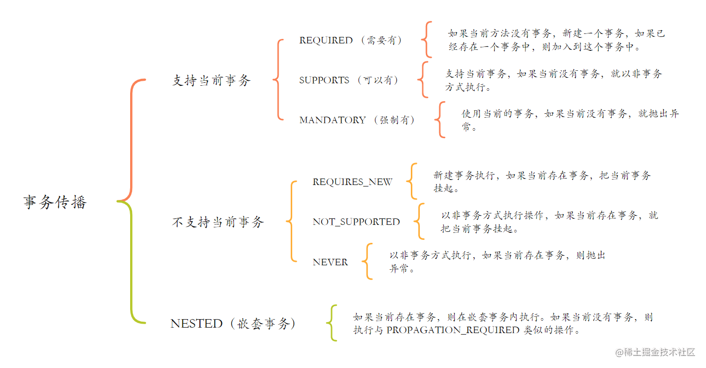


#### 3.2 Spring声明式事务的原理

AOP的核心就是解耦合

利用AOP实现事务的代理（声明式事务就是，那个方法需要添加事务，那个方法不需要添加事务可以动态的配置）

事务 流程：

<u>首先开启一个事务（open）</u>

业务的执行

<u>监听到是否有异常，没异常就提交，有异常就回滚（commit/rollback）</u>

<u>最后事务的关闭（close）</u>

下划线部分表示是AOP帮我们做了这个，这其实也是一个模板方法的模式


#### 3.3 事务传播机制使用与演示

接下来我们演示一下事务传播机制的使用，以下面 3 个最典型的事务传播级别为例：

- 支持当前事务的 REQUIRED；
- 不支持当前事务的 REQUIRES_NEW；
- 嵌套事务 NESTED。

下来我们分别来看。

事务传播机制的示例，需要用到以下两张表：

```sql
-- 用户表
CREATE TABLE `user` (
  `id` int(11) NOT NULL AUTO_INCREMENT,
  `name` varchar(255) COLLATE utf8mb4_bin DEFAULT NULL,
  `password` varchar(255) COLLATE utf8mb4_bin DEFAULT NULL,
  `createtime` datetime DEFAULT CURRENT_TIMESTAMP,
  PRIMARY KEY (`id`) USING BTREE
) ENGINE=InnoDB AUTO_INCREMENT=6 DEFAULT CHARSET=utf8mb4 COLLATE=utf8mb4_bin ROW_FORMAT=DYNAMIC;

-- 日志表
CREATE TABLE `log` (
  `id` int(11) NOT NULL AUTO_INCREMENT,
  `content` text NULL,
  PRIMARY KEY (`id`)
) ENGINE=InnoDB DEFAULT CHARSET=utf8mb4 COLLATE=utf8mb4_bin;
```

创建一个 Spring Boot 项目，核心业务代码有 3 个：UserController、UserServcie 以及 LogService。在 UserController 里面调用 UserService 添加用户，并调用 LogService 添加日志。

##### 3.2.1 REQUIRED 使用演示

REQUIRED 支持当前事务。 UserController 实现代码如下，其中 save 方法开启了事务：

```java
@RestController
public class UserController {
    @Resource
    private UserService userService;
    @Resource
    private LogService logService;

    @RequestMapping("/save")
    @Transactional
    public Object save(User user) {
        // 插入用户操作
        userService.save(user);
        // 插入日志
        logService.saveLog("用户插入：" + user.getName());
        return true;
    }
}
```

UserService 实现代码如下：

```java
@Service
public class UserService {
    @Resource
    private UserMapper userMapper;

    @Transactional(propagation = Propagation.REQUIRED)
    public int save(User user) {
        return userMapper.save(user);
    }
}
```

LogService 实现代码如下：

```java
@Service
public class LogService {
    @Resource
    private LogMapper logMapper;

    @Transactional(propagation = Propagation.REQUIRED)
    public int saveLog(String content) {
        // 出现异常
        int i = 10 / 0;
        return logMapper.saveLog(content);
    }
}
```

执行结果：程序报错，两张表中都没有插入任何数据。

执行流程描述：

> 1. 首先 UserService 中的添加用户方法正常执行完成。
> 2. LogService 保存日志程序报错，因为使用的是 UserController 中的全局事务，所以整个事务回滚，步骤 1 中的操作也跟着回滚。
> 3. 所以数据库中没有添加任何数据。

##### 3.2.1 REQUIRED_NEW 使用演示

REQUIRED_NEW 不支持当前事务。 UserController 实现代码：

```java
@RequestMapping("/save")
@Transactional
public Object save(User user) {
    // 插入用户操作
    userService.save(user);
    // 插入日志
    logService.saveLog("用户插入：" + user.getName());
    return true;
}
复制代码
```

UserService 实现代码：

```java
@Service
public class UserService {
    @Resource
    private UserMapper userMapper;

    @Transactional(propagation = Propagation.REQUIRES_NEW)
    public int save(User user) {
        System.out.println("执行 save 方法.");
        return userMapper.save(user);
    }
}
复制代码
```

LogService 实现代码：

```java
@Service
public class LogService {
    @Resource
    private LogMapper logMapper;

    @Transactional(propagation = Propagation.REQUIRES_NEW)
    public int saveLog(String content) {
        // 出现异常
        int i = 10 / 0;
        return logMapper.saveLog(content);
    }
}
复制代码
```

程序执行结果：

> User 表中成功添加了一条用户数据，Log 表执行失败，没有加入任何数据，但它并没有影响到 UserController 中的事务执行。

通过以上结果可以看出：LogService 中使用的是单独的事务，虽然 LogService 中的事务执行失败了，但并没有影响 UserController 和 UserService 中的事务。

##### 3.2.3 NESTED 使用演示

NESTED 是嵌套事务。 UserController 实现代码如下：

```java
@RequestMapping("/save")
@Transactional
public Object save(User user) {
    // 插入用户操作
    userService.save(user);
    return true;
}
复制代码
```

UserService 实现代码如下：

```java
@Transactional(propagation = Propagation.NESTED)
public int save(User user) {
    int result = userMapper.save(user);
    System.out.println("执行 save 方法.");
    // 插入日志
    logService.saveLog("用户插入：" + user.getName());
    return result;
}
复制代码
```

LogService 实现代码如下：

```java
@Transactional(propagation = Propagation.NESTED)
public int saveLog(String content) {
    // 出现异常
    int i = 10 / 0;
    return logMapper.saveLog(content);
}
复制代码
```

最终执行结果，用户表和日志表都没有添加任何数据。

执行流程描述：

> 1. UserController 中调用了 UserService 的添加用户方法，UserService 使用 NESTED 循环嵌套事务，并成功执行了添加用户的方法。
> 2. UserService 中调用了 LogService 的添加方法，LogService 使用了 NESTED 循环嵌套事务，但在方法执行中出现的异常，因此回滚了当前事务。
> 3. 因为 UserService 使用的是嵌套事务，所以发生回滚的事务是全局的，也就是说 UserService 中的添加用户方法也被回滚了，最终执行结果是用户表和日志表都没有添加任何数据。


### 4、Spring MVC 的工作原理

当用户发送请求到服务器时，DispatcherServlet将请求转发到一个控制器。控制器通过模型和视图来处理请求。模型代表请求的数据，视图代表显示数据的方式。控制器返回一个模型和视图给 DispatcherServlet，它将模型和视图呈现给用户。
Spring MVC 中还有一些中间件，如解析请求，验证请求参数，处理异常等，它们在请求流程中按顺序执行。


### 5、Spring bean的生命周期?

Spring bean 的生命周期包括了以下几个步骤：

（1）Bean 实例化：Spring 通过构造器或工厂方法来创建一个新的 Bean 实例。

（2）Bean 属性设置：Spring 将 Bean 配置的属性设置到创建的 Bean 实例中。

（3）Bean 初始化：当 Bean 实例创建完成并且所有的属性设置完毕后，Spring 会调用 Bean 的初始化方法，例如调用 init-method 指定的初始化方法。

```
1、执行各种通知；
2、执行初始化的前置方法；
3、执行初始化方法；
4、执行初始化的后置方法。
```

（4）Bean 使用：在 Bean 初始化完成后，它可以被容器中的其他 Bean 使用。

（5）Bean 销毁：当 Bean 不再被使用时，容器会调用 Bean 的销毁方法，例如调用 destroy-method 指定的销毁方法。

请注意，Bean 的生命周期在默认情况下是在单例模式下定义的，因此 Bean 的生命周期在整个应用程序生命周期中仅存在一次。如果 Bean 是多例的，则每个 Bean 实例都会有自己的生命周期。

#### 5.1 Spring怎么解决循环依赖的呢？

单例Bean初始化完成，要经历三步：


注入就发生在第二步，**属性赋值**，结合这个过程，Spring 通过**三级缓存**解决了循环依赖：

1. 一级缓存 : Map<String,Object> **singletonObjects**，单例池，用于保存实例化、属性赋值（注入）、初始化完成的 bean 实例
2. 二级缓存 : Map<String,Object> **earlySingletonObjects**，早期曝光对象，用于保存实例化完成的 bean 实例
3. 三级缓存 : Map<String,ObjectFactory<?>> **singletonFactories**，早期曝光对象工厂，用于保存 bean 创建工厂，以便于后面扩展有机会创建代理对象。

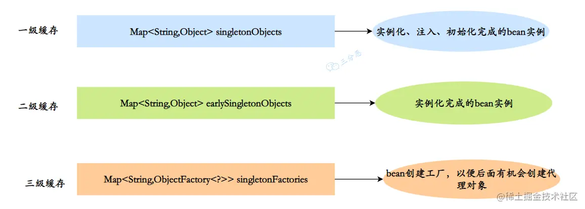

我们来看一下三级缓存解决循环依赖的过程：

当 A、B 两个类发生循环依赖时： 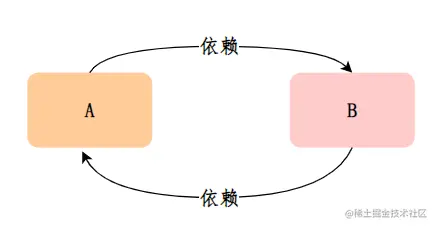

A实例的初始化过程：

1. 创建A实例，实例化的时候把A对象⼯⼚放⼊三级缓存，表示A开始实例化了，虽然我这个对象还不完整，但是先曝光出来让大家知道

   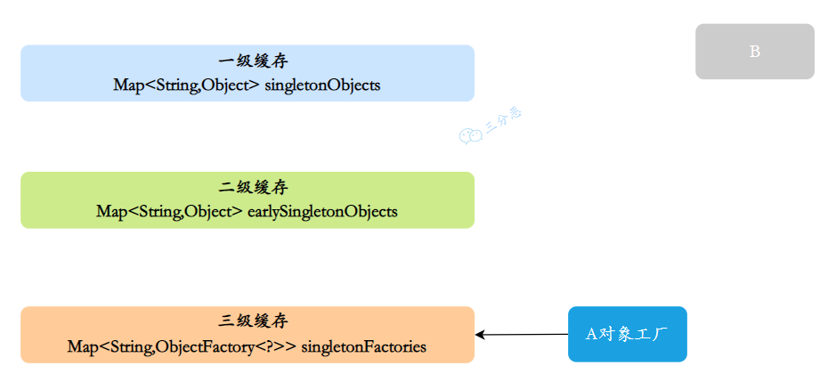

1. A注⼊属性时，发现依赖B，此时B还没有被创建出来，所以去实例化B

2. 同样，B注⼊属性时发现依赖A，它就会从缓存里找A对象。依次从⼀级到三级缓存查询A，从三级缓存通过对象⼯⼚拿到A，发现A虽然不太完善，但是存在，把A放⼊⼆级缓存，同时删除三级缓存中的A，此时，B已经实例化并且初始化完成，把B放入⼀级缓存。

   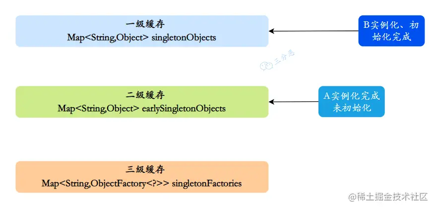

3. 接着A继续属性赋值，顺利从⼀级缓存拿到实例化且初始化完成的B对象，A对象创建也完成，删除⼆级缓存中的A，同时把A放⼊⼀级缓存

4. 最后，⼀级缓存中保存着实例化、初始化都完成的A、B对象

所以，我们就知道为什么Spring能解决setter注入的循环依赖了，因为实例化和属性赋值是分开的，所以里面有操作的空间。如果都是构造器注入的化，那么都得在实例化这一步完成注入，所以自然是无法支持了。

#### 5.2 为什么要三级缓存？⼆级不⾏吗？

不行，主要是为了**⽣成代理对象**。如果是没有代理的情况下，使用二级缓存解决循环依赖也是OK的。但是如果存在代理，三级没有问题，二级就不行了。

因为三级缓存中放的是⽣成具体对象的匿名内部类，获取Object的时候，它可以⽣成代理对象，也可以返回普通对象。使⽤三级缓存主要是为了保证不管什么时候使⽤的都是⼀个对象。

假设只有⼆级缓存的情况，往⼆级缓存中放的显示⼀个普通的Bean对象，Bean初始化过程中，通过 BeanPostProcessor 去⽣成代理对象之后，覆盖掉⼆级缓存中的普通Bean对象，那么可能就导致取到的Bean对象不一致了。


### 6、如果你要设计一个系统，需要考虑以下几个方面：

（1）需求分析：明确系统的目标、功能、特性、限制等。

（2）架构设计：确定系统的技术架构，包括技术选型、分层架构、数据结构、系统模块等。

（3）系统实现：按照架构进行系统开发。

（4）测试与验证：对系统进行功能测试、性能测试、安全测试、代码验证等。

（5）部署与维护：部署系统到生产环境，维护系统的可用性、可靠性、安全性。

（6）需求变更：不断根据业务变更需求进行系统优化。

（7）数据管理：管理系统的数据存储、备份、还原、数据安全等。

此外，在项目实施过程中，还需要考虑团队协作、项目计划、风险管理等方面。因为系统设计是一个复杂的工程问题，需要考虑多方面因素，因此需要一个综合、全面、协调的方法。


## 十五、锁

### 1、乐观锁

用数据版本（Version）记录机制实现，这是乐观锁最常用的一种实现方式。何谓数据版本？即为数据增加一个版本标识，一般是通过为数据库表增加一个数字类型的 “version” 字段来实现。当读取数据时，将version字段的值一同读出，数据每更新一次，对此version值加1。当我们提交更新的时候，判断数据库表对应记录的当前版本信息与第一次取出来的version值进行比对，如果数据库表当前版本号与第一次取出来的version值相等，则予以更新，否则认为是过期数据。


### 2、悲观锁

与乐观锁相对应的就是悲观锁了。悲观锁就是在操作数据时，认为此操作会出现数据冲突，所以在进行每次操作时都要通过获取锁才能进行对相同数据的操作，这点跟java中的synchronized很相似，所以悲观锁需要耗费较多的时间。另外与乐观锁相对应的，悲观锁是由数据库自己实现了的，要用的时候，我们直接调用数据库的相关语句就可以了。

说到这里，由悲观锁涉及到的另外两个锁概念就出来了，它们就是共享锁与排它锁。共享锁和排它锁是悲观锁的不同的实现，它俩都属于悲观锁的范畴。
要使用悲观锁，我们必须关闭mysql数据库的自动提交属性，因为MySQL默认使用autocommit模式，也就是说，当你执行一个更新操作后，MySQL会立刻将结果进行提交。

#### 2.1 共享锁

共享锁又称读锁 read lock，是读取操作创建的锁。其他用户可以并发读取数据，但任何事务都不能对数据进行修改（获取数据上的排他锁），直到已释放所有共享锁。

如果事务T对数据A加上共享锁后，则其他事务只能对A再加共享锁，不能加排他锁。获得共享锁的事务只能读数据，不能修改数据

在查询语句后面增加 LOCK IN SHARE MODE，Mysql会对查询结果中的每行都加共享锁，当没有其他线程对查询结果集中的任何一行使用排他锁时，可以成功申请共享锁，否则会被阻塞。其他线程也可以读取使用了共享锁的表，而且这些线程读取的是同一个版本的数据。

加上共享锁后，对于update,insert,delete语句会自动加排它锁。

#### 2.2 排它锁

排他锁 exclusive lock（也叫writer lock）又称写锁。

若事务 1 对数据对象A加上X锁，事务 1 可以读A也可以修改A，其他事务不能再对A加任何锁，直到事物 1 释放A上的锁。这保证了其他事务在事物 1 释放A上的锁之前不能再读取和修改A。排它锁会阻塞所有的排它锁和共享锁

读取为什么要加读锁呢：防止数据在被读取的时候被别的线程加上写锁，

使用方式：在需要执行的语句后面加上for update就可以了

### 3、CAS 

CAS，即Compare-And-Swap，是一种常见的乐观锁（optimisticlock）算法。它的基本思想是：通过比较内存地址中的值与期望值是否相等来决定是否更新该地址的值。

**CAS 的基本实现流程如下：**
- （1）获取当前内存地址中的值；
- （2）比较当前内存地址中的值与期望值是否相等；
- （3）如果相等，则更新该内存地址的值；
- （4）如果不相等，则重复从步骤 1 开始操作。

CAS 是硬件级别的原子操作，能够保证在同一时刻只有一个线程执行操作，避免了在多线程环境下可能产生的竞争和不一致问题。
因此，CAS在分布式系统中应用非常广泛，如在实现高性能的缓存系统，乐观锁等。
	

#### 3.1 CAS的缺点和问题解决

在并发编程中CAS的缺点和问题，如ABA问题，自旋锁消耗问题、多变量共享一致性问题

##### 3.1.1 ABA

问题描述：线程t1将它的值从A变为B，再从B变为A。同时有线程t2要将值从A变为C。但CAS检查的时候会发现没有改变，但是实质上它已经发生了改变 。可能会造成数据的缺失。

解决方法：CAS还是类似于乐观锁，同数据乐观锁的方式给它加一个版本号或者时间戳，如AtomicStampedReference

##### 3.1.2 自旋消耗资源

问题描述：多个线程争夺同一个资源时，如果自旋一直不成功，将会一直占用CPU。

解决方法：破坏掉for死循环，当超过一定时间或者一定次数时，return退出。JDK8新增的LongAddr,和ConcurrentHashMap类似的方法。当多个线程竞争时，将粒度变小，将一个变量拆分为多个变量，达到多个线程访问多个资源的效果，最后再调用sum把它合起来。

虽然base和cells都是volatile修饰的，但感觉这个sum操作没有加锁，可能sum的结果不是那么精确。

```java
public long sum() {
    Cell[] as = cells; Cell a;
    long sum = base;
    if (as != null) {
        for (int i = 0; i < as.length; ++i) {
            if ((a = as[i]) != null)
                sum += a.value;
        }
    }
    return sum;
}
```
##### 3.1.3 多变量共享一致性问题

解决方法： CAS操作是针对一个变量的，如果对多个变量操作，1. 可以加锁来解决。2 .封装成对象类解决。


### 4、行锁

行锁又分共享锁和排他锁,由字面意思理解，就是给某一行加上锁，也就是一条记录加上锁。
注意：行级锁都是基于索引的，如果一条SQL语句用不到索引是不会使用行级锁的，会使用表级锁。

共享锁：共享锁又叫做读锁，所有的事务只能对其进行读操作不能写操作，加上共享锁后在事务结束之前其他事务只能再加共享锁，除此之外其他任何类型的锁都不能再加了。
排他锁：若某个事物对某一行加上了排他锁，只能这个事务对其进行读写，在此事务结束之前，其他事务不能对其进行加任何锁，其他进程可以读取,不能进行写操作，需等待其释放


### 5、表锁

innodb 的行锁是在有索引的情况下,没有索引的表是锁定全表的.

在实际应用中，要特别注意InnoDB行锁的这一特性，不然的话，可能导致大量的锁冲突，从而影响并发性能。

行级锁都是基于索引的，如果一条SQL语句用不到索引是不会使用行级锁的，会使用表级锁。行级锁的缺点是：由于需要请求大量的锁资源，所以速度慢，内存消耗大。


### 6、死锁

（1）互斥条件：该资源任意一个时刻只由一个线程占用。

（2）请求与保持条件：一个线程因请求资源而阻塞时，对已获得的资源保持不放。

（3）不剥夺条件: 线程已获得的资源在未使用完之前不能被其他线程强行剥夺，只有自己使用完毕后才释放资源。

（4）循环等待条件:若干线程之间形成一种头尾相接的循环等待资源关系。

破坏死锁的产生的必要条件：

（1）破坏请求与保持条件 ：一次性申请所有的资源。

（2）破坏不剥夺条件 ：占用部分资源的线程进一步申请其他资源时，如果申请不到，可以主动释放它占有的资源。

（3）破坏循环等待条件 ：靠按序申请资源来预防。按某一顺序申请资源，释放资源则反序释放。破坏循环等待条件。


## 十六、mybatis

Mybatis 是一款优秀的 ORM（持久层）框架，使用 Java 语言 编写

前身是 apache 的一个开源项目 iBatis，2010 年迁移到 google code 并正式改名为 Mybatis

ORM 持久层 指的是 : **将业务数据存储到磁盘，也具备长期存储能力，只要磁盘不损坏，如果在断电情况下，重启系统仍然可以读取数据**


### 1、Mybatis 关键词

#### SqlSession

负责执行 **select、insert、update、delete** 等命令, 同时负责获取映射器和管理事务; 其底层封装了与 JDBC 的交互, 可以说是 mybatis 最核心的接口之一

#### SqlSessionFactory

负责创建 **SqlSession** 的工厂, 一旦被创建就应该在应用运行期间一直存在, **不需要额外再进行创建**

#### SqlSessionFactoryBuilder

主要是负责创建 **SqlSessionFactory** 的构造器类, 其中使用到了构建者设计模式; 仅负责创建 **SqlSessionFactory**

#### Configuration

Mybatis 最重要的配置类, 没有之一, 存储了大量的对象配置, 可以看源码感受一下

#### MappedStatement

MappedStatement 是保存 SQL 语句的数据结构, 其中的类属性都是由解析 .xml 文件中的 SQL 标签转化而成

#### Executor

SqlSession 对象对应一个 Executor, Executor 对象作用于 **增删改查方法** 以及 **事务、缓存** 等操作

#### ParameterHandler

Mybatis 中的 **参数处理器**, 类关系比较简单

#### StatementHandler

StatementHandler 是 Mybatis 负责 **创建 Statement 的处理器**, 根据不同的业务创建不同功能的 Statement

#### ResultSetHandler

ResultSetHandler 是 Mybatis 负责将 JDBC 返回数据进行解析, 并包装为 Java 中对应数据结构的处理器

#### Interceptor

Interceptor 为 Mybatis 中定义公共拦截器的接口, 其中定义了相关实现方法

### 2、Mybatis 架构

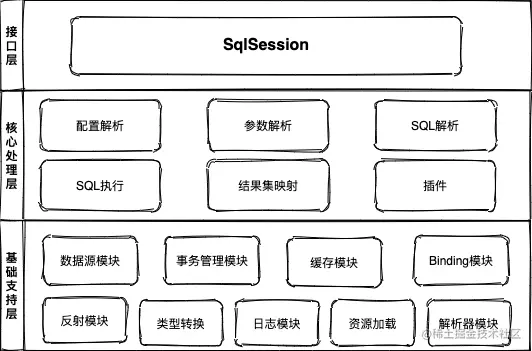


### 3、SQL 执行

SQL 的执行过程涉及几个比较重要的对象, **Executor、StatementHandler、ParameterHandler、ResultSetHandler**

Executor 负责维护 **一级、二级缓存以及事务提交回滚操作**, 举个查询的例子, 查询请求会由 Executor 交给 StatementHandler 完成

StatementHandler 通过 ParameterHandler 完成 **SQL 语句的实参绑定**, 通过 java.sql.Statement 执行 SQL 语句并拿到对应的 **结果集映射**

最后交由 ResultSetHandler 对结果集进行解析, 将 JDBC 类型转换为程序自定义的对象

### 4、Dao 接口的工作原理是什么？Dao 接口里的方法，参数不同时，方法能重载吗？

Dao 接口即 Mapper 接口。接口的全限名，就是映射文件中的 namespace 的值；接口的方法名，就是映射文件中 Mapper 的 Statement 的 id 值；接口方法内的参数，就是传递给 sql 的参数。

Mapper 接口是没有实现类的，当调用接口方法时，接口全限名+方法名拼接字符串作为 key 值，可唯一定位一个 MapperStatement。在 Mybatis 中，每一个 select、insert、update、delete标签，都会被解析为一个MapperStatement 对象。

举例：com.mybatis3.mappers.StudentDao.findStudentById，可以唯一找到 namespace 为 com.mybatis3.mappers.StudentDao 下面 id 为findStudentById 的 MapperStatement。

**Mapper 接口里的方法，是不能重载的，因为是使用 全限名+方法名 的保存和寻找策略。Mapper 接口的工作原理是 JDK 动态代理，Mybatis 运行时会使用 JDK动态代理为 Mapper 接口生成代理对象 proxy，代理对象会拦截接口方法，转而执行 MapperStatement 所代表的 sql，然后将 sql 执行结果返回。**


### 5、为什么说Mybatis是半自动ORM映射工具？它与全自动的区别在哪里？

Hibernate属于全自动ORM映射工具，使用Hibernate查询关联对象或者关联集合对象时，可以根据对象关系模型直接获取，所以它是全自动的。
而Mybatis在查询关联对象或关联集合对象时，需要手动编写sql来完成，所以，称之为半自动ORM映射工具。

**Hibernate 和 MyBatis 的区别：**
1. 相同点 
	- 都是对jdbc的封装，都是持久层的框架，都用于dao层的开发。
2. 不同点
	- 映射关系：
		- （1）MyBatis 是一个半自动映射的框架，配置Java对象与sql语句执行结果的对应关系，多表关联关系配置简单
		- （2）Hibernate 是一个全表映射的框架，配置Java对象与数据库表的对应关系，多表关联关系配置复杂
	- SQL优化和移植性：
		- （1）Hibernate 对SQL语句封装，提供了日志、缓存、级联（级联比MyBatis强大）等特性，此外还提供HQL（HibernateQueryLanguage）操作数据库，数据库无关性支持好，但会多消耗性能。如果项目需要支持多种数据库，代码开发量少，但SQL语句优化困难。
		- （2）MyBatis 需要手动编写SQL，支持动态SQL、处理列表、动态生成表名、支持存储过程。开发工作量相对大些。直接使用SQL语句操作数据库，不支持数据库无关性，但sql语句优 化容易。
	- 开发难易程度和学习成本:
		- (1)Hibernate 是重量级框架，学习使用门槛高，适合于需求相对稳定，中小型的项目，比如： 办公自动化系统
		- (2)MyBatis 是轻量级框架，学习使用门槛低，适合于需求变化频繁，大型的项目，比如：互联网电子商务系统


### 6、请说说MyBatis的工作原理

1）读取 MyBatis 配置文件：mybatis-config.xml 为 MyBatis 的全局配置文件，配置了 MyBatis 的运行环境等信息，例如数据库连接信息。

2）加载映射文件。映射文件即 SQL 映射文件，该文件中配置了操作数据库的 SQL 语句， 需要在 MyBatis 配置文件 mybatis-config.xml 中加载。mybatis-config.xml 文件可以加 载多个映射文件，每个文件对应数据库中的一张表。

3）构造会话工厂：通过 MyBatis 的环境等配置信息构建会话工厂 SqlSessionFactory。

4）创建会话对象：由会话工厂创建 SqlSession 对象，该对象中包含了执行 SQL 语句的所 有方法。

5）Executor 执行器：MyBatis 底层定义了一个 Executor 接口来操作数据库，它将根据 SqlSession 传递的参数动态地生成需要执行的 SQL 语句，同时负责查询缓存的维护。

6）MappedStatement 对象：在 Executor 接口的执行方法中有一个 MappedStatement 类型的参数，该参数是对映射信息的封装，用于存储要映射的 SQL 语句的 id、参数等信 息。

7）输入参数映射：输入参数类型可以是 Map、List 等集合类型，也可以是基本数据类型和 POJO 类型。输入参数映射过程类似于 JDBC 对 preparedStatement 对象设置参数的过 程。

8）输出结果映射：输出结果类型可以是 Map、 List 等集合类型，也可以是基本数据类型 和 POJO 类型。输出结果映射过程类似于 JDBC 对结果集的解析过程。


### 7、Mybatis是否支持延迟加载？如果支持，它的实现原理是什么？

Mybatis仅支持association关联对象和collection 关联集合对象的延迟加载，association 指的就是一对一，collection 指的就是一对多查询。在Mybatis配置文件中，可以配置是否 启用延迟加载lazyLoadingEnabled=true|false。

它的原理是，使用CGLIB创建目标对象的代理对象，当调用目标方法时，进入拦截器方法， 比如调用a.getB().getName()，拦截器invoke()方法发现a.getB()是null值，那么就会单独 发送事先保存好的查询关联B对象的sql，把B查询上来，然后调用a.setB(b)，于是a的对象b 属性就有值了，接着完成a.getB().getName()方法的调用。这就是延迟加载的基本原理。

当然了，不光是Mybatis，几乎所有的包括Hibernate，支持延迟加载的原理都是一样的。


### 8、Mybatis的一级、二级缓存

1）一级缓存: 基于 PerpetualCache 的 HashMap 本地缓存，其存储作用域为 Session， 当 Session flush 或 close 之后，该 Session 中的所有 Cache 就将清空，默认打开一级缓存。

2）二级缓存与一级缓存其机制相同，默认也是采用 PerpetualCache，HashMap 存储， 不同在于其存储作用域为 Mapper(Namespace)，并且可自定义存储源，如 Ehcache。默 认不打开二级缓存，要开启二级缓存，使用二级缓存属性类需要实现Serializable序列化接 口(可用来保存对象的状态),可在它的映射文件中配置 ；

3）对于缓存数据更新机制，当某一个作用域(一级缓存 Session/二级缓存Namespaces)的 进行了C/U/D 操作后，默认该作用域下所有 select 中的缓存将被 clear。

### 9、#{}和${}的区别是什么？ 

- #{}是预编译处理，${}是字符串替换。

- Mybatis 在处理#{}时，会将 sql 中的#{}替换为?号，调用 PreparedStatement 的 set 方法来赋值；

- Mybatis 在处理时，就是把{}时，就是把时，就是把{}替换成变量的值。

- 使用#{}可以有效的防止 SQL 注入，提高系统安全性。


## 十七、netty


## 十八、算法

### 1、普通hash 算法

#### 1.1 普通 hash算法 与 使用场景描述

​        假设我们有三台缓存服务器，用于缓存图片，我们为这三台缓存服务器编号为 0号、1号、2号，现在有3万张图片需要缓存，我们希望这些图片被均匀的缓存到这3台服务器上，以便它们能够分摊缓存的压力。也就是说，我们希望每台服务器能够缓存1万张左右的图片，那么我们应该怎样做呢？常见的做法是对缓存项的键进行哈希，将hash后的结果对缓存服务器的数量进行取模操作，通过取模后的结果，决定缓存项将会缓存在哪一台服务器上


我们举例说明，以刚才描述的场景为例，假设图片名称是不重复的，那我们就可以使用图片名称作为访问图片的key，使用如下公式，计算出图片应该存放在哪台服务器上。

hash（图片名称）% N

> 当我们对同一个图片名称做相同的哈希计算时，得出的结果应该是不变的，如果我们有3台服务器，使用哈希后的结果对3求余，那么余数一定是0、1或者2；如果求余的结果为0， 就把当前图片缓存在0号服务器上，如果余数为1，就缓存在1号服务器上，以此类推；同理，当我们访问任意图片时，只要再次对图片名称进行上述运算，即可得出图片应该存放在哪一台缓存服务器上，我们只要在这一台服务器上查找图片即可，如果图片在对应的服务器上不存在，则证明对应的图片没有被缓存，也不用再去遍历其他缓存服务器了，通过这样的方法，即可将3万张图片随机的分布到3台缓存服务器上了，而且下次访问某张图片时，直接能够判断出该图片应该存在于哪台缓存服务器上，我们暂时称上述算法为 HASH 算法或者取模算法，取模算法的过程可以用下图表示：

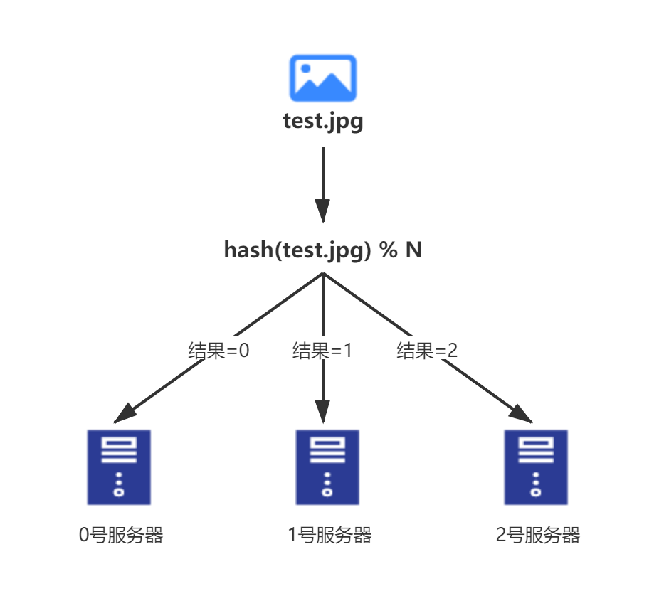

####  1.2 普通 hash 算法的缺陷

​        上述HASH算法时，会出现一些缺陷：如果服务器已经不能满足缓存需求，就需要增加服务器数量，假设我们增加了一台缓存服务器，此时如果仍然使用上述方法对同一张图片进行缓存，那么这张图片所在的服务器编号必定与原来3台服务器时所在的服务器编号不同，因为除数由3变为了4，最终导致所有缓存的位置都要发生改变，也就是说，当服务器数量发生改变时，所有缓存在一定时间内是失效的，当应用无法从缓存中获取数据时，则会向后端服务器请求数据；同理，假设突然有一台缓存服务器出现了故障，那么我们则需要将故障机器移除，那么缓存服务器数量从3台变为2台，同样会导致大量缓存在同一时间失效，造成了缓存的雪崩，后端服务器将会承受巨大的压力，整个系统很有可能被压垮。为了解决这种情况，就有了一致性哈希算法。

​        

### 2、一致性哈希算法

####  2.1 什么是一致性 hash 算法

​        一致性哈希算法也是使用取模的方法，但是取模算法是对服务器的数量进行取模，而一致性哈希算法是对 2^32 取模，具体步骤如下：

步骤一：一致性哈希算法将整个哈希值空间按照顺时针方向组织成一个虚拟的圆环，称为 Hash 环；

步骤二：接着将各个服务器使用 Hash 函数进行哈希，具体可以选择服务器的IP或主机名作为关键字进行哈希，从而确定每台机器在哈希环上的位置

步骤三：最后使用算法定位数据访问到相应服务器：将数据key使用相同的函数Hash计算出哈希值，并确定此数据在环上的位置，从此位置沿环顺时针寻找，第一台遇到的服务器就是其应该定位到的服务器

下面我们使用具体案例说明一下一致性哈希算法的具体流程：

- （1）步骤一：哈希环的组织：

  - 我们将 2^32 想象成一个圆，像钟表一样，钟表的圆可以理解成由60个点组成的圆，而此处我们把这个圆想象成由2^32个点组成的圆，示意图如下：

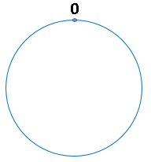

  - 圆环的正上方的点代表0，0点右侧的第一个点代表1，以此类推，2、3、4、5、6……直到2^32-1,也就是说0点左侧的第一个点代表2^32-1，我们把这个由 2^32 个点组成的圆环称为hash环。

- （2）步骤二：确定服务器在哈希环的位置：

哈希算法：hash（服务器的IP） % 2^32

 - 上述公式的计算结果一定是 0 到 2^32-1 之间的整数，那么上图中的 hash 环上必定有一个点与这个整数对应，所以我们可以使用这个整数代表服务器，也就是服务器就可以映射到这个环上，假设我们有 ABC 三台服务器，那么它们在哈希环上的示意图如下：

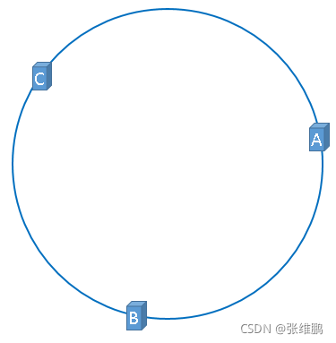

- （3）步骤三：将数据映射到哈希环上：

  - 我们还是使用图片的名称作为 key，所以我们使用下面算法将图片映射在哈希环上：hash（图片名称） % 2^32，假设我们有4张图片，映射后的示意图如下，其中橘黄色的点表示图片：

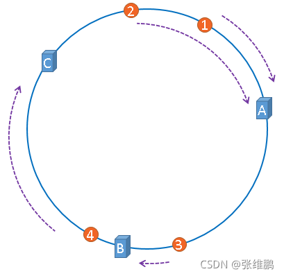

  - 那么，怎么算出上图中的图片应该被缓存到哪一台服务上面呢？我们只要从图片的位置开始，沿顺时针方向遇到的第一个服务器就是图片存放的服务器了。最终，1号、2号图片将会被缓存到服务器A上，3号图片将会被缓存到服务器B上，4号图片将会被缓存到服务器C上。

####  2.2 一致性 hash 算法的优点

​        前面提到，如果简单对服务器数量进行取模，那么当服务器数量发生变化时，会产生缓存的雪崩，从而很有可能导致系统崩溃，而使用一致性哈希算法就可以很好的解决这个问题，因为一致性Hash算法对于节点的增减都只需重定位环空间中的一小部分数据，只有部分缓存会失效，不至于将所有压力都在同一时间集中到后端服务器上，具有较好的容错性和可扩展性。

   - 假设服务器B出现了故障，需要将服务器B移除，那么移除前后的示意图如下图所示：

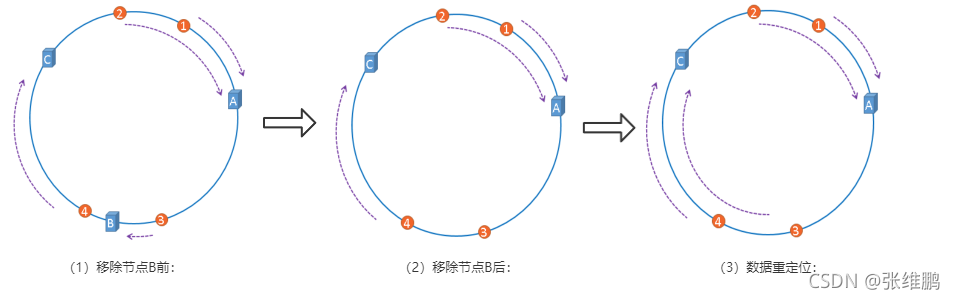

  - 在服务器B未移除时，图片3应该被缓存到服务器B中，可是当服务器B移除以后，按照之前描述的一致性哈希算法的规则，图片3应该被缓存到服务器C中，因为从图片3的位置出发，沿顺时针方向遇到的第一个缓存服务器节点就是服务器C，也就是说，如果服务器B出现故障被移除时，图片3的缓存位置会发生改变，但是，图片4仍然会被缓存到服务器C中，图片1与图片2仍然会被缓存到服务器A中，这与服务器B移除之前并没有任何区别，这就是一致性哈希算法的优点。

####  2.3 hash 环的倾斜与虚拟节点

​        一致性哈希算法在服务节点太少的情况下，容易因为节点分部不均匀而造成数据倾斜问题，也就是被缓存的对象大部分集中缓存在某一台服务器上，从而出现数据分布不均匀的情况，这种情况就称为 hash 环的倾斜。如下图所示：

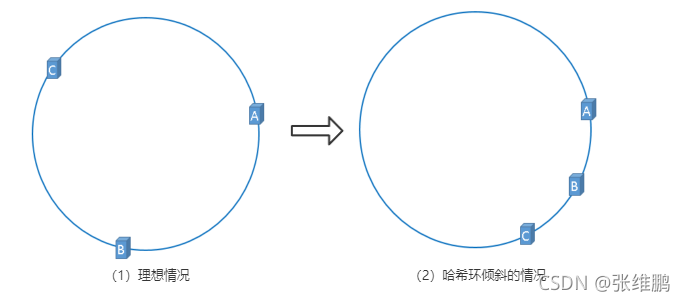

    - hash 环的倾斜在极端情况下，仍然有可能引起系统的崩溃，为了解决这种数据倾斜问题，一致性哈希算法引入了虚拟节点机制，即对每一个服务节点计算多个哈希，每个计算结果位置都放置一个此服务节点，称为虚拟节点，一个实际物理节点可以对应多个虚拟节点，虚拟节点越多，hash环上的节点就越多，缓存被均匀分布的概率就越大，hash环倾斜所带来的影响就越小，同时数据定位算法不变，只是多了一步虚拟节点到实际节点的映射。具体做法可以在服务器ip或主机名的后面增加编号来实现，加入虚拟节点以后的hash环如下：


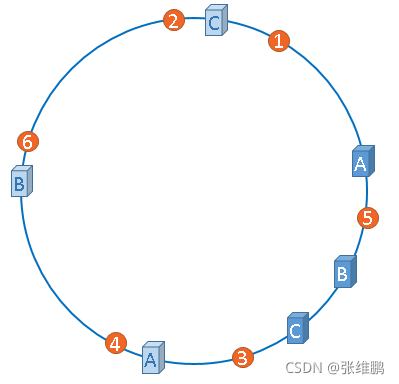


## 十九、零碎

### 1、final 有什么用？

用于修饰类、属性和方法；

被final修饰的类不可以被继承
被final修饰的方法不可以被重写
被final修饰的变量不可以被改变，被final修饰不可变的是变量的引用，而不是引用指向的内容，引用指向的内容是可以改变的


### 2、static存在的主要意义

static的主要意义是在于创建独立于具体对象的域变量或者方法。以致于即使没有创建对象，也能使用属性和调用方法！
它的特性:只会在类加载的时候 执行一次。因此，很多时候会将一些只需要进行一次的初始化操作都放在static代码块中进行。


### 3、Java集合的快速失败机制 “fail-fast”？

是java集合的一种错误检测机制，当多个线程对集合进行结构上的改变的操作 时，有可能会产生 fail-fast 机制。

例如：假设存在两个线程（线程1、线程2），线程1通过Iterator在遍历集合A中 的元素，在某个时候线程2修改了集合A的结构（是结构上面的修改，而不是简 单的修改集合元素的内容），那么这个时候程序就会抛出ConcurrentModificationException 异常，从而产生fail-fast机制。

原因：迭代器在遍历时直接访问集合中的内容，并且在遍历过程中使用一个 modCount 变量。集合在被遍历期间如果内容发生变化，就会改变modCount 的值。每当迭代器使用hashNext()/next()遍历下一个元素之前，都会检测 modCount变量是否为expectedmodCount值，是的话就返回遍历；否则抛出 异常，终止遍历。

解决办法：

在遍历过程中，所有涉及到改变modCount值得地方全部加上 synchronized。
使用CopyOnWriteArrayList来替换ArrayList


### 4、如何边遍历边移除 Collection 中的元素？

边遍历边修改 Collection 的唯一正确方式是使用 Iterator.remove() 方法

Iterator 的特点是只能单向遍历，但是更加安全，因为它可以确保，在当前遍历的集合元素被更改的时候，就会抛出 ConcurrentModificationException 异常。

Iterator 和 ListIterator 有什么区别？
Iterator 可以遍历 Set 和 List 集合，而 ListIterator 只能遍历 List。
Iterator 只能单向遍历，而 ListIterator 可以双向遍历（向前/后遍历）。
ListIterator 实现 Iterator 接口，然后添加了一些额外的功能，比如添加一个元 素、替换一个元素、获取前面或后面元素的索引位置。


### 5、单例模式

懒汉式单例


```java
public class Singleton {
    // 创建类的唯一实例
    private static Singleton instance;
    // 私有构造函数，保证外界无法通过调用构造函数来创建新的实例
    private Singleton() {}

    // 提供获取实例的方法
    public static synchronized Singleton getInstance() {
        // 双重检查加锁，保证线程安全
        if (instance == null) {
            synchronized (Singleton.class) {
                if (instance == null) {
                    instance = new Singleton();
                }
            }
        }
    }
}
```

饿汉式单例

```java
public class Singleton {
    // 创建类的唯一实例
    private static final Singleton instance = new Singleton();

    // 私有构造函数，保证外界无法通过调用构造函数来创建新的实例
    private Singleton() {}
    
    // 提供获取实例的方法
    public static Singleton getInstance() {
        return instance;
    }

}
```


### 6、限流算法

（1）漏桶算法：漏桶算法通过设置固定容量的桶来存储请求，如果请求数量超过桶的容量，那么新的请求将被抛弃。

（2）令牌桶算法：令牌桶算法通过不断向桶中加入令牌来控制请求的数量，如果请求数量超过令牌数量，那么新的请求将被抛弃。

（3）计数器算法：计数器算法通过记录请求的数量，如果请求数量超过一个预定值，那么新的请求将被抛弃。

（4）动态令牌桶算法：动态令牌桶算法结合了令牌桶算法和漏桶算法的思想，可以根据系统的请求情况实时调整令牌的数量，以满足请求的要求。


### 7、Java 序列化中如果有些字段不想进行序列化怎么办

transient 关键字的作用是:阻止实例中那些用此关键字修饰的的变量序列化。transient 只能修饰变量，不能修饰类和方法。


### 8、TCP三次握手、四次挥手

TCP 三次握手是一个创建 TCP 连接的过程，用于建立客户端和服务器之间的可靠连接。三次握手的具体步骤如下：

（1）客户端发送连接请求给服务器，请求建立连接。

（2）服务器收到请求后发送确认消息，表示它准备好接受客户端的数据。

（3）客户端收到确认消息后，再向服务器发送确认消息，确认连接已经建立。


TCP 四次挥手是一个关闭 TCP 连接的过程，用于在客户端和服务器之间断开连接。四次挥手的具体步骤如下：

（1）客户端发送连接关闭请求，请求断开连接。

（2）服务器收到请求后发送确认消息，表示它准备好断开连接。

（3）客户端收到确认消息后，断开连接，不再向服务器发送数据。

（4）服务器确认客户端断开连接后，它也断开连接。
通过三次握手和四次挥手，可以保证客户端和服务器之间的数据传输的可靠性。

## 二十、编程题

### 程序1：斐波那契数列问题

**题目概述：**
古典问题： 有一对兔子，从出生第三个月起每月都生一对兔子，小兔子长到第三个月后每个月又生一对兔子，假如兔子都不死，问每个月的兔子总数为多少

程序分析：兔子的规律为数列1,1,2,3,5,8,13,21....

做这种题目，最好的做法就是找出规律，跟高中的数列一样

本题有：a[n]=a[n-1]+a[n-1],而第一第二项都知道了，后面的值也可以求得

**代码：**

```java
public class Programming1 {
    //斐波那契数列问题
    public static void main(String[] args) {
        System.out.println(Fibonacci(1));
        System.out.println(Fibonacci(2));
        System.out.println(Fibonacci(3));
        System.out.println(Fibonacci(4));
    }

  // 迭代算法求解斐波那契数列
    public static int function(int month) {
        int a = 2, b = 2, c, count = 1;
        while (count < month) {
            c = a;
            a = a + b;
            b = c;
            count++;
        }
        return a;
    }

    //考虑使用递归完成计算
    public static int Fibonacci(int month) {
        if (month == 1 || month == 2) {
            return 2;
        } else {
            return Fibonacci(month - 1) + Fibonacci(month - 2);
        }
    }
}


```


